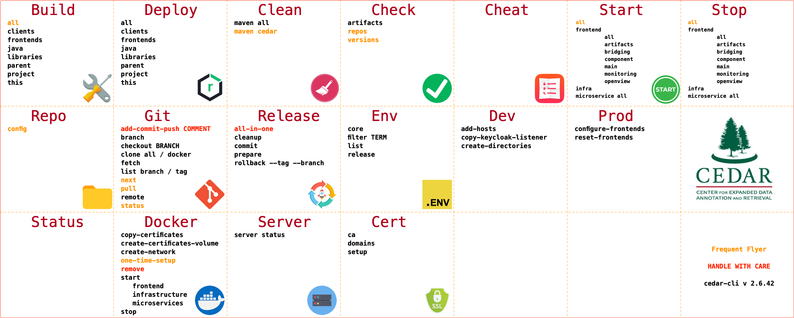

# CEDAR CLI and Scripts

## Overview
The CEDAR system is relatively complex: it uses 15 microservices, 6 frontends and 7 infrastructure services.

Orchestrating the startup, shutdown, rebuild of this system would be a heavy burden if only shell commands were to be used.

### CEDAR-CLI
In order to make the developer's life easier, we created a command line interface that centralizes all the commands. This tool will help the user to easily handle the tasks that will be performed during the development and deployment.

### Environment variables
In order to make the system relatively easily configurable, we extracted the configuration data into environment variables.
These environment variables should be always available in the shell of the user whop develops/maintains the system. 

Currently, there are approximately 180 variables maintained.
These are either read directly from the environment (this is the rare case), or are embedded through automatic interpolation into different configuration files (this is the typical scenario).

## cedar-cli

### Install `cedar-cli`
Install `cedar-cli` by executing the following script:

```sh
export CEDAR_HOME=~/CEDAR

cd ~/CEDAR
git clone https://github.com/metadatacenter/cedar-cli

cd cedar-cli
git checkout develop

python -m venv ./.venv
source .venv/bin/activate
pip install -r requirements.txt

python -m pip install --upgrade pip
```

### Configure `CEDAR_HOME` and `cedarcli` alias

```sh
vi ~/.zshrc
```

Add these lines:

```sh
export CEDAR_HOME=~/CEDAR
alias cedarcli='source $CEDAR_HOME/cedar-cli/cli.sh'
```

### Check bash profile content

At this point, your `~/.zshrc` should contain these lines:

```sh
export PATH=$(brew --prefix)/opt/openssl@1.1/bin:$PATH

export PATH="$HOME/.jenv/bin:$PATH"
eval "$(jenv init -)"

export CEDAR_HOME=~/CEDAR
alias cedarcli='source $CEDAR_HOME/cedar-cli/cli.sh'
```

If you are installing on a system where `Python 3` CLI is available as `python3` instead of `python`, use this alternative instead:

```sh
alias cedarcli='source $CEDAR_HOME/cedar-cli/cli3.sh'
```

## cedar-cli commands

This is the list of the available commands in cedarcli:



## Install the scripts

???+ warning "Important"

    The steps in this section are crucial for the proper installation of CEDAR.
    
    Please execute these steps with great care.

### Copy the helper scripts in place

There are three files that hold configuration that could/should be changed during development.
You need to copy these files from the just cloned repo into CEDAR home folder. There you can make modifications to these files.

These files are the following: 

| Filername                       | Content                                                                                     |
|---------------------------------|---------------------------------------------------------------------------------------------|
| set-env-internal.sh             | Local infrastructure service connection usernames and password.                             |
| set-env-external.sh             | Usernames, passwords and other connection data to remote systems that CEDAR integrates with.|
| cedar-profile-native-develop.sh | Bash profile extension for local development.                                               |

Please copy these files from the recently cloned repo to their final location:

```sh
cd ${CEDAR_HOME}
cp cedar-development/bin/templates/set-env-internal.sh .
cp cedar-development/bin/templates/set-env-external.sh .
cp cedar-development/bin/templates/cedar-profile-native-develop.sh .
```

### Check the location of the new files

```sh
cedarcli check repos
```

should result in:
```
┏━━━━━━━━━━━━━━━━━━━━━━━━━━━━━━━━━━━━━━━━━━━━━━━━━━┳━━━━━━━━━━━┳━━━━━━━━━━━━━━━━━━┳━━━━━━━━━━━━━━━━━━━━━━━━━━┳━━━━━━━━┓
┃ Repo/File/Dir                                    ┃ File Type ┃    Repo Type     ┃      Recognized as       ┃ Status ┃
┡━━━━━━━━━━━━━━━━━━━━━━━━━━━━━━━━━━━━━━━━━━━━━━━━━━╇━━━━━━━━━━━╇━━━━━━━━━━━━━━━━━━╇━━━━━━━━━━━━━━━━━━━━━━━━━━╇━━━━━━━━┩
...
│ cedar-profile-native-develop.sh                  │  📄 file  │                  │ Known CEDAR shell script │   ✅   │
│ cedar-project                                    │  📁 dir   │   java-wrapper   │        CEDAR repo        │   ✅   │
│ cedar-repo-server                                │  📁 dir   │       java       │        CEDAR repo        │   ✅   │
│ cedar-resource-server                            │  📁 dir   │       java       │        CEDAR repo        │   ✅   │
│ cedar-rest-library                               │  📁 dir   │       java       │        CEDAR repo        │   ✅   │
│ cedar-schema-server                              │  📁 dir   │       java       │        CEDAR repo        │   ✅   │
│ cedar-shared-data                                │  📁 dir   │ content-delivery │        CEDAR repo        │   ✅   │
│ cedar-submission-server                          │  📁 dir   │       java       │        CEDAR repo        │   ✅   │
│ cedar-swagger-ui                                 │  📁 dir   │ content-delivery │        CEDAR repo        │   ✅   │
│ cedar-template-editor                            │  📁 dir   │    angularJS     │        CEDAR repo        │   ✅   │
│ cedar-terminology-server                         │  📁 dir   │       java       │        CEDAR repo        │   ✅   │
│ cedar-user-server                                │  📁 dir   │       java       │        CEDAR repo        │   ✅   │
│ cedar-util                                       │  📁 dir   │       misc       │        CEDAR repo        │   ✅   │
│ cedar-valuerecommender-server                    │  📁 dir   │       java       │        CEDAR repo        │   ✅   │
│ cedar-worker-server                              │  📁 dir   │       java       │        CEDAR repo        │   ✅   │
│ set-env-external.sh                              │  📄 file  │                  │ Known CEDAR shell script │   ✅   │
│ set-env-internal.sh                              │  📄 file  │                  │ Known CEDAR shell script │   ✅   │
└──────────────────────────────────────────────────┴───────────┴──────────────────┴──────────────────────────┴────────┘
                                              69 object/files recognized```

### Change the environment variable values

???+ success "Optional"

    This step is optional. On a development machine it is totally acceptable to use the predefined user names, and `changeme` as password for all the systems.
    
    You would definitely change the password for a production system.

If you prefer, you can change the password values, or even the username values in `${CEDAR_HOME}/set-env-internal.sh`.
Please do not change the other two files at this moment.

???+ warning "Important - Remember usernames and passwords"

    If you decide to change the passwords and/or usernames, please remember that you will need to set the usernames and passwords later, when you install the infrastructure services for CEDAR.

???+ warning "Important - Preexisting connection data"

    If you have a system already installed onto your system (for instance you have `MongoDB`), and you wish to reuse an existing privileged user for CEDAR, please change the corresponding values in `${CEDAR_HOME}/set-env-internal.sh`.
    
    In this case you would change the following lines:
    ```sh
    export CEDAR_MONGO_ROOT_USER_NAME="mongoRootUser"
    export CEDAR_MONGO_ROOT_USER_PASSWORD="changeme"   
    ```

## Source shell scripts

Please edit your `bash profile`:

```sh
vi ~/.zshrc
```
and add the following line to it:
```sh
source ${CEDAR_HOME}/cedar-profile-native-develop.sh
```

???+ warning "Important"

    Check your setup at this point.
    Please close your shells, and start a new one.
    
    Execute the following:
    ```sh
    gocedar
    ```

    You should be taken to the previously created `CEDAR` directory

### CEDAR development shell environment

Please make sure, that during this installation, and later during development you always use a shell where the `CEDAR_HOME` is set, and the above-mentioned script is sourced.

If you are using a terminal with multiple profile support (e.g. iTerm), make sure the active profile has the `CEDAR` environment set.

## env list

`cedarcli env list` stands for CEDAR Environment Variables List. You can check the values of all the environment variables that begin with the prefix `CEDAR_` in your current environment.

### Running `env list`
Execute this: 
```sh
cedarcli env list
```

You should see an output resembling this:

```
                                                            CEDAR environment variables
┏━━━━━━━━━━━━━━━━━━━━━━━━━━━━━━━━━━━━━━━━━━━━━━━┳━━━━━━━━━━━━━━━━━━━━━━━━━━━━━━━━━━━━━━━━━━━━━━━━━━━━━━━━━━━━━━━━━━━━━━━━━━━━━━━━━━━━━━━━━━━━━━━━━┓
┃ Name                                          ┃ Value                                                                                           ┃
┡━━━━━━━━━━━━━━━━━━━━━━━━━━━━━━━━━━━━━━━━━━━━━━━╇━━━━━━━━━━━━━━━━━━━━━━━━━━━━━━━━━━━━━━━━━━━━━━━━━━━━━━━━━━━━━━━━━━━━━━━━━━━━━━━━━━━━━━━━━━━━━━━━━┩
│ CEDAR_ADMIN_USER_API_KEY                      │ 0000111122223333444455556666777788889999aaaabbbbccccddddeeeeffff                                │
...
│ CEDAR_WORKER_STOP_PORT                        │ 9211                                                                                            │
└───────────────────────────────────────────────┴─────────────────────────────────────────────────────────────────────────────────────────────────┘
                                                                   182 variables
```

### Debugging `env list`
If your output looks different, than the one presented above, please go back, and start from beginning.
You will need your environment set up correctly before proceeding.

### Other `env` commands
Executing 
```sh
cedarcli env
```
will present you with the other subcommands related to environment variables. Some examples:
```sh
cedarcli env
cedarcli env list
cedarcli env core
cedarcli env release
cedarcli env filter WORKER
```

## status

`cedarcli status` stands for CEDAR Server Status. You can check the status of the various components.
It is actually a shortcut to `cedarcli server status`

### Running `status`
Execute this: 
```sh
cedarcli status
```

You should see the following output:

```
                 CEDAR Server status list
┏━━━━━━━━━━━━━━━━━━━━━━━━┳━━━━━━━━┳━━━━━━━┳━━━━━━━━━━━━━━━┓
┃ Server                 ┃ Status ┃ Port  ┃ Error         ┃
┡━━━━━━━━━━━━━━━━━━━━━━━━╇━━━━━━━━╇━━━━━━━╇━━━━━━━━━━━━━━━┩
│ Microservice           │        │       │               │
│ artifact               │ ❌     │ 9001  │ Port not open │
│ bridge                 │ ❌     │ 9015  │ Port not open │
│ group                  │ ❌     │ 9009  │ Port not open │
│ impex                  │ ❌     │ 9008  │ Port not open │
│ messaging              │ ❌     │ 9012  │ Port not open │
│ monitor                │ ❌     │ 9014  │ Port not open │
│ open                   │ ❌     │ 9013  │ Port not open │
│ repo                   │ ❌     │ 9002  │ Port not open │
│ resource               │ ❌     │ 9007  │ Port not open │
│ schema                 │ ❌     │ 9003  │ Port not open │
│ submission             │ ❌     │ 9010  │ Port not open │
│ terminology            │ ❌     │ 9004  │ Port not open │
│ user                   │ ❌     │ 9005  │ Port not open │
│ valuerecommender       │ ❌     │ 9006  │ Port not open │
│ worker                 │ ❌     │ 9011  │ Port not open │
├────────────────────────┼────────┼───────┼───────────────┤
│ Infrastructure         │        │       │               │
│ MongoDB                │ ❌     │ 27017 │ Port not open │
│ OpenSearch-REST        │ ❌     │ 9200  │ Port not open │
│ OpenSearch-Transport   │ ❌     │ 9300  │ Port not open │
│ NGINX                  │ ❌     │ 80    │ Port not open │
│ Keycloak               │ ❌     │ 8080  │ Port not open │
│ Neo4j                  │ ❌     │ 7474  │ Port not open │
│ Redis-persistent       │ ❌     │ 6379  │ Port not open │
│ MySQL                  │ ❌     │ 3306  │ Port not open │
├────────────────────────┼────────┼───────┼───────────────┤
│ Frontend               │        │       │               │
│ main                   │ ❌     │ 4200  │ Port not open │
│ openview               │ ❌     │ 4220  │ Port not open │
│ content                │ ❌     │ 4240  │ Port not open │
│ monitoring             │ ❌     │ 4300  │ Port not open │
│ artifacts              │ ❌     │ 4320  │ Port not open │
│ bridging               │ ❌     │ 4340  │ Port not open │
├────────────────────────┼────────┼───────┼───────────────┤
│ Frontend-non-essential │        │       │               │
│ cee-dev                │ ❌     │ 4400  │ Port not open │
│ demo.cee               │ ❌     │ 4260  │ Port not open │
│ docs.cee               │ ❌     │ 4280  │ Port not open │
└────────────────────────┴────────┴───────┴───────────────┘
```

### Checking `status`
As you can see, all the services should be stopped at this point.

### Preexisting services

If you have some services in the running state, that means that you already have some components of the CEDAR system installed.
This could be a background service, that you use in another project, e.g. `MongoDB`, `Neo4j` and so on.

???+ warning "Important - Preexisting services"
    
    It is perfectly fine to have CEDAR components preinstalled onto your system.
    
    However, this guide presents an installation on a 'clean' OS.
    
    If you already have some of these components installed, than it is your responsibility to make them work with CEDAR while maintaining their connection to your other projects.

## Startup and stop scripts

There are start and stop scripts available for each service that is present in the CEDAR ecosystem.

As an example starting and stopping `MongoDB` after a brew installation would be done with:

???+ warning "Important - Not yet working at this moment"

    The examples below won't work at this phase of the installation process, they are just listed as an explanation. 


```sh
brew services start mongodb-community@5.0
brew services stop mongodb-community@5.0
```

In the CEDAR environment we have these aliases for simplicity:

```sh
startmongo
stopmongo
```


### List of startup scripts
A non-exhaustive list of the start aliases is as follows

* Infrastructure
```sh
startmongo
startneo
startmysql
startsearch
startredis
startnginx
startkk
```

* Microservices
```sh
startmessaging
startgroup
startrepo
startresource
startschema
startartifact
startterminology
startuser
startvaluerecommender
startsubmission
startworker
startopenview
startinternals
```
* Frontend
```sh
starteditor
```

### List of stop scripts
For each start script/alias there is a corresponding stop script (with some exceptions).
We will not enumerate all these.
The full list of aliases available can be listed using:

```sh
alias
```

## cedarcli git commands

During development, it is needed, that the same git operation is executed on all the repos.
This can be done one by one on all the CEDAR repos.
We have a set of commands that can help the developer with these tasks.  

The following commands can be executed from anywhere, they will use the `CEDAR_HOME` to define the working directory for the underlying git commands.

### Git status

```sh
cedarcli git status
```

### Git pull

```sh
cedarcli git pull
```

### Go to next repo with changes
This is especially usefull during the end-of-day check-in process. This commands changes the directory into the next repo which needs attention:
```sh
cedarcli git next
```

### Important env variable
CEDAR uses some private documentation repos as well, which are not crucial for the deployment of the application.
However, these are included in the list handled by `cedarcli`.

To disregard these repos in case you don't have access to them, set the `CEDAR_DEV_USE_PRIVATE_REPOS` env variable to anything but `true`:
```sh
vi ~/.zshrc
```

Add:
```
export CEDAR_DEV_USE_PRIVATE_REPOS=false
```


### Checkout a given branch
```sh
cedarcli git checkout <branchname>
```

### List the active branches
```sh
cedarcli git branch
```

### Fetch changes
```sh
cedarcli git fetch
```

### List remotes
```sh
cedarcli git remote
```

### List newest local and remote branches
```sh
cedarcli git list branch
```

### List newest local and remote tags
```sh
cedarcli git list tag
```

### Switch to branch
```sh
cedarcli git branch <branchname>
```

### Add-commit-push all repos
```sh
cedarcli git add-commit-push COMMENT
```
