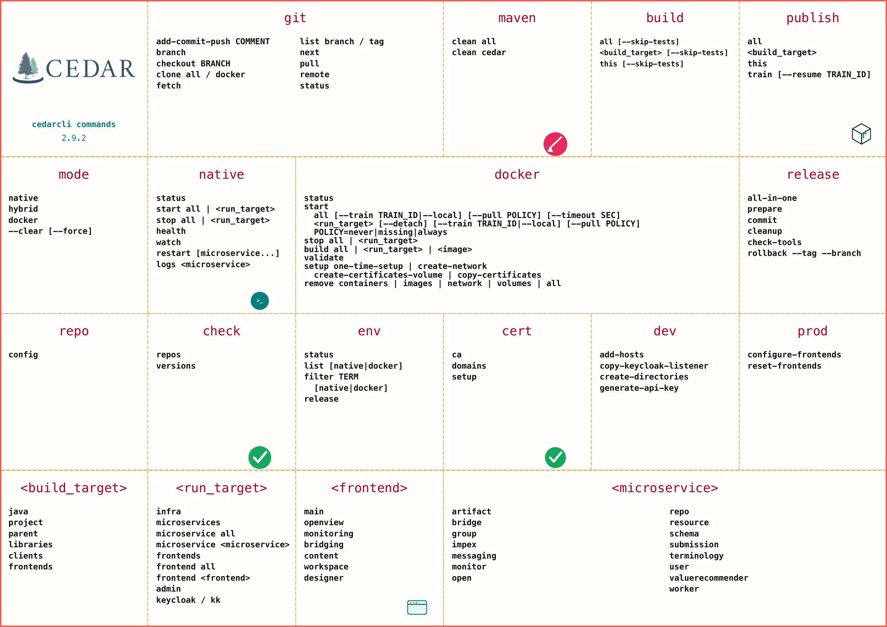

# CEDAR CLI and Scripts

## Overview
The CEDAR system is relatively complex: it uses 15 microservices, seven frontends and seven infrastructure services.

Orchestrating the startup, shutdown, rebuild of this system would be a heavy burden if only shell commands were to be used.

### CEDAR-CLI
In order to make the developer's life easier, we created a command line interface that centralizes all the commands. This tool will help the user to easily handle the tasks that will be performed during the development and deployment.

### Environment variables

CEDAR profiles express installation configuration as environment variables. After you select
`native`, `hybrid`, or `docker` with `cedarcli mode`, the CLI loads the appropriate profile for each
command. A bare shell therefore needs `CEDAR_HOME` and the `cedarcli` alias, but it does not need to
export the complete CEDAR profile itself.

There are many CEDAR variables because they configure the infrastructure, microservices, frontend
routes, build system, and releases. Use the safe `cedarcli env` commands below to inspect the
effective values; credential values are redacted.

## cedar-cli

### Install `cedar-cli`
Install `cedar-cli` by executing the following script:

```sh
export CEDAR_HOME=~/CEDAR

cd ~/CEDAR
git clone https://github.com/metadatacenter/cedar-cli

cd cedar-cli
git checkout develop

python -m venv ./.venv
source .venv/bin/activate
pip install -r requirements.txt

python -m pip install --upgrade pip
```

### Configure `CEDAR_HOME` and `cedarcli` alias

```sh
vi ~/.zshrc
```

Add these lines:

```sh
export CEDAR_HOME=~/CEDAR
alias cedarcli='source $CEDAR_HOME/cedar-cli/cli.sh'
```

### Check bash profile content

At this point, your `~/.zshrc` should contain these lines:

```sh
export PATH=$(brew --prefix)/opt/openssl@1.1/bin:$PATH

export PATH="$HOME/.jenv/bin:$PATH"
eval "$(jenv init -)"

export CEDAR_HOME=~/CEDAR
alias cedarcli='source $CEDAR_HOME/cedar-cli/cli.sh'
```

If you are installing on a system where `Python 3` CLI is available as `python3` instead of `python`, use this alternative instead:

```sh
alias cedarcli='source $CEDAR_HOME/cedar-cli/cli3.sh'
```

## cedar-cli commands

This is the list of the available commands in cedarcli:



## Install the scripts

???+ warning "Important"

    The steps in this section are crucial for the proper installation of CEDAR.
    
    Please execute these steps with great care.

### Copy the helper scripts in place

There are three files that hold configuration that could/should be changed during development.
You need to copy these files from the just cloned repo into CEDAR home folder. There you can make modifications to these files.

These files are the following: 

| Filername                       | Content                                                                                     |
|---------------------------------|---------------------------------------------------------------------------------------------|
| set-env-internal.sh             | Local infrastructure service connection usernames and password.                             |
| set-env-external.sh             | Usernames, passwords and other connection data to remote systems that CEDAR integrates with.|
| cedar-profile-native-develop.sh | Bash profile extension for local development.                                               |

Please copy these files from the recently cloned repo to their final location:

```sh
cd ${CEDAR_HOME}
cp cedar-development/bin/templates/set-env-internal.sh .
cp cedar-development/bin/templates/set-env-external.sh .
cp cedar-development/bin/templates/cedar-profile-native-develop.sh .
```

### Check the repository inventory

```sh
cedarcli check repos
```

The command checks the repository inventory selected by the current profile. It exits nonzero when
a configured repository is missing. Extra top-level Git clones are listed separately as warnings;
ordinary files and working directories under `$CEDAR_HOME` are intentionally ignored.

### Change the environment variable values

???+ success "Optional"

    This step is optional. On a development machine it is totally acceptable to use the predefined user names, and `changeme` as password for all the systems.
    
    You would definitely change the password for a production system.

If you prefer, you can change the password values, or even the username values in `${CEDAR_HOME}/set-env-internal.sh`.
Please do not change the other two files at this moment.

???+ warning "Important - Remember usernames and passwords"

    If you decide to change the passwords and/or usernames, please remember that you will need to set the usernames and passwords later, when you install the infrastructure services for CEDAR.

???+ warning "Important - Preexisting connection data"

    If you have a system already installed onto your system (for instance you have `MongoDB`), and you wish to reuse an existing privileged user for CEDAR, please change the corresponding values in `${CEDAR_HOME}/set-env-internal.sh`.
    
    In this case you would change the following lines:
    ```sh
    export CEDAR_MONGO_ROOT_USER_NAME="mongoRootUser"
    export CEDAR_MONGO_ROOT_USER_PASSWORD="changeme"   
    ```

## Source shell scripts

Please edit your `bash profile`:

```sh
vi ~/.zshrc
```
and add the following line to it:
```sh
source ${CEDAR_HOME}/cedar-profile-native-develop.sh
```

???+ warning "Important"

    Check your setup at this point.
    Please close your shells, and start a new one.
    
    Execute the following:
    ```sh
    gocedar
    ```

    You should be taken to the previously created `CEDAR` directory

### CEDAR development shell environment

Please make sure, that during this installation, and later during development you always use a shell where the `CEDAR_HOME` is set, and the above-mentioned script is sourced.

If you are using a terminal with multiple profile support (e.g. iTerm), make sure the active profile has the `CEDAR` environment set.

## Inspect the Effective Environment

CEDAR profiles contain the addresses, ports, credentials, and other settings used by the running
topology. `cedarcli env` inspects the profile selected by `cedarcli mode`; it does not merely repeat
whatever happened to be exported in the calling shell.

Start with a concise summary:

```sh
cedarcli env status
```

This shows the selected mode, profile path, host and network, plus Docker image information when
applicable. It never prints credentials.

List or search the effective CEDAR variables with:

```sh
cedarcli env list
cedarcli env filter WORKER
```

Password, secret, token, private-key, credential, and API-key values are always displayed as
`<redacted>`. In hybrid mode, native frontend processes and the Docker backend use separate
profiles, so select the surface explicitly:

```sh
cedarcli env list native
cedarcli env list docker
cedarcli env filter HOST native
cedarcli env filter HOST docker
```

The release-specific view remains available as `cedarcli env release`. It reports whether the
release and next-development version inputs are present. The former `env core` command has been
removed; `env status` is its mode-aware replacement.

## Check deployment status

CEDAR has separate status commands for native and Docker deployments:

```sh
cedarcli native status
cedarcli docker status
```

`cedarcli native status` first reports the applications managed by the native process controller,
then checks the expected host ports for the microservices, infrastructure services, and frontends.
This broader view also identifies pre-existing services such as MongoDB or MySQL that may already
be using ports required by CEDAR.

`cedarcli docker status` checks the Compose services and routes expected by the currently selected
Docker deployment mode. Native host-port checks are not sufficient for Docker because some
container ports are deliberately private to the Docker network.

## Startup and stop scripts

There are start and stop scripts available for each service that is present in the CEDAR ecosystem.

As an example starting and stopping `MongoDB` after a brew installation would be done with:

???+ warning "Important - Not yet working at this moment"

    The examples below won't work at this phase of the installation process, they are just listed as an explanation. 


```sh
brew services start mongodb-community@5.0
brew services stop mongodb-community@5.0
```

In the CEDAR environment we have these aliases for simplicity:

```sh
startmongo
stopmongo
```


### List of startup scripts
A non-exhaustive list of the start aliases is as follows

* Infrastructure
```sh
startmongo
startneo
startmysql
startsearch
startredis
startnginx
startkk
```

* Microservices
```sh
startmessaging
startgroup
startrepo
startresource
startschema
startartifact
startterminology
startuser
startvaluerecommender
startsubmission
startworker
startopenview
startinternals
```
* Frontend
```sh
starteditor
```

### List of stop scripts
For each start script/alias there is a corresponding stop script (with some exceptions).
We will not enumerate all these.
The full list of aliases available can be listed using:

```sh
alias
```

## cedarcli git commands

During development, it is needed, that the same git operation is executed on all the repos.
This can be done one by one on all the CEDAR repos.
We have a set of commands that can help the developer with these tasks.  

The following commands can be executed from anywhere, they will use the `CEDAR_HOME` to define the working directory for the underlying git commands.

### Git status

```sh
cedarcli git status
```

### Git pull

```sh
cedarcli git pull
```

### Go to next repo with changes
This is especially usefull during the end-of-day check-in process. This commands changes the directory into the next repo which needs attention:
```sh
cedarcli git next
```

### Important env variable
CEDAR uses some private documentation repos as well, which are not crucial for the deployment of the application.
However, these are included in the list handled by `cedarcli`.

To disregard these repos in case you don't have access to them, set the `CEDAR_DEV_USE_PRIVATE_REPOS` env variable to anything but `true`:
```sh
vi ~/.zshrc
```

Add:
```
export CEDAR_DEV_USE_PRIVATE_REPOS=false
```


### Checkout a given branch
```sh
cedarcli git checkout <branchname>
```

### List the active branches
```sh
cedarcli git branch
```

### Fetch changes
```sh
cedarcli git fetch
```

### List remotes
```sh
cedarcli git remote
```

### List newest local and remote branches
```sh
cedarcli git list branch
```

### List newest local and remote tags
```sh
cedarcli git list tag
```

### Switch to branch
```sh
cedarcli git branch <branchname>
```

### Add-commit-push all repos
```sh
cedarcli git add-commit-push COMMENT
```
