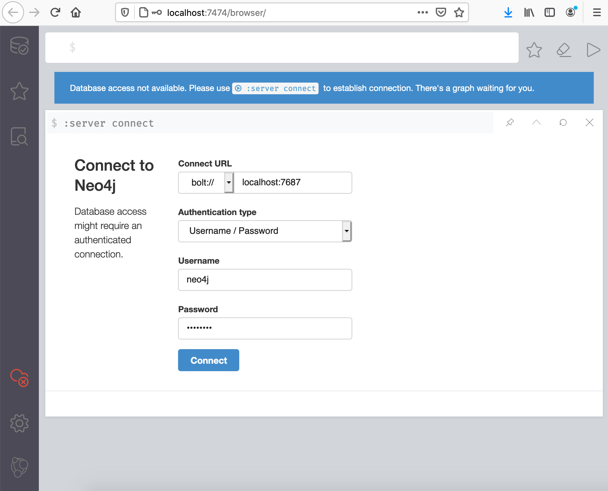
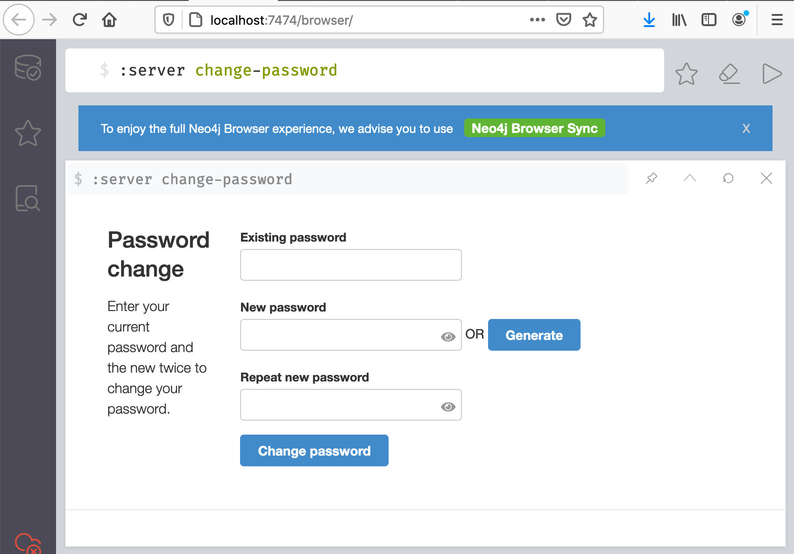

# Infrastructure Services

## MongoDB
CEDAR uses `MongoDB` as the storage for the CEDAR artifacts: fields, elements, templates and metadata instances.

### Install MongoBD

Please install `MongoDB Community`, version 5.0:

```sh
brew tap mongodb/brew
brew install mongodb-community@5.0
```

And pin this version:

```sh
brew pin mongodb-community@5.0
```

???+ warning "Important"
    
    Do not add MongoDB as a background service! We will have scripts in place which will start it when necessary.

    **Do not start MongoDB at this point!**

### Start MongoDB without access control
In order to have secure access to MongoDB, we will create a privileged user, a dedicated CEDAR user, and we will turn on access control.

First, we will create a power user. You will need to start MongoDB without access control from the command line.

Please replace the path below with the one applicable to your system:

```sh
$(brew --prefix)/Cellar/mongodb-community@5.0/5.0.<patch_version>/bin/mongod \
  --port 27017 \
  --dbpath $(brew --prefix)/var/mongodb
```

### Create privileged user
Once mongoDB is started, in a different terminal connect to it:

```sh
$(brew --prefix)/Cellar/mongodb-community@5.0/5.0.<patch_version>/bin/mongo
```

In this new terminal use the `admin` collection and create a privileged user:

```js
use admin

db.createUser(
  {
    user: "mongoRootUser",
    pwd: "changeme",
    roles: [ { role: "root", db: "admin" } ]
  }
)

exit
```

Close this terminal, and stop the running MongoDB by pressing ++ctrl++ + C.

### Start MongoDB with access control
```sh
startmongo
```

### Create CEDAR application user
Connect to MongoDB with the previously created user:
```sh
$(brew --prefix)/Cellar/mongodb-community@5.0/5.0.<patch_version>/bin/mongo \
  --port 27017 \
  --username "mongoRootUser" \
  --password "changeme" \
  --authenticationDatabase "admin"
```

Create the user:
```js
use cedar

db.createUser(
  {
   user: "cedarMongoUser",
   pwd: "changeme",
   roles: [ "readWrite"]
  })

exit
```

### Restart MongoDB
```sh
stopmongo
startmongo
```

### Check MongoDB status
```sh
cedarcli status
```

You should see the following line in the output:
```
│ MongoDB                │ ✅     │ 27017 │               │
```

## OpenSearch
CEDAR uses `OpenSearch` to make search for artifacts possible.

### Install OpenSearch

Please install `OpenSearch`, version 2.18:

```sh
brew install opensearch
```

And pin this version:

```sh
brew pin opensearch
```
    
???+ warning "Important"

    Do not add OpenSearch as a background service! We will have scripts in place which will start it when necessary.

    **Do not start OpenSearch at this point!**
 
### Configure OpenSearch

```sh
vi $(brew --prefix)/etc/opensearch/opensearch.yml
```

Around `line #17`, change the cluster name configuration:

```
cluster.name: opensearch_cedar
```

### Start OpenSearch

```sh
startsearch
```

### Check OpenSearch status
```sh
cedarcli status
```

You should see the following lines in the output:
```
│ OpenSearch-REST        │ ✅     │ 9200  │               │
│ OpenSearch-Transport   │ ✅     │ 9300  │               │
```

## MySql
CEDAR uses `MySql` as the backend for Keycloak as well as storage for messages and logs.

### Install MySql

Please install `MySql`, version 9.1.0:

```sh
brew install mysql
```

And pin this version:

```sh
brew pin mysql
```
    
???+ warning "Important"

    Do not add MySql as a background service! We will have scripts in place which will start it when necessary.

### Start MySql
```sh
startmysql
```

### Check MySql status
```sh
cedarcli status
```

You should see the following line in the output:
```
│ MySQL                  │ ✅     │ 3306  │               │
```

### Secure MySql server
```sh
$(brew --prefix)/Cellar/mysql/9.1.<minor_version>/bin/mysql_secure_installation
```

If you get a 'Column count' error, you will need to run the following command first:

```sh
sudo $(brew --prefix)/Cellar/mysql/8.0.<minor_version>/bin/mysql_upgrade
```

Respond to the questions as follows:

| Question                                          | Answer   |
|---------------------------------------------------|----------|
| Would you like to setup VALIDATE PASSWORD plugin? | N        |
| New password:                                     | changeme |
| Re-enter new password:                            | changeme |
| Remove anonymous users?                           | Y        |
| Disallow root login remotely?                     | Y        |
| Remove test database and access to it?            | Y        |
| Reload privilege tables now?                      | Y        |

### Create CEDAR application users
Connect to the running MySql server

```sh
$(brew --prefix)/Cellar/mysql/9.1.<minor_version>/bin/mysql -uroot -p
```

Execute the below three groups of statements in order to create MySql databases and corresponding users for the different components of CEDAR: 
```sql
CREATE DATABASE IF NOT EXISTS `cedar_keycloak`;
CREATE USER 'cedarMySQLKeycloakUser'@'localhost' IDENTIFIED BY 'changeme';
GRANT ALL PRIVILEGES ON cedar_keycloak.* TO 'cedarMySQLKeycloakUser'@'localhost';
```

```sql
CREATE DATABASE IF NOT EXISTS `cedar_messaging`;
CREATE USER 'cedarMySQLMessagingUser'@'localhost' IDENTIFIED BY 'changeme';
GRANT ALL PRIVILEGES ON cedar_messaging.* TO 'cedarMySQLMessagingUser'@'localhost';
```

```sql
CREATE DATABASE IF NOT EXISTS `cedar_log`;
CREATE USER 'cedarMySQLLogUser'@'localhost' IDENTIFIED BY 'changeme';
GRANT ALL PRIVILEGES ON cedar_log.* TO 'cedarMySQLLogUser'@'localhost';
```
Flush privileges and quit:

```sql
FLUSH PRIVILEGES;
quit
```

## Redis
CEDAR uses `Redis` to implement a message queue for communication between components of the system.

### Install Redis

Please install `Redis`, version 7.2:

```sh
brew install redis@7.2
```

And pin this version:

```sh
brew pin redis@7.2
```
    
???+ warning "Important"

    Do not add Redis as a background service! We will have scripts in place which will start it when necessary.

### Start Redis
```sh
startredis
```

### Check Redis status
```sh
cedarcli status
```

You should see the following line in the output:
```
│ Redis-persistent       │ ✅     │ 6379  │               │
```

## Neo4j
CEDAR uses `Neo4j` as storage for the following artifacts of CEDAR:

- users
- groups
- categories
- permissions
    

### Install Neo4j

Please install `Neo4j Community Edition`, version 5.4.0:

???+ warning "Important"

    Do not install Neo4j from a binary. We want to allow usage of `APOC` which will be possible if we install Neo4j from a zip.

Download the package from the distribution site:

```sh
gocedar
wget https://dist.neo4j.org/neo4j-community-5.26.0-unix.tar.gz
# or
wget https://dist.neo4j.org/neo4j-community-5.26.0-windows.zip
```

Once the package is downloaded, unpack it and rename it:

```sh
tar -xvf neo4j-community-5.26.0-unix.tar.gz
mv neo4j-community-5.26.0 neo4j
```

???+ warning "Important"

    Do not start Neo4j yet. We need to set the initial password first.

### Enable APOC procedures

Move ```apoc-5.26.0-core.jar``` from ```labs``` to ```plugins```:

```sh
mv $CEDAR_HOME/neo4j/labs/apoc-5.26.0-core.jar $CEDAR_HOME/neo4j/plugins/. 
```

Edit the config, and enable the procedures:
```sh
vi $CEDAR_HOME/neo4j/conf/neo4j.conf 
```
Add this line:
```
dbms.security.procedures.unrestricted=algo.*,apoc.*
```


### Set password for the neo4j user

Neo4j server uses a default username, 'neo4j'. We will change the password for this user before we start the server.

Execute the following:

```sh
${CEDAR_NEO4J_HOME}/bin/neo4j-admin dbms set-initial-password changeme
```

### Start Neo4j

```sh
startneo
```

### Check Neo4j status
```sh
cedarcli status
```

You should see the following line in the output:
```
│ Neo4j                  │ ✅     │ 7474  │               │
```


### Check the connection

Connect to the Administrative UI of Neo4j.

Using your browser open: [http://localhost:7474/](http://localhost:7474/)

You will see a page resembling the image below:



Please fill in the form according to these values:

| Question             | Answer                |
|----------------------|-----------------------|
| Connect URL          | bolt://localhost:7687 |
| Authentication type: | Username / Password   |
| Username:            | neo4j                 |
| Password             | changeme              |

You should be able to log in to the system.

### Troubleshooting

#### Default password
If by mistake you started `neo4j` before changing the initial password, the password for user `neo4j` will be set to `neo4j`

Log in with this default password. You will be prompted to change it. Change it to `changeme`.

#### Change password
If at any time you decide to change the password for the `neo4j` user, log in to the admin UI, and type

```
:server change-password
```

into the top console line, as seen on this picture:



You will be able to change your password.

## Keycloak

### Overview

Keycloak plays a central role in the CEDAR infrastructure, as it provides the authentication for the frontend.
It also allows social login, in integration with other Authentication Providers.

Once set up, the developer can 'forget' about Keycloak, it will just silently work.

However, setting it up properly is somewhat more complicated than the other components of the infrastructure.

### Download Keycloak

We will download and unpack the `Keycloak` distribution.

#### Download Keycloak

Please install `Keycloak`, version 22.0.5:

Download the package from the distribution site:

```sh
gocedar
wget https://github.com/keycloak/keycloak/releases/download/22.0.5/keycloak-22.0.5.tar.gz
```

???+ success "Alternative download"

    Alternatively, you could download Keycloak using your browser, navigating to
    [https://www.keycloak.org/archive/downloads-22.0.5.html](https://www.keycloak.org/archive/downloads-22.0.5.html).
    
    Please save the archive into `CEDAR_HOME` if you choose this method/

#### Unpack and rename Keycloak Directory

Once the package is downloaded, unpack it and rename it:

```sh
tar -xvf keycloak-22.0.5.tar.gz
mv keycloak-22.0.5 keycloak
rm keycloak-22.0.5.tar.gz
```

### Install Keycloak event listener

The CEDAR system needs to be notified every time when a login request is performed against the Keycloak authentication module.

In order to accomplish this, we have an event listener in place.
This even lister part of the CEDAR code base, and can be found in the `cedar-keycloak-event-listener` repo.

You will need to install this event listener under `Keycloak`

Ideally this event listener should be updated all the times when a CEDAR build is performed.
However, if there are no changes in the CEDAR codebase which will have an effect on the event listener, it is ok not to update the event listener.

#### Deploy the event listener JAR

The following command will copy the event listener into it's proper location:
```sh
cedarcli dev copy-keycloak-listener
```

You can execute this command from any location. This command copies the event listener JAR `cedar-keycloak-event-listener.jar` from `$CEDAR_HOME/cedar-keycloak-event-listener/target/` to `${CEDAR_KEYCLOAK_HOME}/providers/`.


???+ warning "Deploy event listener"

    Please deploy the event listener every time a change in its code is performed.
    
    Also please deploy it after each CEDAR release update.

### Install CEDAR Keycloak theme

Keycloak lets user customize the registeration and login experience by allowing the default theme to be overridden.

The CEDAR Keycloak theme can be found in the `${CEDAR_HOME}/cedar-development/os-mirror/development-macos/CEDAR_HOME/keycloak/themes/cedar-03/` directory.

#### Copy the theme files

```sh
mkdir ${CEDAR_KEYCLOAK_HOME}/themes/cedar-03/
cp -r ${CEDAR_HOME}/cedar-development/os-mirror/development-macos/CEDAR_HOME/keycloak/themes/cedar-03/* \
  ${CEDAR_KEYCLOAK_HOME}/themes/cedar-03/
```

### Configure Keycloak

In order for Keycloak to use MySQL database, use right certificates and host name, please copy the pre-packaged config file over the existing one:
```sh
mv ${CEDAR_KEYCLOAK_HOME}/conf/keycloak.conf ${CEDAR_KEYCLOAK_HOME}/conf/keycloak.conf.original
cp ${CEDAR_HOME}/cedar-development/os-mirror/development-macos/CEDAR_HOME/keycloak/conf/keycloak.conf ${CEDAR_KEYCLOAK_HOME}/conf/. 
```

##### Apply the changes
Run:
```sh
${CEDAR_KEYCLOAK_HOME}/bin/kc.sh build
```
so the changes will be applied.

### Set up CEDAR realm

Keycloak groups the settings and users of an organization under realms.

Setting up a realm is not trivial, so instead of guiding the user through the UI of Keycloak, we created a CEDAR realm that can be imported into Keycloak easily.

The CEDAR Keycloak realm can be found in the `${CEDAR_HOME}/cedar-util/keycloak/realm/` directory.

#### Import CEDAR realm

You will need the `MySql` server running for this step. Check if it is already available using `cedarcli status`:

```sh
startmysql
cedarcli status
```

Importing a realm is done by starting `Keycloak` in the import mode
```sh
cd ${CEDAR_HOME}/cedar-development/os-mirror/development-macos/CEDAR_HOME/keycloak/
${CEDAR_KEYCLOAK_HOME}/bin/kc.sh \
  import \
  --file keycloak-realm.CEDAR.development.2023-07-05.json
```

Please monitor the log output for anomalies. Not that this importation process can take several minutes so please wait until it has finished.

Once the logs stopped, you should see the following line:
```
YYYY-mm-dd HH:MM:SS,SSS INFO  [io.quarkus] (main) Keycloak stopped in X.XXXs
``` 

#### Start Keycloak in regular mode

You can start `Keycloak` from now on by executing:

```sh
startkk
```

#### Check Keycloak status
```sh
cedarcli status
```

You should see the following line in the output:
```
│ Keycloak               │ ✅     │ 8080  │               │
```


#### Stop Keycloak

If you need to stop `Keycloak`, do that by:

```sh
killkk
```

The script starts with `kill` to emphasize that actually the process is killed.

#### Export CEDAR realm

???+ success "Export CEDAR realm"

    If at any moment you need to back up your realm, and you do not wish or cannot perform a full database export, you can export the realm as a JSON file.

    This file will contain your realm settings, your users, roles and credentials.

    It will not contain any logs or historical data.
    
    To export the file, you will need to stop `Keycloak`, export the data, and then start it again. 

    ```sh
    killkk
    ```
    ```sh
    ${CEDAR_KEYCLOAK_HOME}/bin/kc.sh export \
      --realm CEDAR \
      --users realm_file \
      --file ${CEDAR_HOME}/keycloak-realm.CEDAR.development.<YOUR-DATE-HERE>.json
    ```

    ```sh
    startkk
    ```

## Nginx

### Overview

Nginx acts as a reverse proxy in front of all CEDAR microservices, frontends, and Keycloak.

As such, each request to CEDAR arrives to `nginx` on the standard `443` `https` port.
Based on the subdomain in the request, `nginx` will forward the request to one of the components.
`Nginx` talks on plain `http` with all the microservices and the frontends.
`Nginx` connects to `Keycloak` using `https`.

#### List of services behind `nginx`
This table summarizes the services that are proxied by `nginx`.
The microservices are ordered in increasing `port` number order, which shows the evolution of CEDAR.

The frontend is delivered differently during development than on production.

???+ success "List of services"

    The table is provided for better understanding of the infrastructure, it is not required for the installation process. 


| Subdomain / <br> repo name | Service type         | Upstream / content on `dev` | Upstream / content on `prod`  | Repo on `dev` / `prod`                 | 
|----------------------------|----------------------|-----------------------------| -----------               |----------------------------------------|
| .                          | Redirect             | `nginx` redirect            |  `nginx` redirect         | N/A                                    |
| cedar                      | Frontend             | `gulp` on 4200              |  `nginx` directory access | cedar-template-editor                  |
| openview                   | Frontend             | `ng serve` on 4220          |  `nginx` directory access | cedar-openview / cedar-opernview-dist  |
| content                    | Content distribution | `ng serve` on 4240          |  `nginx` directory access | cedar-content-distribution             |
| monitoring                 | Frontend             | `ng serve` on 4300          |  `nginx` directory access | cedar-monitoring/cedar-monitoring-dist |
| artifacts                  | Frontend             | `ng serve` on 4320          |  `nginx` directory access | cedar-artifacts/cedar-artifacts-dist |
| bridging                   | Frontend             | `ng serve` on 4340          |  `nginx` directory access | cedar-bridging/cedar-bridging-dist |
| auth                       | Keycloak             | 8443                        |  8443                     | N/A                                    |
| artifact                   | Microservice         | java on 9001                |                           | cedar-artifact-server                  |
| repo                       | Microservice         | java on 9002                |                           | cedar-repo-server                      |
| schema                     | Microservice         | java on 9003                |                           | cedar-schema-server                    |
| terminology                | Microservice         | java on 9004                |                           | cedar-terminology-server               |
| user                       | Microservice         | java on 9005                |                           | cedar-user-server                      |
| valuerecommender           | Microservice         | java on 9006                |                           | cedar-valuerecommender-server          |
| resource                   | Microservice         | java on 9007                |                           | cedar-resource-server                  |
| impex                      | Microservice         | java on 9008                |                           | cedar-impex-server                     |
| group                      | Microservice         | java on 9009                |                           | cedar-group-server                     |
| submission                 | Microservice         | java on 9010                |                           | cedar-submission-server                |
| worker                     | Microservice         | java on 9011                |                           | cedar-worker-server                    |
| messaging                  | Microservice         | java on 9012                |                           | cedar-messaging-server                 |
| open                       | Microservice         | java on 9013                |                           | cedar-openview-server                  |
| monitor                    | Microservice         | java on 9014                |                           | cedar-monitor-server                   |
| bridge                     | Microservice         | java on 9015                |                           | cedar-bridge-server                    |

### Install Nginx

Please install `Nginx`, version 1.27.3:

```sh
brew install nginx
```

???+ warning "Important"
    
    Do not add `nginx` as a background service! We will have scripts in place which will start it when necessary.

    **Do not start `nginx` at this point!**

### Configure nginx

Configuring `nginx` for CEDAR would involve a huge amount of editing.

Because of this, we provide ready-made config files that you will need to put in the 
proper place, and link them under the main `nginx` configuration.

???+ success "nginx"

    Once configured, `nginx` will work without any further intervention.
    However, it will be useful to understand what it actually does for CEDAR.

???+ note "nginx config"

    The way of configuring `nginx` for CEDAR could be regarded as not totally aligning with the *nginx-way* (custom directory holding the configs).
    
    However, we decided to go this way for the readability and maintainability.

#### Copy config files and SSL certificates

```sh
cp -R ${CEDAR_DEVELOP_HOME}/os-mirror/development-macos/opt/homebrew/etc/nginx/ \
  $(brew --prefix)/etc/nginx/
```

#### Replace user home folder if needed

???+ warning "Important"
    
    Please observe, that the `nginx` config files do not contain any variable interpolation.
    This is due to `nginx` intentionally not supporting this easily.
    
    If for some reason your `CEDAR_HOME` is not `/Users/cedar-dev/CEDAR/`, please replace this value in all the config files with the proper value from your system.

    ```sh
    cd $(brew --prefix)/etc/nginx/cedar/
    find . -type f -name '*.conf' -exec sed -i '' s/cedar-dev/YOUR_HOME_FOLDER_NAME_HERE/g {} +
    ```

### Start nginx

You can start `nginx` with our dedicated alias.

???+ warning "User password required"

    Since `nginx` listens on a low port (lower than `1024`), it requires your password to start up.
    
    You need necessary privileges to start a listener on a low port.
    If the current user was created as `Administrator` on a Mac, that would be enough. 

#### Starting `nginx` without user password

Entering the user's password in every new shell window could be a disturbance.
You can circumvent this if you add the scripts that `startnginx` and `stopnginx` uses to the `sudoers`.
Edit the `sudoers` file:

```sh
sudo visudo -f /etc/sudoers.d/cedar-dev
```

Add this line to the file:
```sh
cedar-dev ALL=(ALL) NOPASSWD: /Users/cedar-dev/CEDAR/cedar-development/bin/util/services-osx/startnginx.sh,/Users/cedar-dev/CEDAR/cedar-development/bin/util/services-osx/stopnginx.sh
```

???+ warning "Quicker version - username and `CEDAR_HOME`"

    The above assumes that your username is `cedar-dev` and CEDAR is installed under `/Users/cedar-dev/CEDAR/` (value of `${CEDAR_HOME}`)

    If that is not true, change the values in the above command and text

    Alternatively you can execute:

    ```sh
    echo `whoami` 'ALL=(ALL) NOPASSWD:' ${CEDAR_HOME}/cedar-development/bin/util/services-osx/startnginx.sh,${CEDAR_HOME}/cedar-development/bin/util/services-osx/stopnginx.sh 
    ```

    and add the content to the file opened after:
    ```sh
    sudo visudo -f /etc/sudoers.d/cedar-dev
    ```


#### Allow `nginx` to read `CEDAR_HOME`

Nginx will serve static content aside of acting as a reverse proxy. In order to achieve this, it will need read privileges for the full path of the `CEDAR_HOME`.

Please execute the following command to allow it to read your home directory:

```
chmod o+x /Users/cedar-dev/
```

Please replace `cedar-dev` with your own username if you are using a different one!

#### Start `nginx`
```sh
startnginx
```

#### Check `nginx` status
```sh
cedarcli status
```

You should see the following line in the output:
```
│ NGINX                  │ ✅     │ 80    │               │
```

## Set up CEDAR Keycloak administrator

In order to administer Keycloak, you will need to set up an administrator user.
This is a global system-wide Keycloak administrator. It is different than the `cedar-admin` user that you will use to administer CEDAR resources.

### Start Keycloak

```sh
startkk
```

### Access the Administration Console

In your browser navigate to: [http://localhost:8080/](http://localhost:8080/).

### Create administrator user

In the form enter the following values:

| Question                | Answer |
| -----------             | ----------- |
| Username:               | administrator|
|New password:            | changeme|
|Re-enter new password:   | changeme|

Submit the form.

After the user is created, click on the "Administration Console >" link, and log in with your user.

### Stop Keycloak

```sh
killkk
```

## Starting the infrastructure services

### Start the services

```sh
startinfra
```

### Check status

```sh
cedarcli status
```

You should see all the services in the `Infrastructure` (2nd) block in `Running` (✅) status.

If this is not the case, stop the infrastructure services using one of these ways:

* with the `stopinfra` command from another console
* with a single ++ctrl++ + C form the active console.

Then please try running them again. If this does not help, please analyze the output for indications of what went wrong.

### Stop infrastructure services

```sh
stopinfra
```
