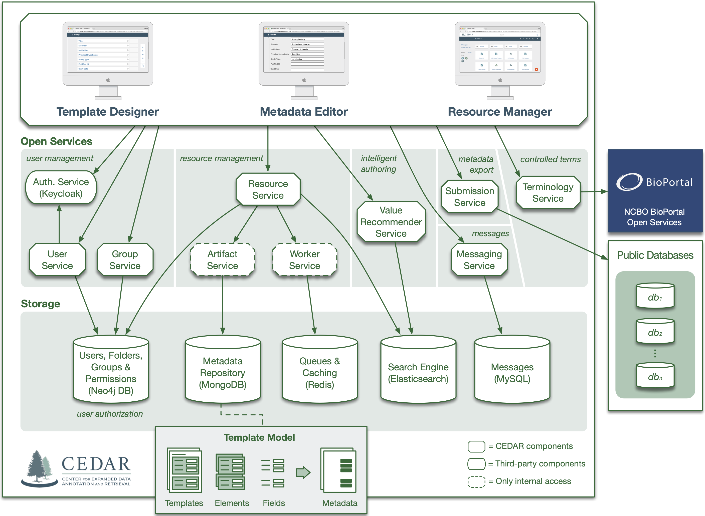

# Developer Install Overview

## Introduction

The CEDAR Developer Team uses `macOS Sonoma` for development.

Of course, the project could be installed to other operating systems as well, and we encourage you to do so.

It is possible that CEDAR would work with other versions as well, but please try to use the software that we specify here. Otherwise we can not guarrantee that the system will work as expected.

## System Architecture

Our system is an open-source, Java microservice-based, REST-heavy system, with one frontend developed in `AngularJS` and five frontends in `Angular`.
The backend is provided by several industry standard storage solutions.
The authentication is based on `Keycloak`. An `nginx` acts as a reverse proxy in front of our services and frontends.

