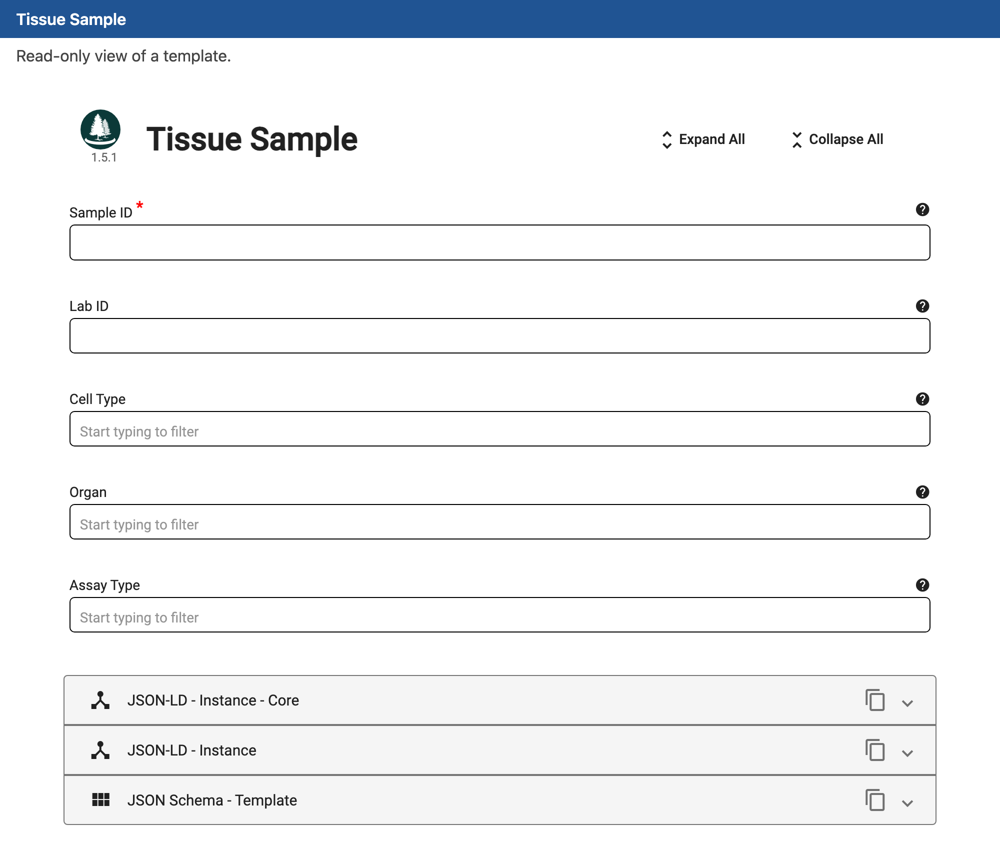
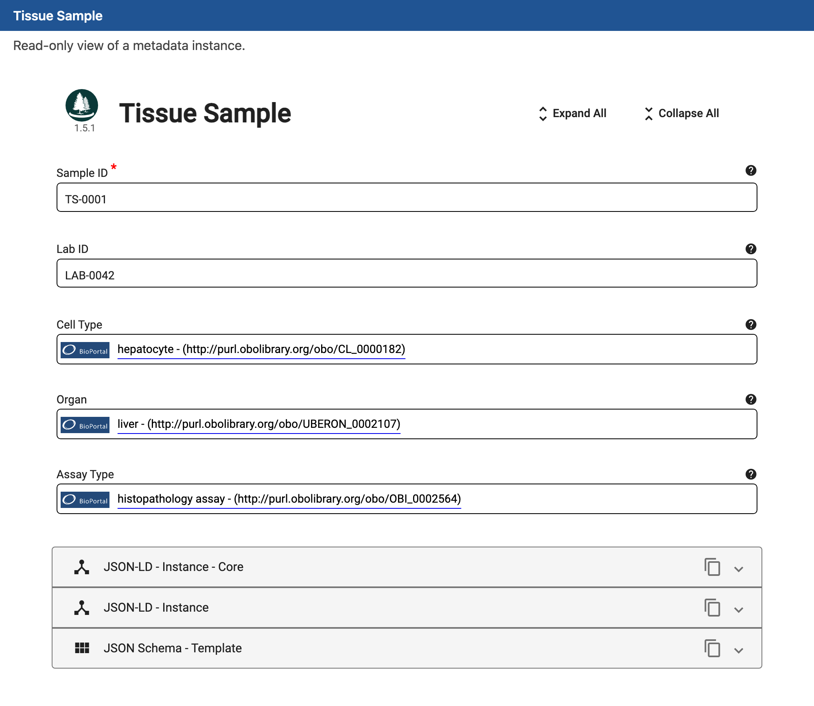

# CEDAR MCPs Tutorial

Good metadata is still made by hand. Someone reads a dataset, its data
dictionary, a protocol, and a paper, then retypes what they learned into a
structured form, choosing a standardized term for each value. It is slow work,
and it is exactly the kind of reading and restructuring that a large language
model does well.

A language model on its own, though, is probably not the best tool for the final step. Ask
one to write a metadata template and it will cheerfully invent field names,
guess ontology identifiers that do not resolve, and emit something that looks
like CEDAR but does not validate. The reasoning is useful. The unaided output is
not trustworthy.

The Model Context Protocol (MCP) closes that gap. An MCP server hands the model a
set of real tools backed by real services. The model still decides what the
template should contain and which vocabularies fit; the servers do the parts that
have to be exact: resolving a name to a genuine ontology IRI, assembling a schema
the CEDAR validator accepts, and rendering that schema as an actual CEDAR form.
This tutorial walks the smallest end-to-end example of that division of labor.

## The Four MCP Servers

Building a template this way touches four different jobs, and no single service
does all of them well. Finding the right ontology term is a search problem
against BioPortal. Turning a design into a valid CEDAR schema is a modeling and
validation problem. Seeing what that schema looks like is a rendering problem.
Keeping and sharing the result is a storage problem. So we built four small MCP
servers, one for each job, and an assistant orchestrates them. Together they
carry a template from a plain-language description all the way to a stored,
standards-based artifact, without the model ever having to invent a schema or an
identifier on its own.

The MCPs are:

- **BioPortal term server**: searches [BioPortal](https://bioportal.bioontology.org)
  and resolves names to real ontology classes and ontologies, each with a
  resolvable IRI.
- **CEDAR artifact server**: builds, validates, and renders CEDAR templates and
  instances as YAML.
- **CEDAR embeddable-editor server**: renders a template or an instance as a form
  in your browser, so you can see what the YAML actually produces.
- **CEDAR REST server**: uploads and manages artifacts on a CEDAR server, so you
  can keep and share what you built.

Setup instructions are in the [Appendix](#appendix-configuring-the-mcp-servers).

## What We Will Build

In this tutorial you build a real piece of CEDAR metadata by conversation alone.
You describe what you want in plain language, and an assistant backed by the four
MCP servers does the rest: it finds the right ontology terms, assembles a valid
template, renders it as a form you can inspect, and fills an instance of it, right
up to an artifact you could store and share. There is no CEDAR Workbench to click
through and no schema to hand-write. That path, from a sentence to a
standards-based artifact, is what we are demonstrating.

Concretely, we build one template, **Tissue Sample**, with two plain identifier
fields and three fields constrained to ontology terms, and then fill one instance
of it. Two companion tutorials do this by hand: the [CEDAR Tutorial](cedar_tutorial.md)
walks through creating folders, templates, and fields in the Workbench, and the
[CEDAR Controlled Term Tutorial](cedar_term_tutorial.md) clicks through the term
picker to constrain fields to ontology terms, using this very Tissue Sample
template. Everything those two
accomplish by pointing and clicking, you accomplish here by describing it in
plain language. You need an assistant with the four servers configured and about
ten minutes.

## Step 1: Describe What You Want

Everything starts with a plain-language request. You do not write YAML; you say
what the template should hold:

> Build a CEDAR template called "Tissue Sample". Give it two plain text fields,
> Sample ID (required) and Lab ID. Then add three fields constrained to ontology
> terms: Cell Type, allowing any term from the Cell Ontology; Organ, allowing any
> organ from Uberon; and Assay Type, allowing three specific assays:
> histopathology, imaging, and microscopy.

Everything after this is the assistant working. It happens in three moves:
resolve the terms, assemble the template, and preview it.

## Step 2: Resolve the Terms

The assistant does not take ontology identifiers from memory. For each controlled
field it asks the BioPortal server, turning the names in your request into real
classes and ontologies. To bind Cell Type to a whole ontology it calls
`find_ontology`; to find the *organ* class in Uberon and the assay classes in OBI
it calls `find_class`, scoped to the right ontology.

Each result carries the identifier the template actually needs. The search for
*organ* in Uberon, for instance, comes back with a resolvable IRI:

```json
{ "class_iri": "http://purl.obolibrary.org/obo/UBERON_0000062",
  "pref_label": "organ",
  "ontology_acronym": "UBERON" }
```

The Cell Ontology resolves to the acronym `CL`, and *histopathology assay* in OBI
resolves to `OBI_0002564`. These are real, dereferenceable IRIs. The model has
looked each one up instead of guessing it, which is the whole reason the finished
template will point at terms that other people and other programs can resolve.

## Step 3: Assemble the Template

With real IRIs in hand, the assistant builds the template on the CEDAR artifact
server. It creates the template, adds each field, and attaches each field's value
constraint. The three controlled fields take three different shapes of
constraint. Cell Type is bound to an entire ontology, Organ to a branch (the
*organ* class and everything beneath it), and Assay Type to a hand-picked list of
classes. The server validates the artifact as it is built, so what comes back is
a well-formed CEDAR template, rendered as YAML:

```yaml
type: template
name: Tissue Sample
description: A tissue-sample record whose fields are constrained to ontology terms.
children:
  - key: sample-id
    type: text-field
    name: Sample ID
    description: Local identifier for this tissue sample
    configuration:
      required: true
  - key: lab-id
    type: text-field
    name: Lab ID
    description: Identifier of the lab that produced the sample
  - key: cell-type
    type: controlled-term-field
    name: Cell Type
    description: "The cell type, from the Cell Ontology"
    datatype: iri
    values:
      - type: ontology
        acronym: CL
        ontologyName: Cell Ontology
        iri: https://data.bioontology.org/ontologies/CL
  - key: organ
    type: controlled-term-field
    name: Organ
    description: "The organ the sample came from, from Uberon"
    datatype: iri
    values:
      - type: branch
        ontologyName: Uber Anatomy Ontology
        acronym: UBERON
        termLabel: organ
        iri: http://purl.obolibrary.org/obo/UBERON_0000062
        maxDepth: 0
  - key: assay-type
    type: controlled-term-field
    name: Assay Type
    description: "How the sample was analyzed, from OBI"
    datatype: iri
    values:
      - type: class
        label: histopathology assay
        acronym: OBI
        termType: class
        termLabel: histopathology assay
        iri: http://purl.obolibrary.org/obo/OBI_0002564
      - type: class
        label: imaging assay
        acronym: OBI
        termType: class
        termLabel: imaging assay
        iri: http://purl.obolibrary.org/obo/OBI_0000185
      - type: class
        label: microscopy assay
        acronym: OBI
        termType: class
        termLabel: microscopy assay
        iri: http://purl.obolibrary.org/obo/OBI_0002119
```

Read down the `children` and you can see the request answered field by field: two
plain `text-field`s, then three `controlled-term-field`s whose `values` hold the
three constraint shapes, each pointing at an IRI the BioPortal server returned in
Step 2. This is compact CEDAR YAML. CEDAR also mints a stable `@id` for the
template, omitted here for readability.

## Step 4: Preview the Template

YAML is exact but hard to picture. The embeddable-editor server renders the
template as the CEDAR form it describes, opened read-only in your browser, so you
can check the design before saving anything. The assistant calls `show_template`
and returns a link:



The red asterisk marks Sample ID as required. Cell Type, Organ, and Assay Type
render as ontology-backed pickers, each inviting you to "Start typing to filter"
its allowed terms. The panels at the bottom expose the very same template as
JSON-LD and as JSON Schema, the standards-based forms CEDAR speaks natively.

## Step 5: Fill an Instance

A template is a blueprint. The metadata you keep are *instances* of it, one per
sample. Ask the assistant to fill one:

> Create an instance of that template: Sample ID TS-0001, Lab ID LAB-0042, Cell
> Type hepatocyte, Organ liver, Assay Type histopathology assay.

The assistant resolves the three controlled values through BioPortal again
(*hepatocyte* to a Cell Ontology class, *liver* to a Uberon class,
*histopathology assay* to its OBI class), builds the instance on the artifact
server, validates it against the template, and renders it:

```yaml
type: instance
name: Tissue Sample TS-0001
isBasedOn: https://repo.metadatacenter.org/templates/940fa702-460a-4880-846d-d22cc168ea11
children:
  sample-id:
    value: TS-0001
  lab-id:
    value: LAB-0042
  cell-type:
    id: http://purl.obolibrary.org/obo/CL_0000182
    label: hepatocyte
  organ:
    id: http://purl.obolibrary.org/obo/UBERON_0002107
    label: liver
  assay-type:
    id: http://purl.obolibrary.org/obo/OBI_0002564
    label: histopathology assay
```

Notice the difference between the two kinds of value. Sample ID and Lab ID are
plain strings. The three controlled fields are `id` and `label` pairs, where the
`id` is a real ontology IRI and the `label` is the human-readable term it stands
for. `isBasedOn` links the instance back to the template it was filled from.

Preview it the same way, with `show_instance`:



Each controlled value carries a BioPortal badge and shows its IRI. That is the
whole point. The instance stores *hepatocyte* as `CL_0000182`, not as the loose
word "hepatocyte", so the value means the same thing to every reader and every
program that encounters it.

## Save to CEDAR

Everything so far has happened locally, on your machine and in your browser,
without touching a server. When you want to keep what you built and let others
find, fill, and reuse it, the CEDAR REST server uploads the template and the
instance to a CEDAR account. It takes the same YAML you already have. That step
is optional, and this tutorial stops short of it: the aim here is the
construction, not the storage.

## What Just Happened

The work split cleanly in two. The model supplied the judgment: which fields the
template needs, which vocabularies fit them, and which shape of constraint each
field should take. The servers supplied the ground truth: real IRIs from
BioPortal, a valid schema and a valid instance from the CEDAR artifact server,
and a faithful rendering from the embeddable editor. Neither half is enough
alone. The model without the servers invents identifiers; the servers without the
model have nothing to assemble.

Because the workflow is a conversation over reusable tools rather than a one-off
script, the same method retargets to any study. Change the description of what you
want, keep the approach, and the servers keep the output honest.

## Appendix: Configuring the MCP Servers

Each server is a standalone MCP server that your assistant launches over stdio.
You register the four in your client's MCP configuration once. The shape is the
same across MCP-capable clients (Claude Desktop, Claude Code, and others); the
launch command and paths depend on how you installed each server. A
representative configuration:

```json
{
  "mcpServers": {
    "bioportal-term": {
      "command": "uv",
      "args": ["--directory", "/path/to/bioportal-term-mcp", "run", "bioportal-term-mcp"],
      "env": { "BIOPORTAL_API_KEY": "your-bioportal-api-key" }
    },
    "cedar-artifact": {
      "command": "java",
      "args": ["-jar", "/path/to/cedar-artifact-mcp.jar"]
    },
    "cedar-cee": {
      "command": "java",
      "args": ["-jar", "/path/to/cedar-cee-mcp.jar"]
    },
    "cedar-artifact-rest": {
      "command": "java",
      "args": ["-jar", "/path/to/cedar-artifact-rest-mcp.jar"],
      "env": {
        "CEDAR_API_KEY": "your-cedar-api-key",
        "CEDAR_BASE_URL": "https://your-cedar-server"
      }
    }
  }
}
```

A few notes on credentials:

- `BIOPORTAL_API_KEY` comes from your BioPortal account and lets the term server
  query BioPortal.
- The artifact and embeddable-editor servers need no credentials. One builds,
  validates, and renders locally; the other renders locally in your browser.
- The REST server needs a CEDAR API key and the base URL of your CEDAR server. It
  is required only if you save artifacts, as in [Save to CEDAR](#save-to-cedar).

After adding the block, restart your client. The assistant then has the tools
this tutorial used, from `find_class` and `set_branch_constraint` to
`show_template`, ready to call.
