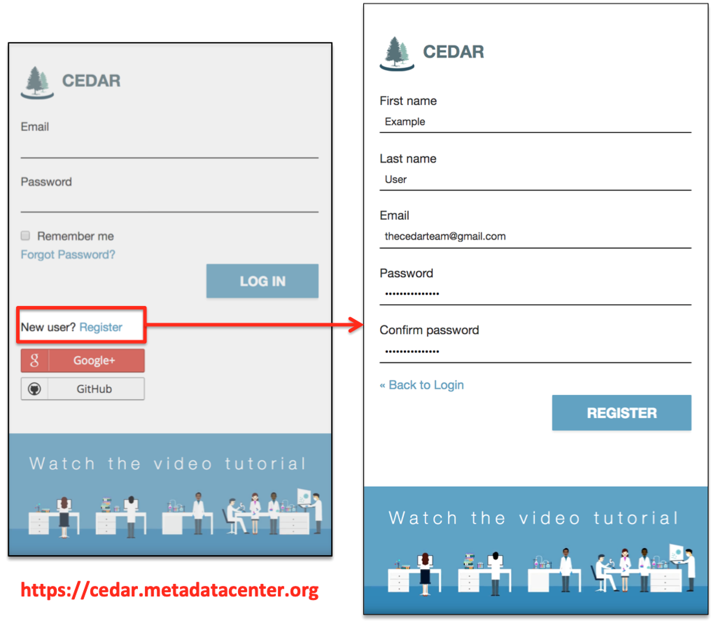
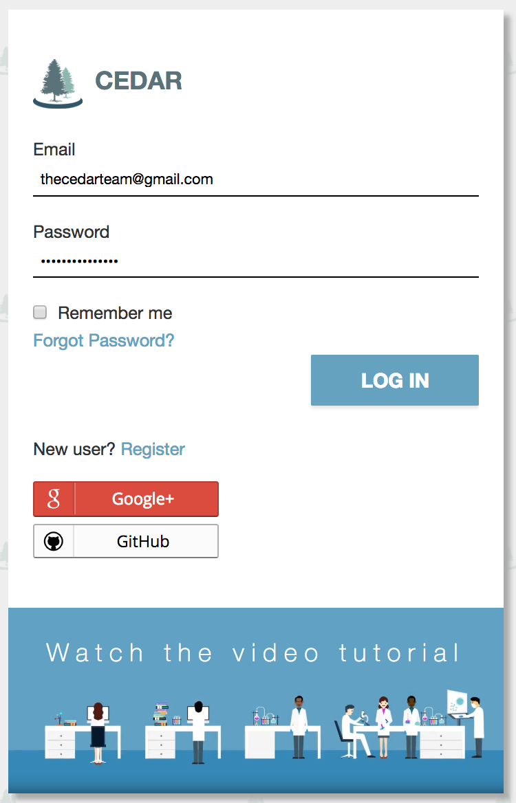

# Accounts and Logging In

## Creating a CEDAR Account

Using the CEDAR Workbench starts with a free account. Go to
[cedar.metadatacenter.org](https://cedar.metadatacenter.org "CEDAR Workbench") and click the
**Register** link below the password field.

Enter your first name, last name, a working email address, and a password. Your first and last
name become the label on your user folder, so choose what you want others to see. If you are
creating a second account, give it a different name from the first, so you can tell the two
apart in CEDAR.

Click **REGISTER**. CEDAR emails a validation link to the address you gave, usually within a
few minutes. If it does not arrive, check your spam folder or resend it from the registration
screen. Click the link to finish creating the account.

{:width="75%" class="centered"}

## Logging In to CEDAR

To sign in, return to [cedar.metadatacenter.org](https://cedar.metadatacenter.org "CEDAR
Workbench") and enter your email and password. If you have forgotten your password, use the
**Forgot Password?** link below the password field. Once you sign in, you arrive at your CEDAR
workspace.

{:width="50%" class="centered"}
