# Advanced Template Topics

CEDAR Metadata Templates—all CEDAR templating resources—are really modeling tools. 
These tools define what information is important to collect, 
what that information means (in terms a computer can understand and analyze),
and how that information is organized and internally connected.

## Extending a Template (adding fields)

We're sorry, this resource has not yet been developed. 
You are welcome to contribute to its development at the link below.

### Introduction

### How to Extend a Template

make a copy

rename appropriately

add a comment (optional)

### Letting Users Add Their Own Fields

simple as using the Attribute-Value field type

doesn't really create a new specification

### Creating an Extended Specification

many specifications are extended for additional uses (sometimes called profiling, alas)

after basic steps, add your desired field, at end or (for eximple templates) inline

if you want inline but inside an element are used, 
they would have to be extended themselves

## More Semantics

We're sorry, this resource has not yet been developed. 
You are welcome to contribute to its development at the link below.

### Characterizing your templating artifact

### Relating your Element or Field to its parent

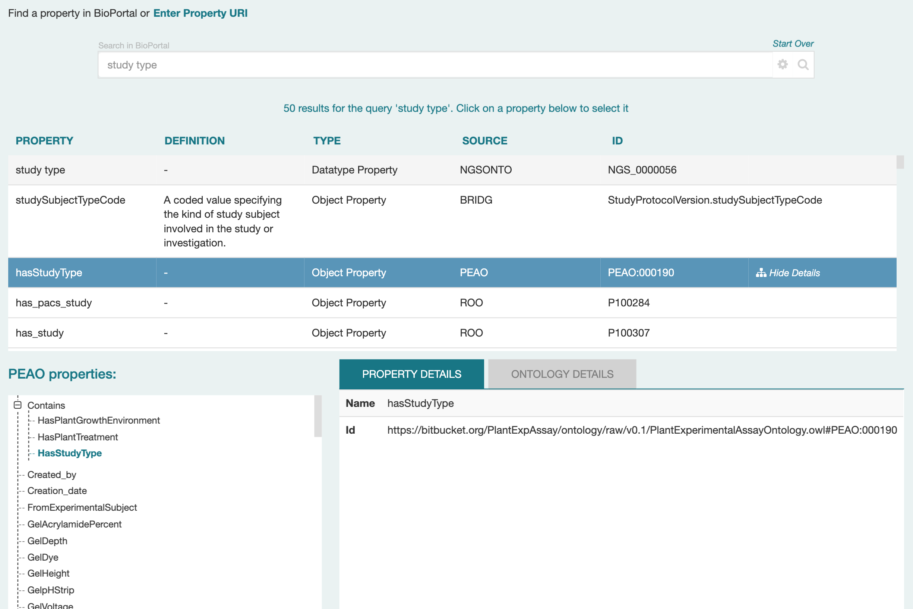{:width="60%" class="centered"}

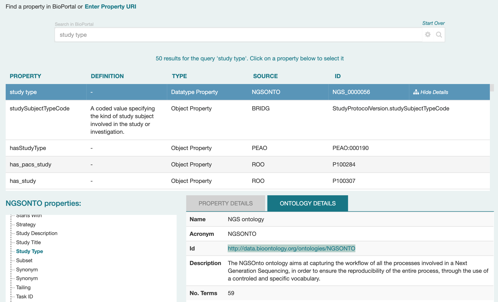{:width="60%" class="centered"}

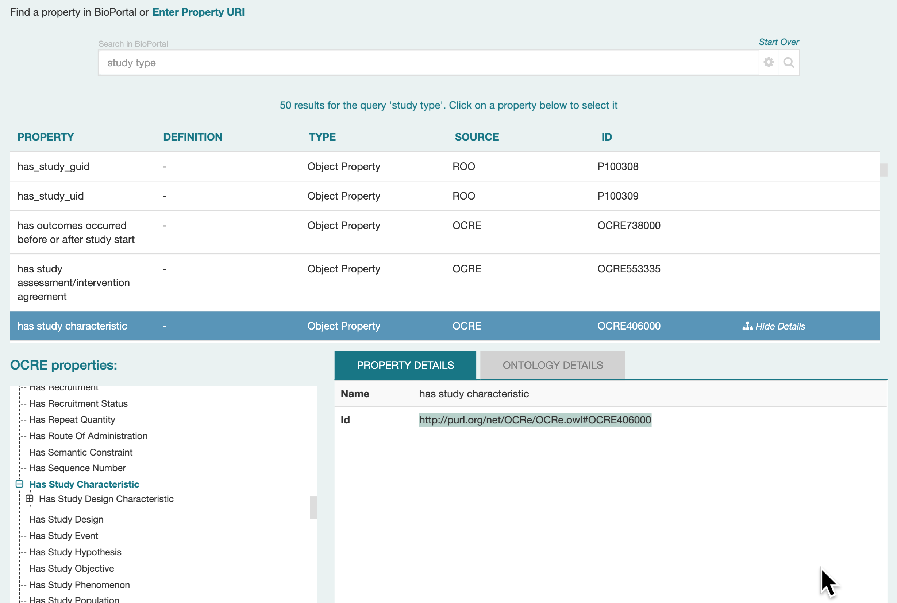{:width="60%" class="centered"}

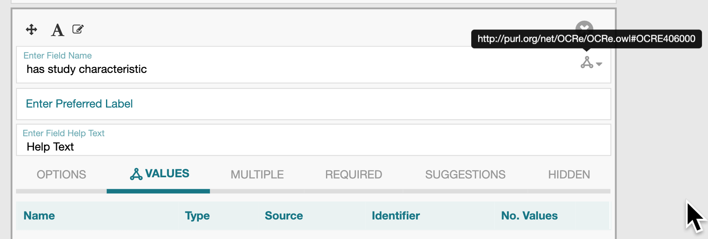{:width="60%" class="centered"}

### Characterizing your field (future)

### Versioning vocabularies you use

### Adding your terminology to BioPortal

## Understanding the Suggestion System

CEDAR's Value Recommender is a metadata recommendation system that helps users to fill out metadata templates with the most appropriate values. The system finds and applies patterns in the previously entered values to generate recommendations for all the recommendation-enabled fields. CEDAR's Value Recommender is integrated in the CEDAR Workbench [1] and it can also be invoked programmatically through its API [2].

This document describes the steps to enable recommendations for templates and use them to quickly and accurately create new metadata.

### Getting started
Metadata suggestions are disabled by default. When creating your template, you can enable suggestions by following these steps:
* Log in to the CEDAR Workbench [1] and create a new template.
* Add a new field to the template and use the “Suggestions” setting to enable recommendations for it. Note that:
   * The “Suggestions” tab is only available for fields of type “text”.
   * You must enable suggestions for a minimum of two fields in the template.

The Value Recommender will make recommendations only when it can see a pattern worth recommending, which means there must be many repeated values in a field. Thus, fields with controlled vocabularies, or with relatively few likely choices, are the best candidates for recommendations.

Save the template and click on the arrow located on the top left corner of the screen to exit the Template Designer.

Once the template has been saved, you can start filling it out with metadata and getting recommendations. At least one saved metadata instance must exist for a template before recommendations are generated. To fill out the metadata for a template with recommendations the user proceeds as for any other template:
* In the listing for the template, click on the ‘metadata’ tag (shown at right). This generates a form to fill out the metadata.  Alternatively, select your template and click on the template options menu (displayed as three vertical dots), choosing “Populate” to start entering metadata for the template.
* Click on any field that is configured to support recommendations. You will receive a list of value recommendations presented as a drop-down. 
* The numeric percentages indicate the strength of the recommendation (not the percentage of entries that are filled out with that value). See the paper cited below for details about how this strength is calculated.

If you do not see a list of value recommendations when you expect them, it is likely that the metadata filled out so far for that template does not contain any patterns strong enough to recommend.  

### Example
Suppose we have an “Experiment” template with three fields: (1) an “experiment ID” field that stores the identifier of the experiment; (2) a “tissue” field that captures the type of tissue tested in the experiment, and (3) a “disease” field to enter the disease of interest. 

Fig. 1 shows the template in the Template Designer and the “Suggestions” setting for the field “tissue”. The user has clicked on the “tissue” field and enabled metadata recommendations for the field using the “Suggestions” tab. 

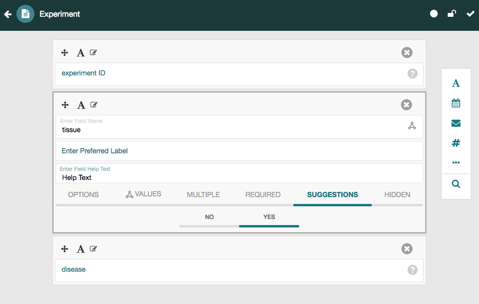{:width="75%" class="centered"}

We will assume the user also enables suggestions for the field “disease”.

Fig. 2 shows a screenshot of the Metadata Editor for a template generated from the Experiment template. The user entered the value “skin” for the field “tissue” and is about to enter a value for the field “disease”. In this case, the editor shows four suggested values: “skin ulcer”, “atopic dermatitis”, “melanoma”, and “psoriasis”. The percentage shown between brackets next to each suggestion represents the strength of the recommendation. The recommendations provided by the system are context-sensitive, meaning that the values predicted for the “disease” field are generated and ranked based on the value entered for the “tissue” field. In this case, the four values suggested by the system are useful, since all of them are diseases that affect the skin.
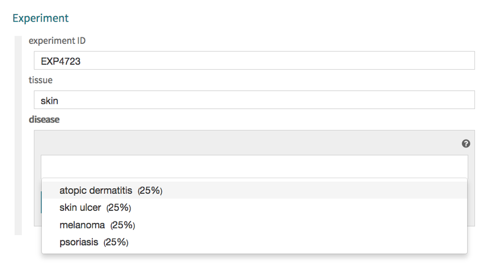{:width="75%" class="centered"}

### Frequently Asked Questions

**Can I enable suggestions for text fields whose values have been restricted to terms from ontologies?**
:   Yes. CEDAR’s Value Recommender works both for plain text values and ontology terms.

 

**Can I access the source code?**
:   Yes. The source code of CEDAR’s Value Recommender is open source and available on GitHub [3].

 

**How does CEDAR’s Value Recommender work?**
:   The system is based on a well-established data mining method known as association rule mining to generate real-time suggestions based on analyses of previously entered metadata. A paper describing this method in detail will be available soon.

 

**Will recommendations still work if I modify the template after metadata is collected?**
:   No, they will not. To modify a template with existing metadata, you must create a new template version. The recommendations for the previous template version will be applied to any metadata created from that previous template, and metadata for the new template version will be based on metadata created for that version.

 

**Can I use recommendations based on metadata from other CEDAR templates?**
:   Not yet, although we are investigating this as a possible enhancement.

 

**What are the technologies behind CEDAR’s Value Recommender?**
:   CEDAR's Value Recommender has been implemented in Java. The system uses the Dropwizard framework [4] to provide a REST-based API that is used by the Metadata Editor and can also be used directly by third-party applications. The rule extraction process is performed using the Java API of the WEKA (Waikato Environment for Knowledge Analysis) data mining software [5]. All metadata for a particular template are transformed to WEKA's ARFF (Attribute-Relation File Format). The association rules are extracted using the Apriori algorithm, which is commonly used in association rule mining.

 

**How should I cite this work?**
:   Please cite the following paper, which describes CEDAR’s Value Recommender in some detail:  
   _Martínez-Romero M, O’Connor MJ, Egyedi AL, Willrett D, Hardi J, Graybeal J, Musen MA. Using association rule mining and ontologies to generate metadata recommendations from multiple biomedical databases. Database. Volume 2019, 10 June 2019. https://doi.org/10.1093/database/baz059._

### References

<pre>
[1] https://cedar.metadatacenter.org/
[2] https://valuerecommender.metadatacenter.org/api
[3] https://github.com/metadatacenter/cedar-valuerecommender-server
[4] https://www.dropwizard.io
[5] https://www.cs.waikato.ac.nz/ml/weka/
</pre>

## Updating and Versioning

As you build more complex templates, you will start using elements and want to update 
these in your template. Doing so can be a little subtle in CEDAR, 
especially when one wants to use rigorous version control.
In this section, we describe working with CEDAR for these use cases.

### **Updating Fields and Elements**

Once you create a template or element that has nested elements, 
you may find you need to update a lower-level element in your template.
Because the elements are imported as static resources, this is a two-step process.

First, you must update the element that needs to be changed. 
(If it is a versioned resource, follow the instructions in the Creating and Managing Versions topic below.)

After saving your updated element, go to the template that contains it.
Import the updated element as described in [Adding Elements](building-basic-templates.md#adding-elements); the updated element will appear at the bottom of your form. 

Move the element to the correct location in your form, 
and delete the element that is already there. 

Repeat this process for each updated element that you want to include in the form.
Also be sure to update any other forms that you want to have the updated element.

#### Updating Nested Elements

Because imported field and elements are static once imported, 
if you have multiple levels of nested elements and fields,
you must start the re-import process with the lowest-level changes, 
making all changes at the lowest level before re-importing content at the next-highest level.
For example, if Template A contains Element B which imported Field C, 
if you want to change Field C in the parent template you must first modify Field C,
import the modified field into Element B, then import the modified element into Template A.
If there are multiple items changing at a given level in an element, 
all those changes must be made
before that element is re-imported into the parent element or template.

### **Creating and Managing Versions**

CEDAR assigns a version number of `0.0.1` to every new templating artifact 
(templates, elements, and fields). 
You can modify these templating artifacts as often as you want, 
and the version number will not change. 
However, you should not modify a CEDAR template that already has instances;
you will get a warning message if you try to do this. 

Many users want more rigorous control over their artifacts, so that if the artifact is changed,
everyone will be able to see the change has occurred. 
Similarly, users may want to keep older copies of the artifact, 
so they can compare different versions or look up particular versions 
that have been used in the past.

CEDAR uses a 3-number versioning system known as "semantic versioning", 
in which trivial changes are delineated by the right-most number, 
minor changes (with relatively small impact on the overall system) are 
indicated by the middle number, and major changes are shown in the left-hand number.
Each time release a new version, 
you can choose any version representing a higher version number. 
For instance, updating from version 0.0.1 you could choose 0.0.2 
(or any 0.0.x where x is higher than 2), 0.1.y, or
1.y.z as your new version number, where y and z are any number.

#### Make Your Artifact Version-Controlled 

To enable such control, CEDAR provides a versioning system for templating artifacts
that is enabled by the `Publish version` menu item. 
When you select Publish version from an artifact's kebob menu,
you will be prompted for your desired version number for your versioned artifact.

Once you select the version and click Save, the artifact named by that version 
will no longer be modifiable, and you will see its version in Desktop resource lists.

#### Updating Versioned Artifacts

If you want to create a new version of your artifact,
you must select `Create version` from the artifact's dropdown menu, 
and a new, editable artifact will be created with the right-hand version number
incremented by 1 from the previous artifact. We will call this a draft artifact, 
and it will automatically include metadata referencing the previous version 
as its predecessor. 

You will be able to edit the draft artifact as much as you want, 
but when you are ready to put it under version control, 
you must repeat the Publish version process described above.
Again you can set the version number to any larger sequence 
than the previously published artifact, including the same version as the draft artifact.

As suggested in Updating Nested Elements above, CEDAR templates and elements
import lower-level artifacts in their entirety. 
Thus, later changes to the lower-level artifacts do not change the higher-level artifacts
that import them; the lower-level artifacts must be re-imported.
When new versions of elements or fields are created, 
you must follow the instructions in Updating Fields and Elements above.

The act of publishing an artifact does not change its IRI, 
even if a different version is selected than the draft artifact's version.

### **Finding and Viewing Versioned Artifacts**

When you create and publish new versions of templating artifacts, 
the previously published version is kept on the system, 
and can still be accessed.
However, by default the Workspace and search tools will show only the most recent published version
of an artifact. (If a draft version exists, that will always be shown.)  

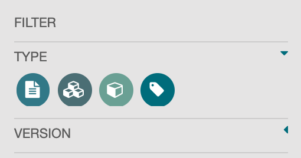{:width="20%" class="right"}
This behavior is controlled by the Version drop-down in the Filter section 
on the left side of the CEDAR Workspace.  
In a typical configuration, the Version drop-down is closed, as shown to the right.

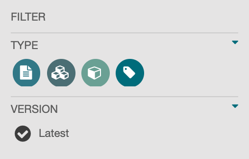{:width="20%" class="right"}
If you open the Version drop-down, you will see a Latest indicator, 
with a darkened checkbox indicating that viewing the Latest version only is enabled.
Search results and other listings will not show older versions.
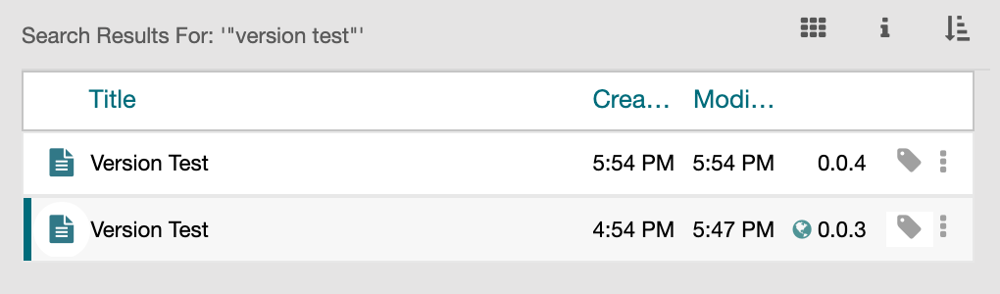{:width="50%" class="centered"}

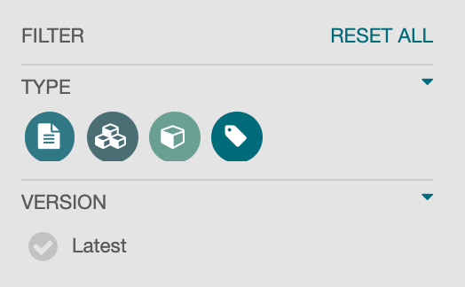{:width="20%" class="right"}
To see all versions, click on the Latest item to disable the Latest filter. 
Now, all versions will be shown in any search or folder display that contains them.
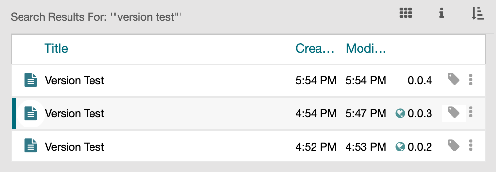{:width="50%" class="centered"}

#### Seeing and Navigating to All Artifact Versions

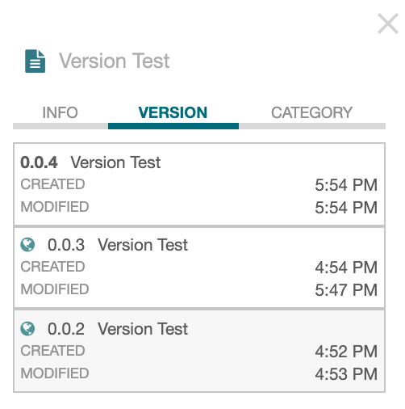{:width="25%" class="right"}
The version history for any artifact is shown in the Version tab of the metadata panel 
(see image on the right). 
(Click on the 'i' icon to make this panel visible; see
<a href="viewing-resource-information.md#viewing-resource-metadata">Viewing Resource Details</a> for more information.)  

In the metadata panel example, 
you can see the three versions of the Version Test artifact. 
The Version tab shows all the versions available for the selected artifact, 
no matter the setting of the Version drop-down in the Filter section.
The world icon indicates the artifact is published; an artifact without that icon is a draft.

To open any of the versions listed in the metadata panel,
click on that version's title ("Version Test") in the list.
The Template Designer will be opened with the appropriate version of the artifact.
There can be only one draft version open for any published artifact,
and that draft version is always more current than any of the published versions
of that artifact.

## Working with CDEs

CEDAR contains nearly 60,000 Common Data Elements imported from the National Cancer Institute's caDSR Data Element repository. 
These are represented as Fields in CEDAR, as each CDE
describes a single question and its possible answers.

Because all of these CDEs are managed by caDSR following the same metadata model, 
we can offer some tips for working with them efficiently in the CEDAR system.

### **Finding and Browsing CDEs** 

The same practices used for [finding other CEDAR resources](finding-resources.md) will work with CDEs as well.
However, there are a few additional strategies that may be particular helpful for 
those working with CDEs in CEDAR on a regular basis.

#### Searching from the CEDAR Desktop

As described in the section [Finding Resources](finding-resources.md)
you can search for resources by name or description. 
In the case of CDEs, it is also possible to search by their CDE identifier.
This number is shown at the top middle of the CEDAR field in the Template Editor 
(or between parentheses in a Desktop resource list). 

For very short version numbers (like '5' or '58'), the indexing does not provide an
obvious way to find the whole number, instead finding all the numbers containing that string.
As a workaround, you can enter the number surrounded by spaces, and within quotes. 
This may find other occurrences of the number by itself, for example in the description 
of the CDE. You can then search within the results set in your browser by scrolling 
the results until they are all displayed, then enter into your browser 
your identifier surrounded by parentheses (e.g., `(5)`).

Another handy attribute for some searches is the version attribute.
Entering the exact version number will find all artifacts with that version, 
most of which will be CDEs. 
Entering version numbers with wildcards can find many CDEs at once; 
for example, `*0.0` will find all CDEs (and other artifacts) 
with version numbers ending in 0.0.

#### Browsing All CDEs

If you search for the string "CDE" from the Desktop, 
one of the first entries you'll see is the shared CDE folder.
This is the location of all the imported CDEs from caDSR.

Double-click on the CDE folder to open it. You must wait a while (10-15 seconds) 
before the first screen of CDEs is displayed.

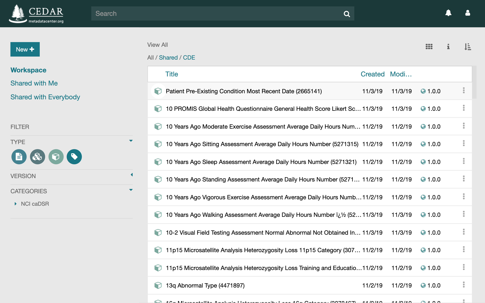{:width="80%" class="centered"}

You will quickly discover that navigating through this list isn't practical, as only a small 
number can be presented at any one time. Instead, use the search bar to narrow down the list, 
as described above.

#### Browsing by CDE Categories

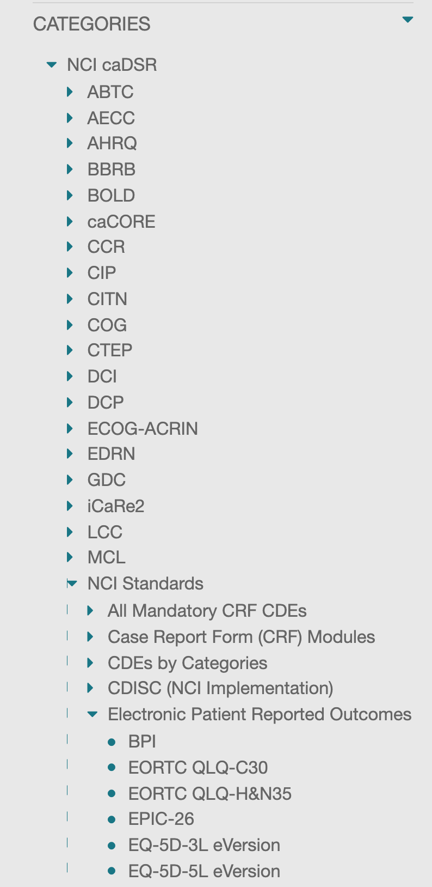{:width="20%" class="right"}
In caDSR, CDEs and forms can be classified using Classifications, more specifically 
Classification Schemes and Classification Scheme Item. The caDSR classifications have been
imported into CEDAR as hierarchical categories under the NCI caDSR category, 
as shown in the image on the right. 

You can find CDEs in a particular category by using the CEDAR categories menu 
in the left-hand navigation panel. Selecting an item at any level of the category
hierarchy will show all the CDEs contained within that level, and all lower levels.

You can view the Category or Categories for any CDE you see in the Desktop by clicking on
the CDE, [bringing up the information metadata tab](viewing-resource-information.md#viewing-resource-metadata), and selecting the Categories tab.
CEDAR lists all the Categories to which the selected CDE belongs.

#### When Creating a Template

On bringing up the search pop-up display, searching results should be the same as 
when searching from the CEDAR Desktop. The returned results list is somewhat shorter,
so searching using the identifier is the best approach.

#### Advanced: Search for Templates Using A CDE

If you are trying to find all the templates (or instances) that are using a particular CDE,
you could try using the field name of the CDE if it is relatively uncommon. 
By using the [Advanced Searching—Field Names](finding-resources.md#advanced-searching-search-fields)
strategies, you can search by the name of the field for templates and/or instances
containing that field. (You must use the actual name of the field, not the displayed label.)

### **Obtaining and Maintaining CDEs**

By importing the XML-defined CDEs from the caDSR system into JSON Schema-defined fields in CEDAR, 
we make these specifications available to any CEDAR user. 
CEDAR imports only the released CDEs, not those in earlier stages of preparation.
To date the conversion process is manually initiated, 
but we plan to run conversions as frequently as nightly 
to keep the CEDAR CDEs up-to-date with respect to the source content.

When run, the conversion process updates any caDSR-updated CDEs in the CEDAR system, 
replaces all the CDE Value Sets in BioPortal, and 
ensures that the Categories in CEDAR are updated to the Classifications 
provided in the caDSR export. 

We do not manage the entire content of the CDE specification. CDEs in caDSR contain a comprehensive implementation of the ISO/IEC 11179 standard, but focus instead on core functionality that relates to the precise specification of questions and the values used to answer those questions.

### **References**

These references provide more information about performing CDE-related activities.

* [CEDAR for caDSR Users](cedar-for-cadsr.md)—a separate section of this manual targeting users of caDSR systems
* [CEDAR Announcement of CDE Support](https://metadatacenter.org/happenings/news/cedar-announces-cde-support/)—Blog post describing CEDAR's support for CDEs
* [Unleashing the value of Common Data Elements through the CEDAR Workbench](hhttps://www.ncbi.nlm.nih.gov/pmc/articles/PMC7153094/). Published in [Proceedings of AMIA 2019 Annual Symposium](https://knowledge.amia.org/69862-amia-1.4570936), 681-690.
