# Artifact Versioning

Templates, elements and fields change as metadata requirements change. A definition that other
people already fill out, or that other templates already reuse, cannot change underneath them
without invalidating their work. CEDAR separates the copy an author is still working on from the
copy everyone else depends on: an editable **draft**, and a **published** version whose content
is fixed. The [CEDAR Versioning Model](advanced-topics/versioning-model/index.md) sets out the
rules those two states obey.

Templates, elements and fields follow the same cycle. One element serves as the example
throughout: a Principal Investigator element holding an investigator's name and ORCID, which is
published, drafted again, reused by a Study template, and then changed while that template is
using it.

## Working on a Draft

A new template, element or field starts as a draft numbered `0.0.1`. Save a draft as often as
you like. Each save replaces the stored content, keeps the same identifier, and leaves the
version number where it is, so ordinary saves never accumulate as separate versions.

The Template Designer shows the number in the Version box at the top, beside the artifact's name
and description. The open padlock at the top right marks the artifact as editable, and the Save
button commits each change. [Saving and Closing](building-basic-templates.md#saving) explains
the three status icons.

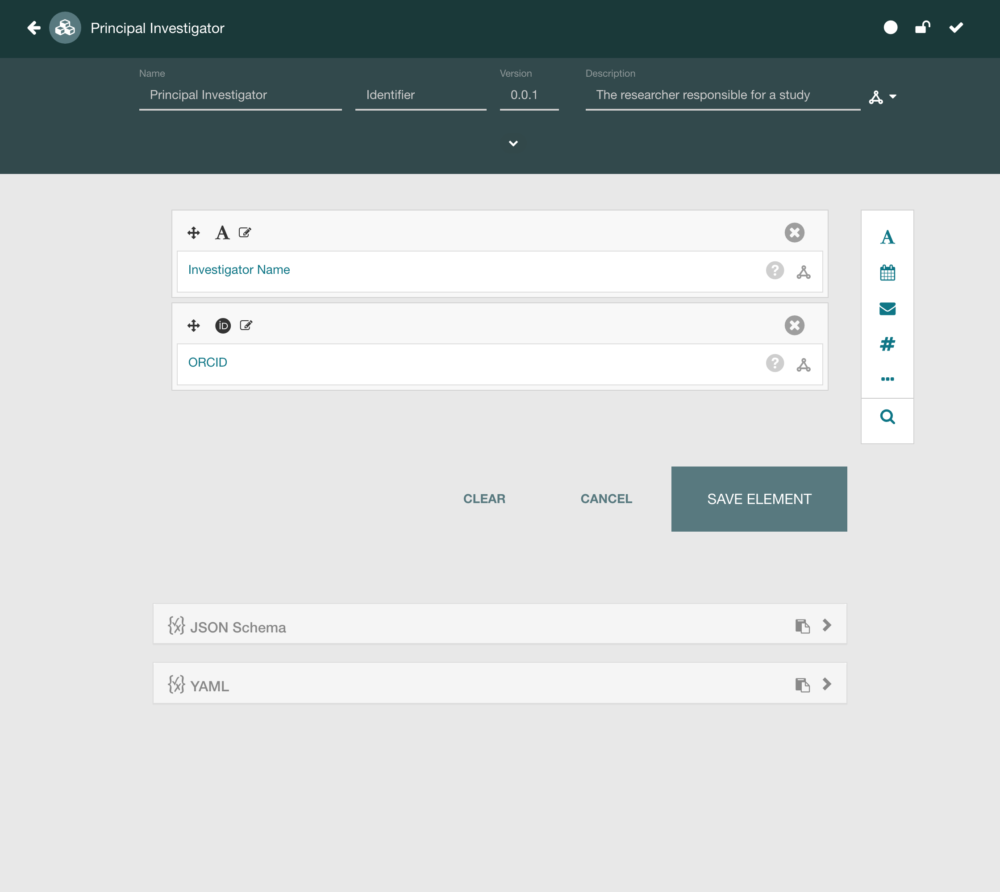{:width="80%" class="centered"}

In the workspace listing, a published version carries a globe and its number. A draft carries
its number alone, and a draft still at the starting `0.0.1` carries nothing at all, so an
artifact with no version marking has never been published.

## Publishing a Version

Publishing fixes the content of a draft and gives it a number others can cite.

Open the resource's kebab menu (**⋮**) and choose **Publish version…**. Next to it,
**Create version…** stays unavailable while the artifact is a draft, because there is no release
for a new draft to continue from.

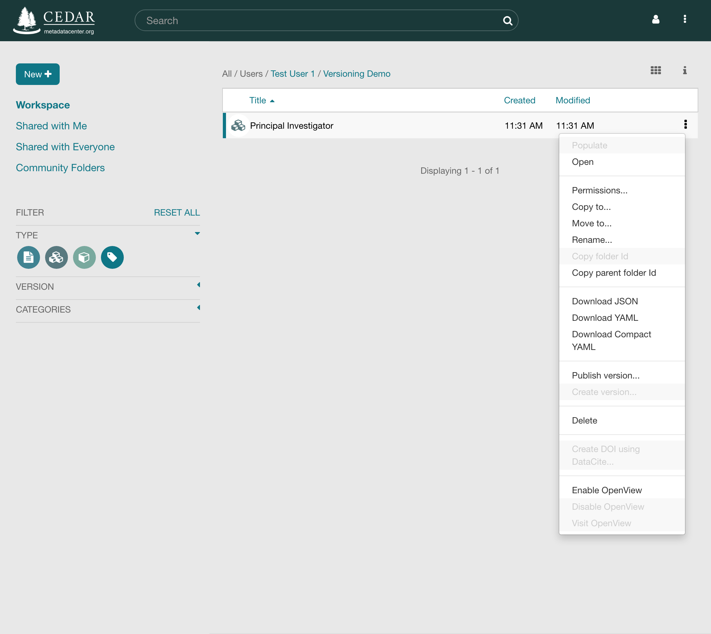{:width="80%" class="centered"}

The dialog offers the three parts of a `major.minor.patch` number, starting from the draft's
current one. You can keep that number or raise any part of it, and you cannot lower it. CEDAR
neither derives the number from what changed nor checks that a patch release stays compatible
with the release before it. The choice is the author's: raise the major part for a change users
of the artifact must react to, and the patch part for a correction they can ignore.

{:width="80%" class="centered"}

Once the version is published, its row in the workspace carries a globe and the number, and the
two version commands reverse. **Publish version…** greys out, and **Create version…** becomes
available.

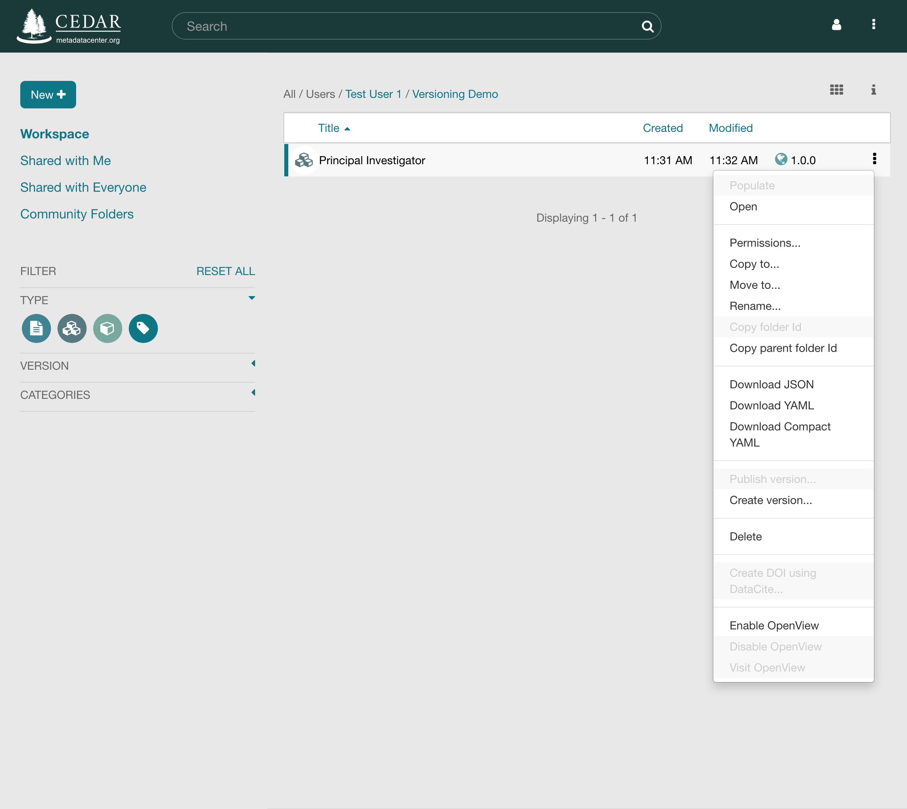{:width="80%" class="centered"}

A published version opens read-only. The padlock at the top right is closed and yellow, and the
Clear, Cancel and Save buttons are gone.

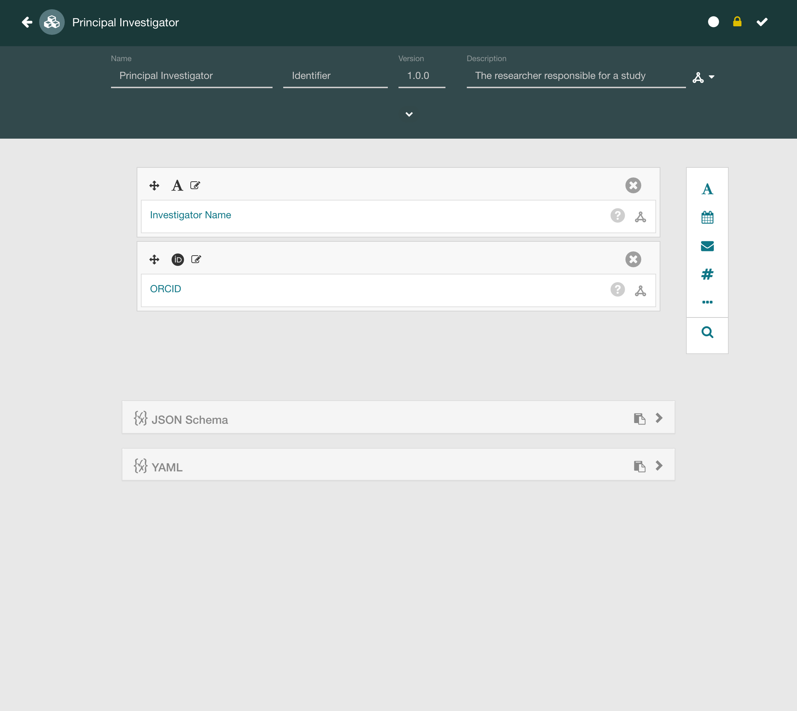{:width="80%" class="centered"}

## Creating the Next Version

**Create version…** copies the published version into a new artifact with an identifier of its
own, and records the published version as its predecessor. The published version itself is not
touched and stays available to everyone using it.

The dialog opens on the next patch number, `1.0.1` for a release of `1.0.0`. Raise it here, or
leave it and raise it when the draft is published.

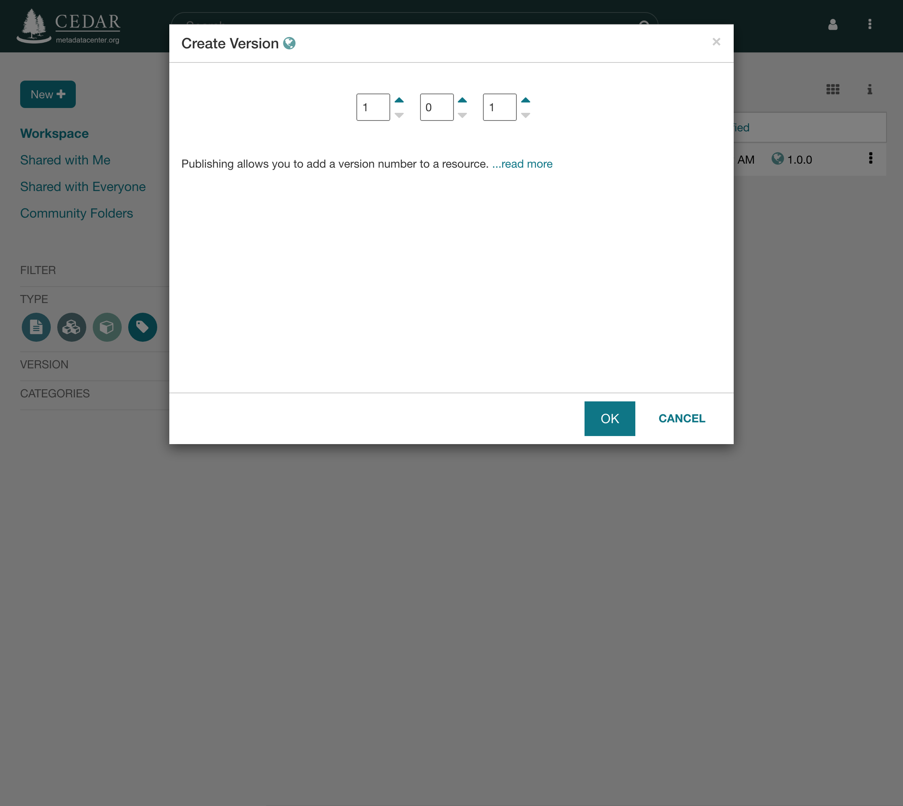{:width="80%" class="centered"}

The workspace then lists the series under one title: the new draft, and the published version it
came from.

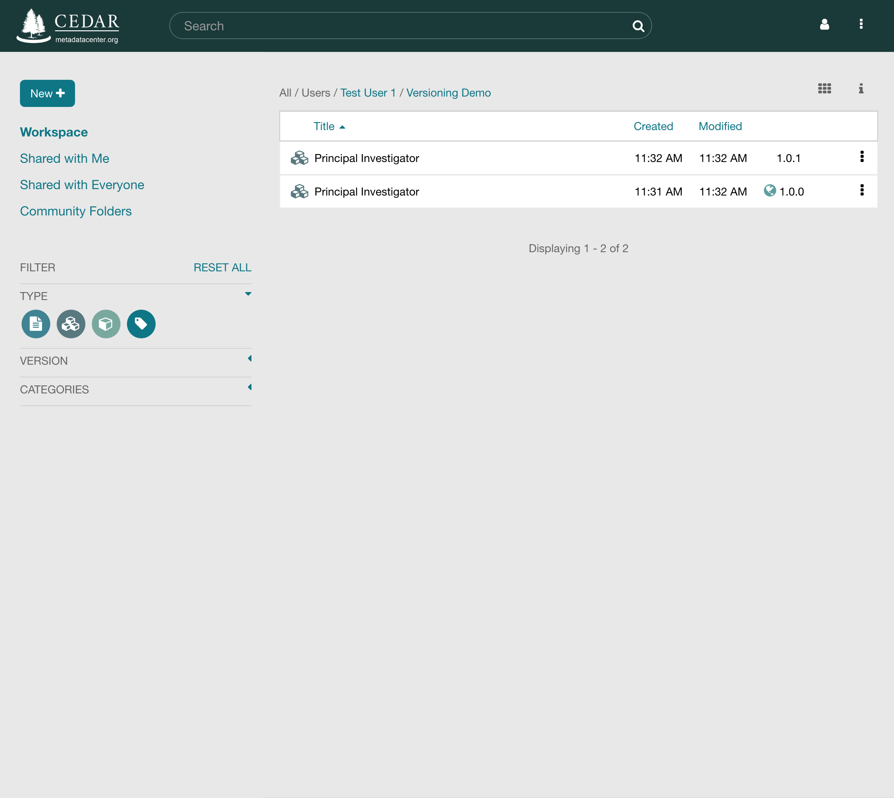{:width="80%" class="centered"}

A series carries one draft at a time. That draft must be published before another can be
created, which keeps development in a single line with no branches. Creating a draft is reserved
to the owner of the latest published version, who also needs Editor access to the folder the
draft goes into. The rest of the access rules are in
[Versioning and Permissions](advanced-topics/versioning-model/managing-versioned-artifacts/versioning-and-permissions.md).

Copying an artifact does something different. The copy starts a series of its own at draft
`0.0.1` and records where it came from, but it does not continue the release history of the
artifact it was copied from.

## Reusing a Version in a Template

When a template imports an element, it takes a copy of that element as it stands at that moment.
The copy belongs to the template, so later work on the element does not reach the template by
itself.

[Adding Elements](building-basic-templates.md#adding-elements) covers the import window. Every
version of an element appears there under the same title, so the details pane on the right is
what tells them apart: it names the version, with a globe if that version is published.

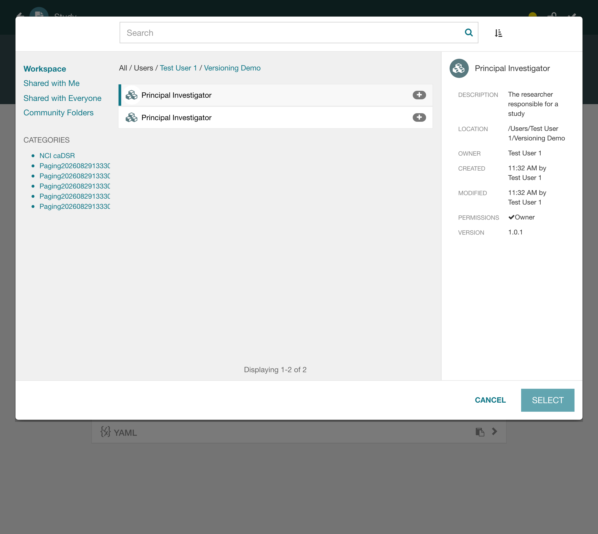{:width="80%" class="centered"}

Importing the `1.0.1` draft puts its number beside the element icon inside the template, which
records the version the copy was taken from.

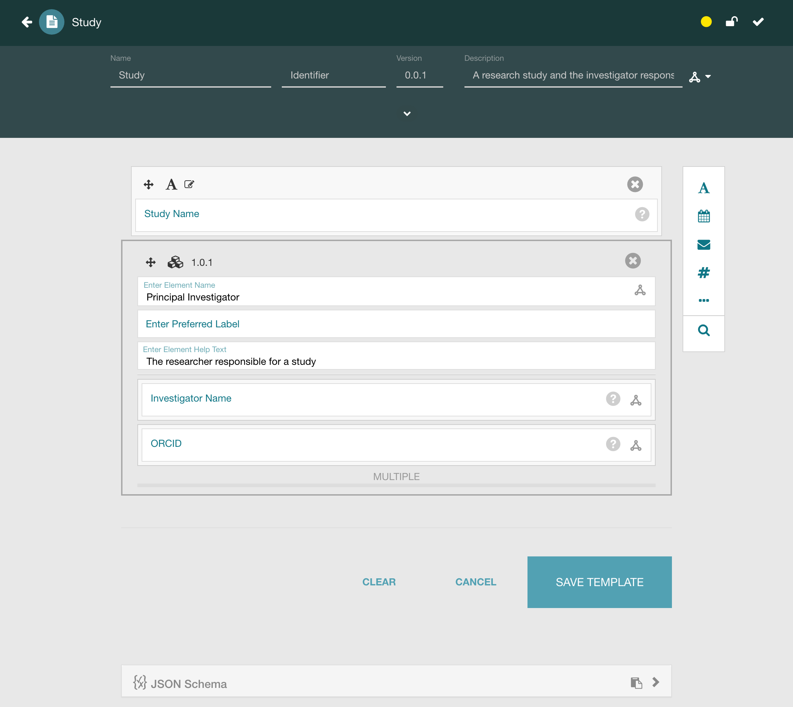{:width="80%" class="centered"}

## Carrying a Change to the Artifacts That Reuse It

Because the template holds a copy, an edit to the element does not reach it. CEDAR offers to
reconcile the two at the moment of the edit.

Adding an Institution field to the `1.0.1` draft and saving it stores the element immediately.
CEDAR then looks for every element and template holding a copy of it and opens the Update
Bubbling window.

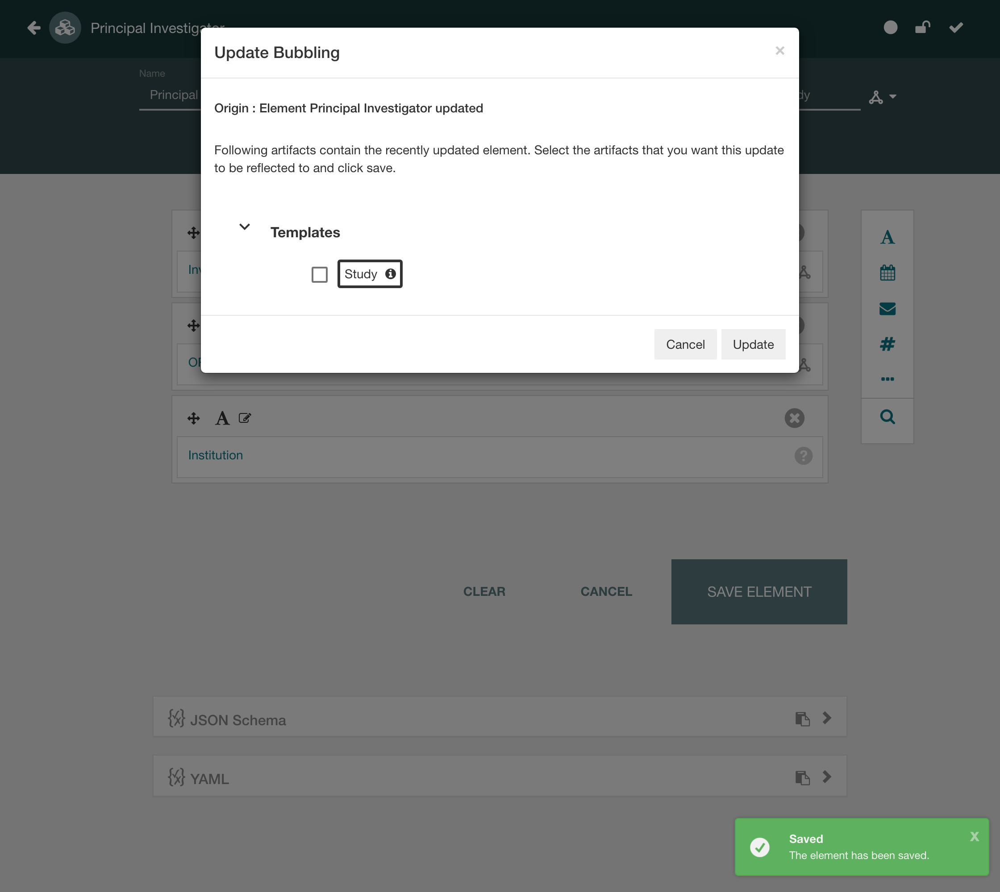{:width="80%" class="centered"}

The window lists the artifacts that hold a copy, grouped by kind, and the information icon
beside a name shows its location, owner and provenance. Tick the ones that should take the new
definition and click **Update**. Each is rewritten where it stands, keeping its own identifier,
name and version, with only the embedded copy replaced. Cancelling, or leaving an artifact
unticked, leaves it on the copy it already has.

Only drafts can take the change. Publication fixes a version's content, so the window offers no
tick for a published artifact: its checkbox is greyed, and a globe beside the name marks the
version as released. Create a new version of it first, and tick that instead.

The Study template now carries the element with its Institution field.

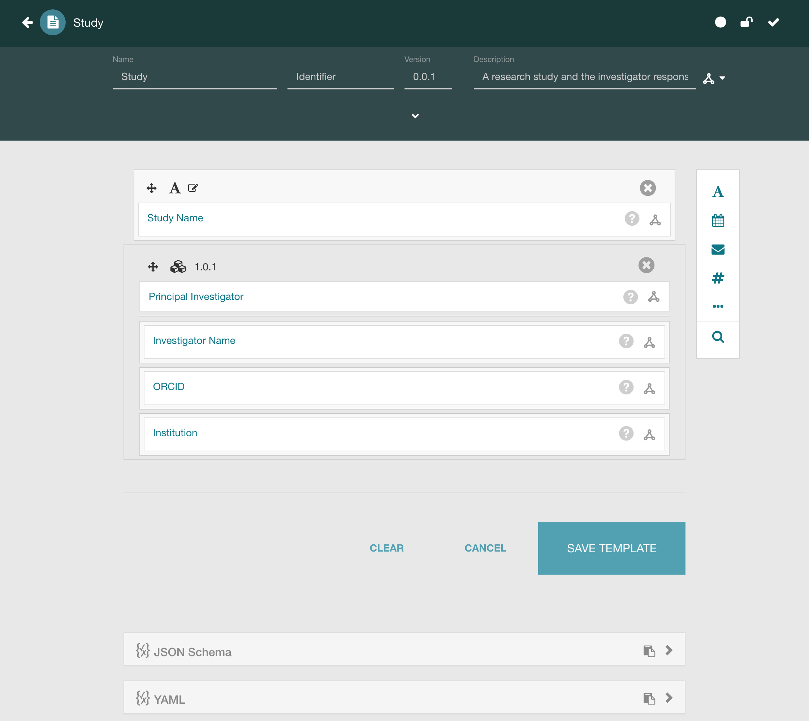{:width="80%" class="centered"}

### When Metadata Already Depends on the Element

Instances are filled out against the fields their template had at the time. Changing those
fields would leave the stored instances describing a shape the template no longer has. CEDAR
therefore warns before any editing starts when the element is reused by a template that already
has instances.

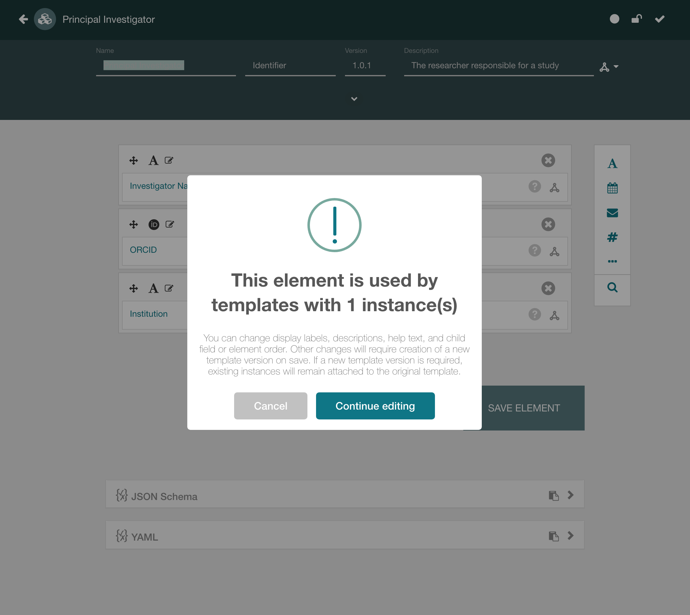{:width="80%" class="centered"}

Display labels, descriptions, help text and the order of children can still change, because none
of them alters what an instance holds. Any other change does, and CEDAR will not propagate it:
the update is refused, none of the selected artifacts are written, and the template needs a new
version of its own before the updated element can go into it. Instances stay attached to the
template they were filled out against.

## Finding Earlier Versions

Every published version stays on the system and remains available to the people using it.

The Version tab of the information panel lists the whole series for the selected artifact,
newest first, with a globe on each published version and a Latest badge on the current one.
Clicking a title opens that version.
[Viewing Resource Metadata](viewing-resource-information.md#viewing-resource-metadata) covers
the panel itself.

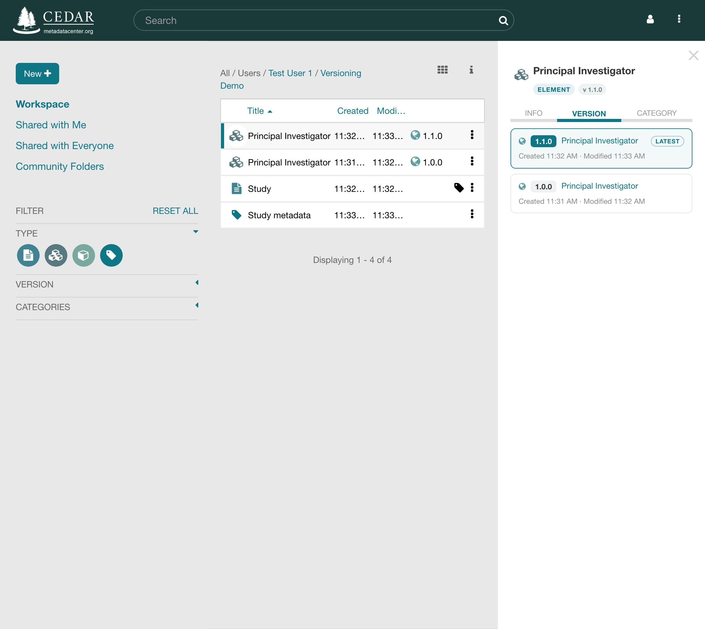{:width="80%" class="centered"}

**Latest**, in the Version section of the Filter sidebar, decides which versions reach listings
and search results. With Latest on, each series contributes its newest published version and its
draft, if it has one.

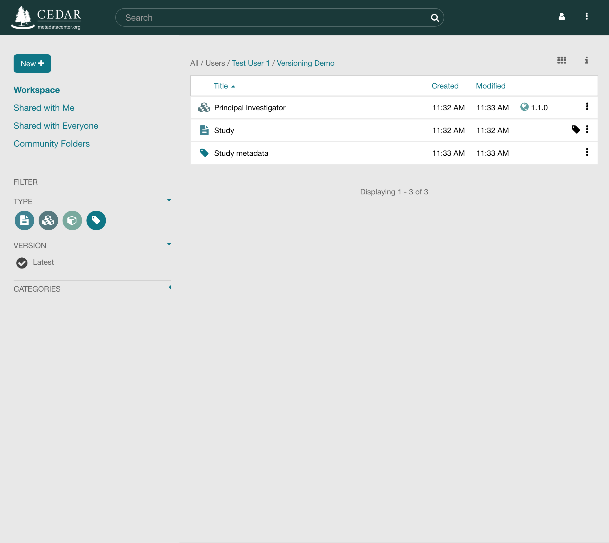{:width="80%" class="centered"}

With Latest off, every version appears in any folder or search that holds it.

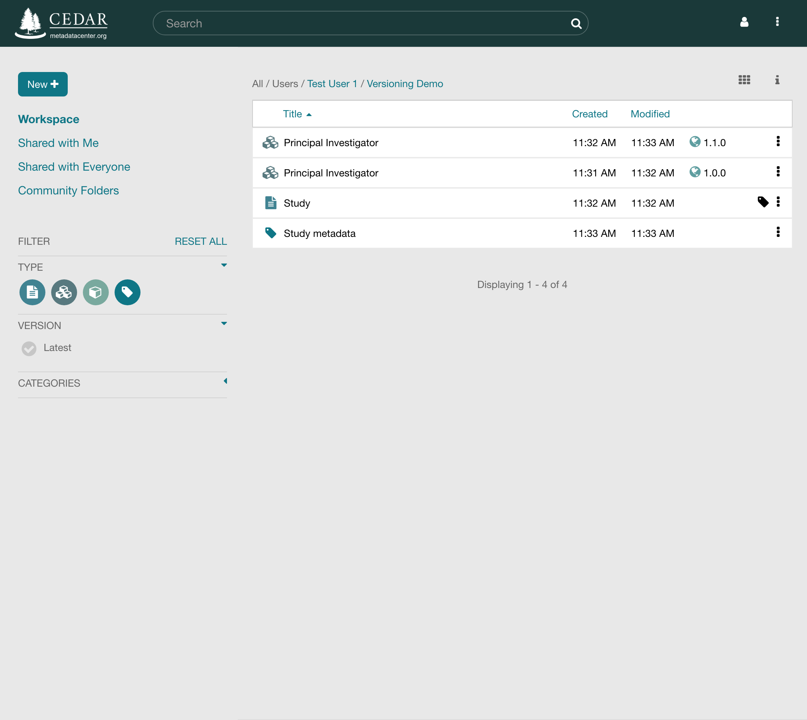{:width="80%" class="centered"}

The folder, the access you have, and the other filters still apply either way, and **Reset all**
at the top of the sidebar returns the Version section to Latest along with everything else.
