# Building Basic Templates

You build a template in the Template Designer, composing it from fields and elements. The
fields and elements you create can be shared, published on the Web, and reused in other
templates and elements. The finished template generates the form that metadata authors fill
out.

## First Steps

Creating a template starts with three things: a human-readable name, an optional identifier,
and a description of what the template represents (for example, "Injury-related treatments").

Click the **New** button on the navigation sidebar (upper left of the Workspace) and choose
**Template** from the menu. This opens the Template Designer. Enter the Name, Identifier, and
Description in the three text fields ('Untitled', 'Identifier', 'Description') underlined in
the image below. The Name labels the artifact in your workspace and can be changed later.

{:width="80%" class="centered"}

You can [save and close a template](#saving-and-closing) at any time and return to it later.
To reopen it, or any template you have access to, double-click its icon in the workspace.

### Naming and Describing a Template

CEDAR searches match on an artifact's Name, Identifier, Description, and Version, so choose
words that will help the template be found.

**Name.** Keep the name short enough to fit the workspace view, around 40 to 50 characters.
CEDAR names instances by appending "metadata" to the template name, so think of the Name as
the title of the form. You need not add "Template" or "Form" to the end; that is clear from
context.

**Identifier.** For a template, the Identifier is an *external* identifier for something the
template corresponds to, not a CEDAR identifier. Most authors leave it blank. It is for those
who want to tie the template to an outside entity, and it works best when that entity has a
stable, automatically assigned identifier. This Identifier is for the template, not for the
instances filled out from it.

**Description.** The description can be any length; a sentence or short paragraph is common.
Describe what the template documents. Since the context already establishes that this is a
CEDAR template describing metadata, you need not say so, though "Metadata describing …" often
makes a useful opening. Because it is a longer field, the description is a good place for
keywords you want to search on.

### Next Steps

Fill in the template by [adding fields](#adding-fields) and [adding elements](#adding-elements),
or [save and close it](#saving-and-closing) to return later.

## Adding Fields

A field can be added to a template in two ways: by defining it directly inside a template or
element, or by importing a stand-alone Field artifact created separately. Throughout this
guide, a stand-alone Field artifact is written with a capital "F", and a field defined inside a
template or element with a lower-case "f".

### Defining a Field in Place

A field defined inside a template or element can be customized in many ways, including
constraining the values a metadata author may enter. Some customizations apply to nearly every
field type; others belong to just one or two.

A template or element can hold many fields. A Field artifact holds exactly one, and it must be
a data-entry field.

Arrange fields and elements by dragging them. Grab the drag handle at the upper left of a field
or element and drag it up or down. If dragging is awkward, shrink the browser view to fit more
of the template on screen. You cannot rearrange the contents of an imported Field or Element.

#### Adding a Field Definition

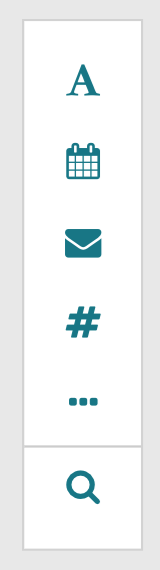{:width="8%" class="right"}
Choose a field type from the vertical selector at the upper right of the Template Designer. The
first few choices add common fields directly: text, date, email, and numeric.

For a less common field type, including presentation and documentation fields, click the
ellipsis (three dots) for the full set. The left column holds data-entry fields; the right
column holds fields that shape how the template is presented to the metadata author.

The search (magnifying glass) icon opens a window for finding other elements or fields to
import. That window is covered in [Adding Elements](#adding-elements).

#### Choosing and Configuring a Field

Each data-entry field type supports a set of options. Required, for instance, is offered on
every data-entry field. A few key field types are covered next; the full set of types and
their options is in the [Field Type Reference](#field-type-reference).

#### Common Options

Besides Required, many fields support the Multiple option.

**Required.** When Required is set to Yes, the Metadata Editor marks the field as required and
warns the author on save if it is empty. The author can dismiss the warning and save anyway.

**Multiple.** When Multiple is set to Yes, the Template Designer shows controls for the minimum
and maximum number of entries. The Metadata Editor then lets the author enter the field more
than once, requires at least the minimum number of slots (though they need not be filled), and
stops the author at the maximum by disabling the Copy icon.

**Value Relation.** The Value Relation optionally sets the relationship from a field's parent
(its template or element) to the field's value. With a Value Relation of "has study
characteristic" from the Ontology for Clinical Relations
(`http://purl.org/net/OCRe/OCRe.owl#OCRE406000`), the metadata reads as `<ParentElement>
has_study_characteristic <user-selected-value>`. To set one, click the RDF icon at the right of
the field and search for a property. If the search returns classes rather than properties,
click Start Over to clear it. After you pick a property, the drop-down arrow beside the RDF
icon shows the current choice. Clicking the RDF icon again clears the property and starts a new
search.

#### Options for a Text Field

The Options tab presents features specific to the field type.

**Default Value.** Sets the value used when the author leaves the field empty. It can be a
string or a controlled term (an IRI).

**Minimum and Maximum Length.** Sets a minimum length, a maximum length, or both. The author
is warned on save if the entry does not meet the limits.

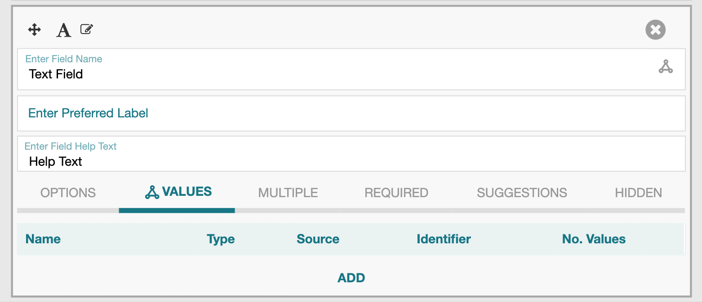{:width="50%" class="right"}
**Values.** The Values tab shows the value sets an author may draw on. With none listed, the
author enters free text.

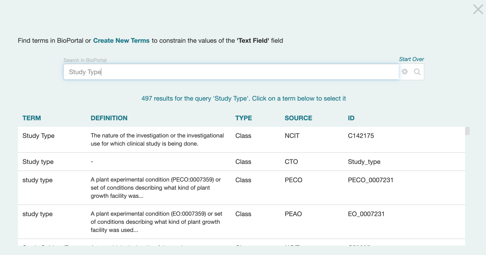{:width="50%" class="right"}
Clicking Add opens a window for choosing a term, a branch, or a whole ontology of allowed
values. Repeat to add more. For guidance on finding good terms, see
[Choosing Controlled Terms](more-fair-templates.md#choosing-controlled-terms).

**Suggestions.** Set the Suggestions tab to Yes to enable authoring suggestions for the field.
See [Understanding the Suggestion System](understanding-the-suggestion-system.md).

#### Options for a Numeric Field

**Number Type.** By default a numeric field accepts any number, entered as an integer or a
floating-point value. You can choose a more specific type from the 'Any numbers' drop-down:
long integer, integer, double-precision real, or single-precision real. The choice constrains
what the author may enter.

**Unit of Measure.** A free-text label shown to authors and viewers of the metadata, before and
after a value is entered.

**Minimum and Maximum Value.** Sets a lowest value, a highest value, or both. The author is
warned in real time if an entry falls outside the range.

**Decimal Places.** Sets how many decimal places the author's value is displayed with.

### Creating a Stand-Alone Field

Creating a Field artifact begins much like creating a template in [First Steps](#first-steps).
Once created, its single field definition is built as in Adding a Field Definition above.

Click the **New** button on the navigation sidebar and choose **Field**. This opens the Field
creation form. Enter the Name, Identifier, and Description in the three text fields ('Untitled',
'Identifier', 'Description') underlined below. The Name labels the artifact in CEDAR and can be
changed later.

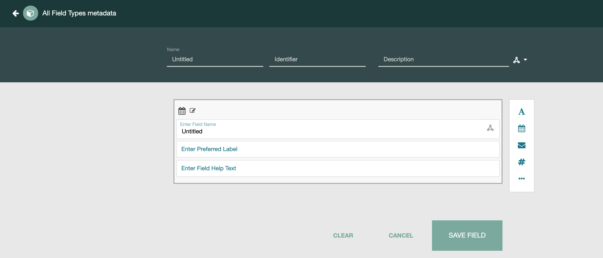{:width="80%" class="centered"}

Because a Field artifact holds exactly one field, it opens with a text field already selected.
To use a different type, pick it from the drop-down; the existing definition is replaced.

At any point you can save the artifact and use the Template Designer's left-arrow to return to
the workspace. From there you can change its name, permissions, and visibility, as described in
[Managing Resources](managing-resources.md#managing-resources).

### Importing a Stand-Alone Field

Once a Field artifact exists, you can import it into other templates and elements. While
editing a template or element, the search (magnifying glass) icon in the field-addition menu
opens a window for finding elements and fields to import. That window is covered in
[Adding Elements](#adding-elements).

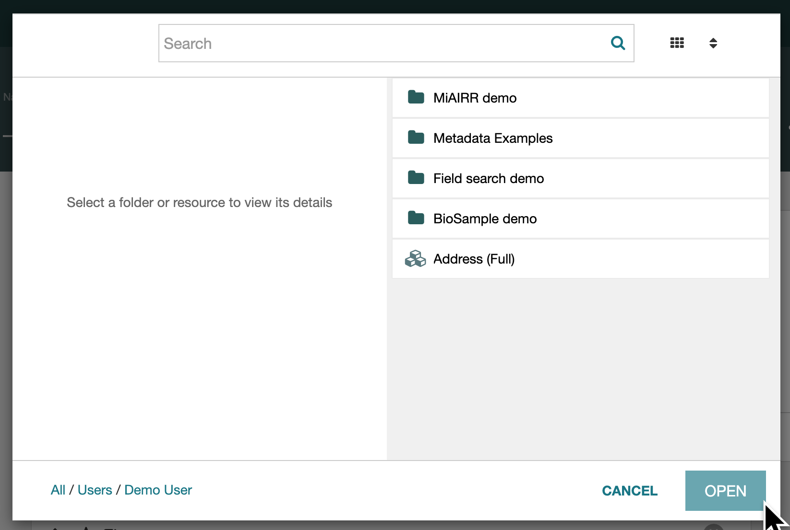{:width="60%" class="centered"}

### Next Steps

Add more content by [adding elements](#adding-elements), or
[save and close](#saving-and-closing) to return later.

## Adding Elements

An element is composed of field definitions (possibly imported as Field artifacts) and other
elements. Elements cannot recurse. They let template creators share, reuse, and extend the same
group of fields across templates and across groups.

Adding an element takes two steps: create the element, then embed it in the template.

### Creating an Element

Return to the workspace, using the Back button in the Template Designer if needed (you may be
prompted to save the artifact you are editing). Click **New** and choose **Element**. This
opens the element view of the Template Designer.

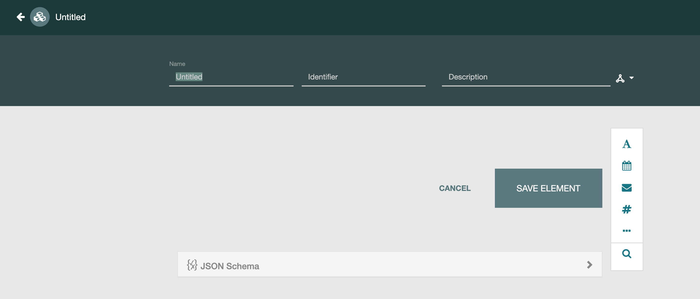{:width="80%" class="centered"}

Enter the Name, Identifier, and Description in the three text fields ('Untitled', 'Identifier',
'Description') underlined below. The Name labels the artifact in CEDAR and can be changed later.

Build the element's content by adding field definitions directly or importing Field artifacts,
both described in [Adding Fields](#adding-fields). You can also import existing elements, as
described below.

At any point you can save the artifact and use the left-arrow to return to the workspace, where
you can change its name, permissions, and visibility, as described in
[Managing Resources](managing-resources.md#managing-resources).

#### Spreadsheet-Compatible Elements

To let authors fill an element out as a spreadsheet, useful when there are many fields to
enter, the element must meet one requirement: it must be flat. It can hold no nested elements
and no fields that allow multiple entries. The element itself must have Multiple enabled.
Filling out such an element as a spreadsheet is described in
[Filling Out Metadata](filling-out-metadata.md#filling-out-metadata).

### Embedding an Element

While editing a template or element, the search (magnifying glass) icon in the field-addition
menu opens a window for finding elements and fields to import.

{:width="60%" class="centered"}

The navigation path at the lower left starts in your current folder and can move to other
locations, but most authors find elements and fields by searching. Type a search string in the
window's search field. Below, "Address" has been entered and searched; both elements and fields
appear in the results.

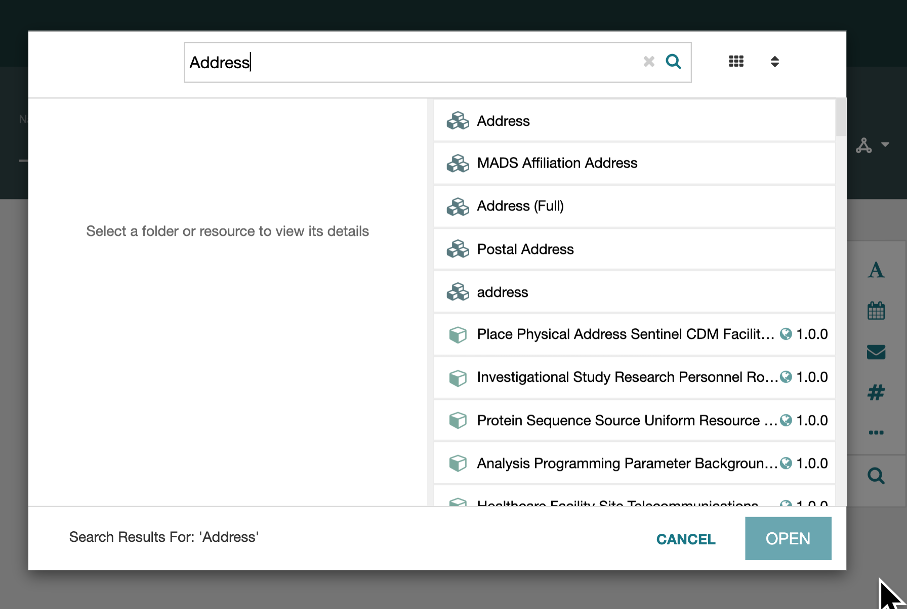{:width="80%" class="centered"}

To inspect a result, click it to see its description.

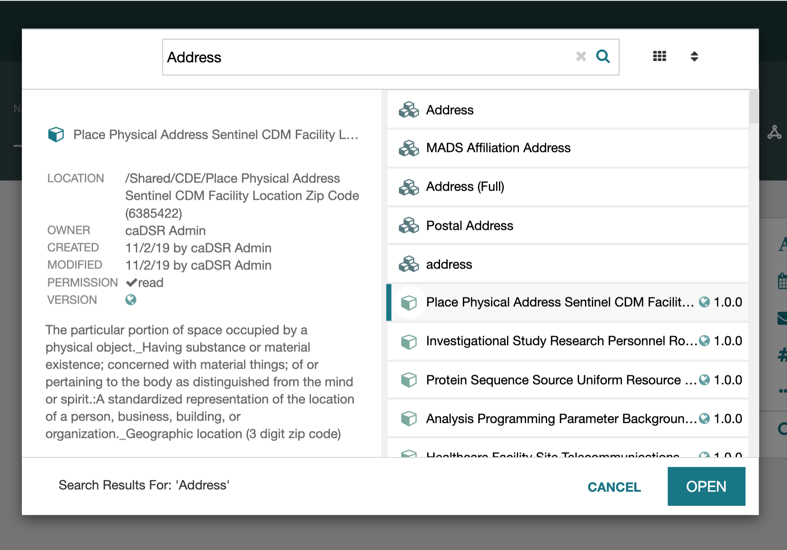{:width="80%" class="centered"}

To embed an element or field, double-click it, or click it once and click Open. It is added at
the end of your template or element.

You cannot edit the core of imported content, including the order of components inside an
imported element. You can relabel it and choose a property relating it to its parent. Move an
imported element or field by dragging its handle at the upper left, up or down. If dragging is
awkward, shrink the browser view to fit more on screen.

## Saving and Closing

### Saving

To save a template, element, or field, click the Save button at the lower right. It is labeled
Save Template, Save Element, or Save Field depending on what you are editing.

{:width="80%" class="centered"}

Three icons at the top right show the resource's status. The circle is filled when there are no
unsaved changes and a hollow yellow circle when there are. When the lock (the middle icon) is
yellow and closed, you cannot save your changes, even to a separate file. To get an editable
version, exit the resource, copy it from the workspace, and edit the copy.

### Validation

CEDAR checks that a template, element, or field is well-formed when it is opened and saved.
This should always succeed, shown by a white checkmark in the third icon. A yellow checkmark
signals a problem inside CEDAR; you can often keep working, but it is worth alerting the CEDAR
team. On success, CEDAR shows a green "Template saved successfully" notice (or "Element" or
"Field").

### Closing

While editing, you can save at any time.

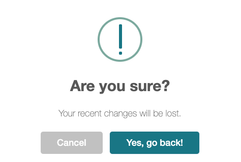{:width="15%" class="right"}
If you try to leave with unsaved changes using the CEDAR back button, CEDAR warns you. Continue
discards the changes and returns to the workspace; Go Back returns you to the resource.

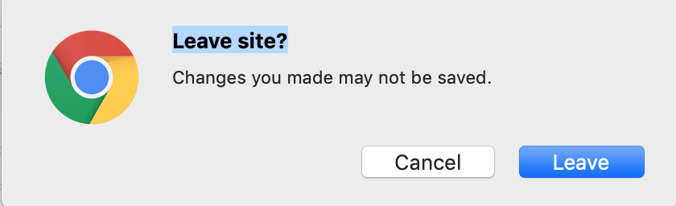{:width="15%" class="right"}
If you try to leave using the browser's back button or by closing the window, the browser warns
you instead. In Chrome, Leave Site (the default) closes the resource, and Cancel keeps you on
the page.

Sessions can be lost in unusual conditions, and lost work cannot be restored, so save often.

If you stay on the page, save the resource and then return to the workspace or close the
window.

#### Returning to the Workspace

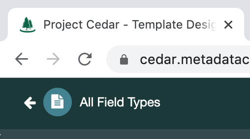{:width="20%" class="right"}
Two "return left" buttons close a template: the browser's and the one at the upper left of the
Template Designer. The CEDAR button returns to the last folder you had open, ignoring any
searches since. If you opened the Template Designer from a search results page and want to
return to it, use the browser back button, which re-runs the search. (If you took the CEDAR
button by mistake, the browser button twice still gets you back to the results.)

#### Recovering a Previous Version

There is no undo. To recover an earlier version, contact the CEDAR team, who can restore one
from before your edits. Before significant or experimental changes, save a copy first.

## Field Type Reference

A field defined inside a template or element can be customized in many ways, including
constraining the values an author may enter. Some customizations apply to nearly every field
type; others belong to just one or two. The tables below list the field types and their
options; each option is described afterward.

### Reference Tables

#### Data-Entry Fields

All data-entry fields support Required and Value Relation, and all support Multiple except
where noted. The table lists the customizations unique to each type, along with the number
types offered where relevant. A blank Data Type column means a text string.

| Field Type | Data Type(s) | Unique Options |
| --------- | :----- | :-------------- |
| Short Text |   | Values; Suggestions; Hidden; Default  |
| Paragraph Text |   |   |
| Email |   |   |
| Phone |   |   |
| Link |   |   |
| Numeric | any number; integer; long integer; single-precision real; double-precision real |  Unit of Measure; Minimum Value; Maximum Value; Decimal Places  |
| Date |  date |   |
| Multi-Choice |   | Default; _no Multiple_  |
| Checkbox |   | Default; _no Multiple_ |
| Pick From List |   | Single Select vs Multi-Select; Default; _no Multiple_  |

The Attribute-Value field is a special data-entry field: the author names the attribute *and*
provides the value. It allows any number of entries by design.

#### Presentation Fields

These field types store no metadata. They let the template author shape how the form is
presented.

| Field Type | Description | Purpose |
| --------- | :--------- | :------- |
| Section | Creates a section break | A textual separator, with optional explanatory text  |
| Page | Creates a page break | Splits the form into multiple pages when entering metadata |
| Rich Text | Rich text entered as HTML  | A descriptive lead-in to the *following* field |
| Image | Location of an image to display | A visual lead-in to the following field |
| YouTube | Location of a YouTube video to display | A video lead-in to the following field |

### Option Descriptions

The options are listed alphabetically.

**Decimal Places (numeric).** Sets how many decimal places constrain and display the author's
value. The author cannot enter more; extra places are rounded to fit. This has no effect on an
integer number type.

**Default Value (text).** The value used when the author leaves the field empty. It can be a
string or a controlled term, expressed as an IRI from BioPortal.

**Minimum and Maximum Value (numeric).** A lowest value, a highest value, or both. The author
is warned in real time if an entry falls outside the range.

**Minimum and Maximum Length (text).** A minimum string length, a maximum, or both. The author
is warned on save if the entry does not meet the limits.

**Multiple.** When set to Yes, the Template Designer shows controls for the minimum and maximum
number of entries. The Metadata Editor then lets the author enter the field more than once,
requires at least the minimum number of slots (though they need not be filled), and stops the
author at the maximum by disabling the Copy icon.

**Number Type (numeric).** By default a numeric field is a decimal, entered as an integer or a
floating-point value (exponential notation is not supported). From the 'Any numbers' drop-down
you can choose a more specific type: long integer, integer, double-precision real, or
single-precision real. The choice constrains what the author may enter.

**Required.** When set to Yes, the Metadata Editor marks the field as required and warns the
author on save if it is empty. The author can dismiss the warning and save anyway.

**Suggestions.** Set the Suggestions tab to Yes to enable authoring suggestions for the field.
See [Understanding the Suggestion System](understanding-the-suggestion-system.md).

**Unit of Measure (numeric).** A free-text label for the field's unit, shown to authors and
viewers of the metadata, before and after a value is entered.

**Value Relation.** The Value Relation makes metadata more semantic. For any data-entry field,
it optionally sets the relationship from the field's immediate parent (the element containing
it, or the template if the field is top-level) to the field's value. With a Value Relation of
"has study characteristic" from the Ontology for Clinical Relations
(`http://purl.org/net/OCRe/OCRe.owl#OCRE406000`), the metadata reads as `<ParentElement>
has_study_characteristic <user-selected-value>`, with each part standing for its IRI. To set
one, click the RDF icon at the right of the field and search for a property. If the search
returns classes rather than properties, click Start Over to clear it. After you pick a
property, the drop-down arrow beside the RDF icon shows the current choice. Click the RDF icon
again, carefully, to clear the property and start a new search.

{:width="50%" class="right"}
**Values.** The Values tab shows the value sets an author may draw on. With none listed, the
author enters free text.

{:width="50%" class="right"}
Clicking Add opens a window for choosing a term, a branch, or a whole ontology of allowed
values. After you choose, you return to the field, which now shows a line describing the
selection. Repeat with Add to include more, and remove any with the X at the right of its row.
For guidance on finding good terms, see
[Choosing Controlled Terms](more-fair-templates.md#choosing-controlled-terms).
