# CEDAR for caDSR Users

The {{ page.fb }} and {{ page.cedarw }} use different naming conventions to describe the various components in their systems. The following table offers a translation: 

|caDSR Form Builder|CEDAR Workbench|
|----|----|
|common data element (CDE)|field|
|data element|field|
|question|field|
|classification|category|
|classification scheme|category|
|classification scheme item|category|
|context|category|
|form|template|
|module|element|
|permissible values|values|

To get started with any of the following topics, navigate to the [CEDAR Workbench](http://cedar.metadatacenter.org/){:target="_blank"} and log in to your account. If you need instructions for creating an account, please refer to the "[Accounts and Logging In](accounts-and-logging-in.md "Accounts and Logging In")" section of the user guide.

## Use Case: Building templates from scratch

This page covers the basics of building templates in the {{ page.cedarw }}, with a special focus on CDEs.

***

### Introduction

NCI's Form Builder allows users to build forms that contain modules with questions. Equivalent functionality is available in the {{ page.cedarw }}, i.e., you can build templates that contain elements with fields. A key difference between the platforms is that the {{ page.cedarw }} allows fields to exist at the root level outside of elements.

Refer to the following graphical representations for comparison:

**Form Builder**

~~~
|-- Form
|   |-- Module
|   |   |-- Question/CDE
|   |   |-- Question/CDE
|   |-- Module
|   |   |-- Question/CDE
|   |   |-- Question/CDE
~~~

**CEDAR Workbench**

~~~
|-- Template
|   |-- Field/CDE
|   |-- Field/CDE
|   |-- Element
|   |   |-- Field/CDE
|   |   |-- Field/CDE
|   |-- Element
|   |   |-- Field/CDE
|   |   |-- Field/CDE
~~~
 

Before getting started in the {{ page.cedarw }}, it may be helpful to read through and consider the following points:

**Searching for CDEs**

The CDE Browser is currently perceived to have richer search capabilities for locating CDEs. You may want to consider using the CDE Browser to find CDEs of interest, and record their Public IDs before beginning your work in the {{ page.cedarw }}.

**Modifying CDE options**

CDEs are imported into the {{ page.cedarw }} with a "published" status. Published artifacts are considered final, which means they can't be modified or deleted. When you add a published CDE to a template, you have the opportunity to edit some common options, e.g.:

* required vs. optional
* specify a default value
* specify a cardinality

However, other CDE options such as the name, help text, alternate labels, etc., are unmodifiable. If you want to build a template using CDEs as they are, no special action is needed. If you're not satisfied with the content of a CDE and want to make changes, there are a couple of options for proceeding:

* Modify the CDE externally, and wait for the modified version to get imported into the {{ page.cedarw }} (CDEs are imported on a nightly basis).
* Make a copy of the CDE and implement your changes. Once you create a copy of a CDE, you are the owner of the new object and have the necessary privileges to make changes. 

A section with instructions for making copies of CDEs is included later in this tutorial.

**Grouping CDEs**

This page describes the process of adding individual CDEs to templates. One advantage to this approach is that you are allowed to make edits to CDE's common options, as well as edits to all other field types from within a template container. The {{ page.cedarw }} offers the ability to group CDEs together into "elements" so that multiple CDEs can be added to a template at once. The tradeoff for this approach is that the CDEs and other fields contained in elements are unmodifiable once the element has been added to a template. 

More detail and instructions for creating elements with multiple CDEs are given on a [separate page](#use-case-building-resusable-groups-of-cdes). Understanding how to build templates in the {{ page.cedarw }} is not a prerequisite for creating elements.
  

### Build a Template Step-By-Step

This section of the documenation will walk you through the mechanical steps of creating a template in the {{ page.cedarw }} that contains several CDEs.

#### Step 1 - Go to your Workspace

Navigate to the [{{ page.cedarw }}](https://cedar.metadatacenter.org/){:target="_blank"} and make sure you're logged in. If you need help creating an account and logging in, see the [Accounts and Logging In](accounts-and-logging-in.md) section of this guide.

Click the Workspace link in the upper-left portion of the window to start out in your personal workspace.

#### Step 2 - Create a new template object

Click on the "New +" button in the upper-left portion of the window, and select "Template" from the resulting dropdown menu.

This will create a new template object and open the template designer view:

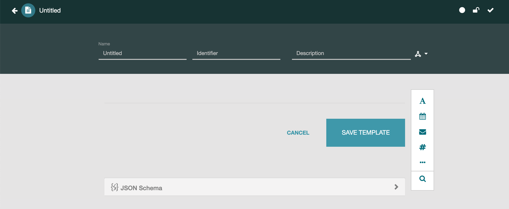 

In the dark gray header at the top of the page, enter a name and description for your template, leaving the Identifier field blank.

Click the "SAVE TEMPLATE" button. This will ensure that your new template is saved in the {{ page.cedarw }}. If you need to exit your browser at any point and return to this tutorial at a later time, your new template will appear in your workspace, and you can double-click on it to reopen the template designer.

#### Step 3 - Add some CDEs

Locate the vertical selector toolbar on the right-hand side of the template desinger view and click the "Search for fields and elements" button (depicted with a magnifying glass icon). This will launch a modal dialog where you can use the Search bar across the top to locate the desired CDE by entering, e.g., the Public ID or double quoted title and pressing the Enter key:

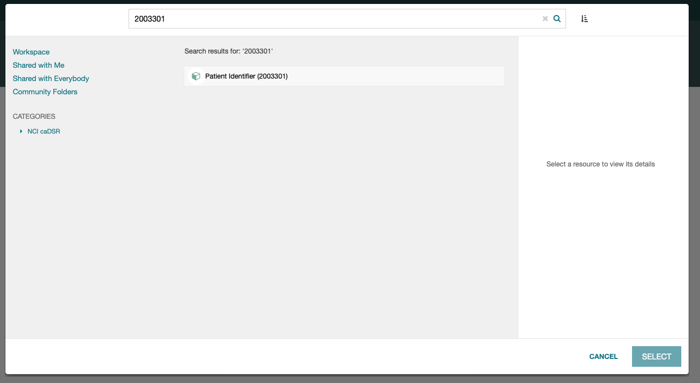 

If multiple items are returned in the search results, it can be particularly helpful to click on the individual entries to see additional information such as the description, location, permissions, version numbers, etc.:

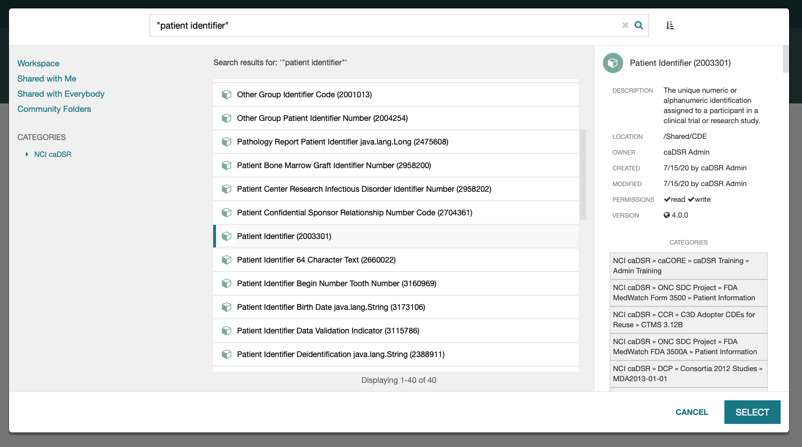 

_Note:_ In addition to using the Search bar at the top of the modal dialog, you can browse for CDEs by location using the links in the top left, or browse by category using the NCI caDSR tree widget.

Once you locate the desired CDE, select it in the middle pane and click the "SELECT" button. This will insert the CDE into your template and return to the template designer view.

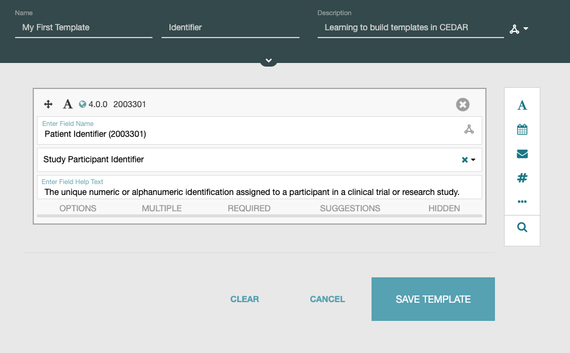 

Feel free to practice by adding several more CDEs to your template.

_Note:_ When a CDE or any other type of artifact is added to a template, it is initially show in an expanded view and others are collapsed. To expand an artifact and collapse others, simply click on the header bar of any given artifact. The following screen shot depicts a template with four CDEs where the second CDE is expanded, and all others are collapsed:

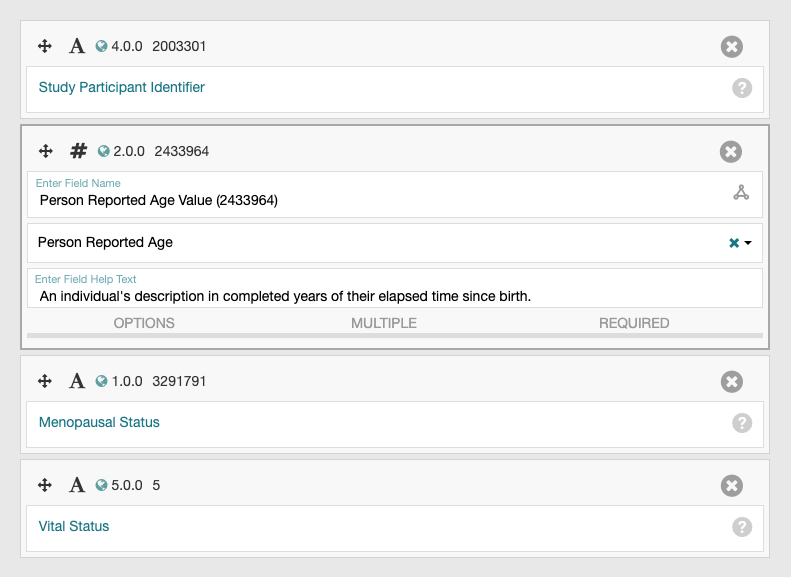 

There are several helpful tips to keep in mind when populating templates:

- Click the Delete button ('X' icon) in the upper right corner to delete CDEs and other artifacts
- Click and drag on CDEs and other artifacts to easily reorder them in your template
<!-- - Use the CLEAR link at the bottom of your template to remove all of the artifacts -->
- Remember to click the SAVE TEMPLATE button periodically to save your changes

The {{ page.cedarw }} offers many other types of artifacts that you can add to templates beyond CDEs, e.g., multiple choice and checkbox style fields, phone numbers, images, etc. All of these fields are available via the right hand vertical selector toolbar in the template designer. For more detail on artifacts outside of CDEs, you may find the following sections of the "[Building Basic Templates](building-basic-templates.md)" portion of the user guide helpful:

- [Adding Fields](building-basic-templates.md#adding-fields)
- [Adding Elements](building-basic-templates.md#adding-elements)
- [Field Type Reference](building-basic-templates.md#field-type-reference)

#### Step 4 - Configure CDE options

As indicated in the introduction, there are certain CDE options that you are allowed to configure. For example, if you want to indicate that the CDE is a required field, click the REQUIRED link at the bottom of the CDE and use the slider to indicate YES or NO. Another example is clicking on the MULTIPLE link to indicate whether the CDE can appear multiple times in a template, as well as the minimum and maximum number of occurrences.

If you want to change question text, which is referred to as the "preferred label" in the {{ page.cedarw }}, you can place your mouse in the "Enter Preferred Label" text box (second text box from the top) to see a dropdown list of available options. If the CDE has a large number of options for the preferred label, the {{ page.cedarw }} offers the ability to view all of the options depicted as a tag group by clicking the OPTIONS link at the bottom of the CDE:

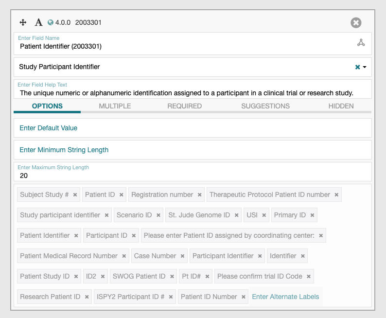 

Some CDEs have permissible values, which are referred to in the {{ page.cedarw }} as simply "values". If you added such a CDE to your template, there will be a VALUES link at the bottom of the CDE:

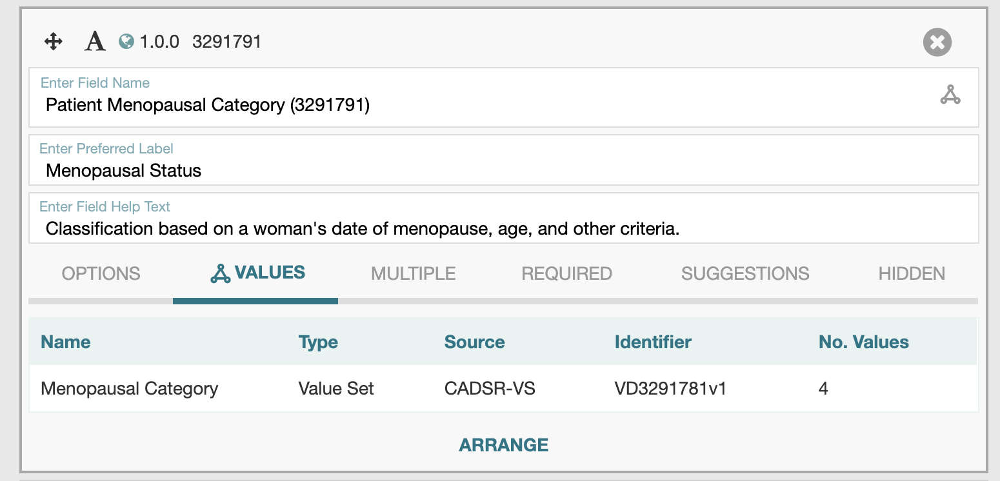 

To view the values, click the VALUES link at the bottom of the CDE, then click the ARRANGE link, which launches the Arrange Values modal dialog with the list of allowed values:

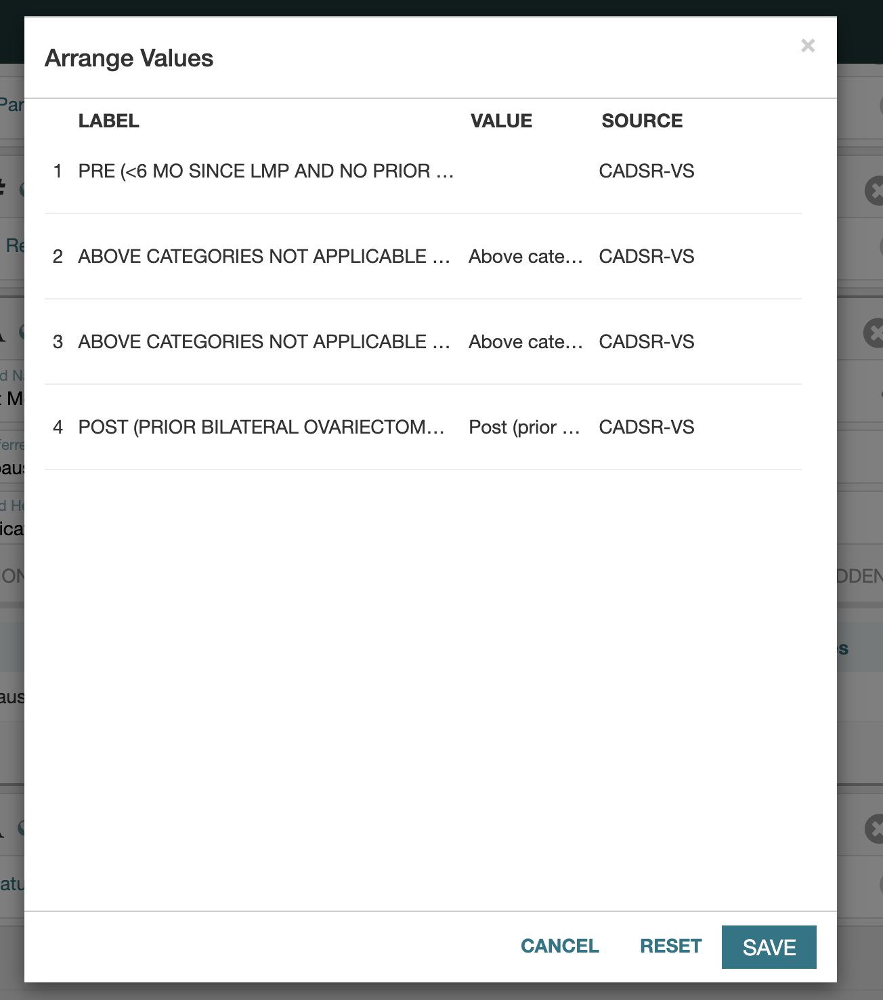 

Hover your mouse over individual values to display right hand icons that allow you to either delete a value, or move the value to the top and/or a specific position in the list.

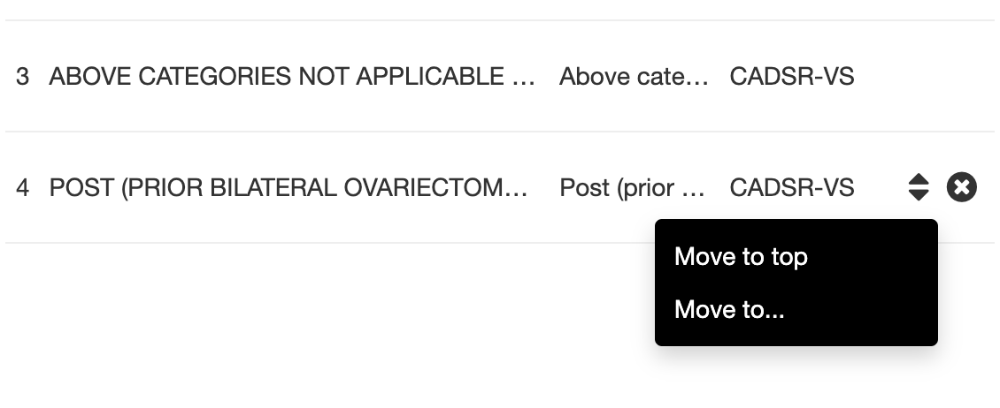 

Adding values is not currently possible from within the {{ page.cedarw }}. Requests for new values should be submitted via email to the following address: [caDSR.RA@mail.nih.gov](mailto:caDSR.RA@mail.nih.gov).

#### Step 5 - Save your template

Now that you have added several CDEs and possibly other artifacts to your template, click the SAVE TEMPLATE button and use the left arrow in the top left corner of the main window to return to your workspace. Your new template will be displayed in the middle pane with "Populate" and "More" icons on the right-hand side.

If you want to get a sense for how your template will look to someone that is filling it out, click either the Populate icon, or click the More icon and select the Populate menu item. This will open your template in the metadata editor where you can populate an instance of your template:

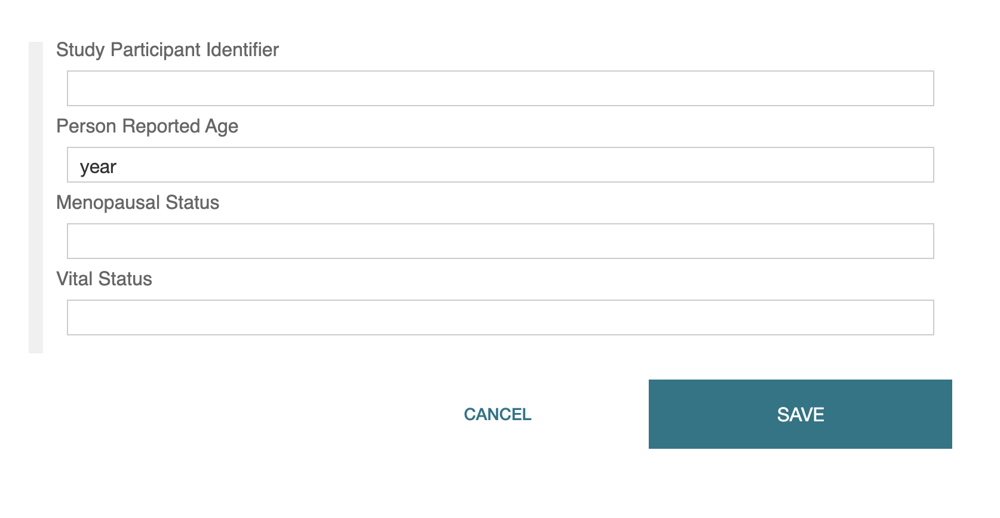 

If you fill out your template and click the SAVE button, the {{ page.cedarw }} will create an instance of your template and save it in the same directory. To view the instance, click the left arrow in the top left corner of the main window to return to your workspace. The new instance will have the same name as your template with the word "metadata" tacked onto the end:

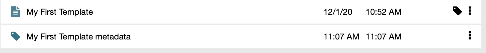 

If you want to organize your templates using folders, you can create new folders by clicking the "New +" button at the top left and selecting Folder from the resulting dropdown menu. Once you have your desired folder structure in place, you can click on the More buttons associated with your templates and select the "Copy to..." and/or "Move to..." menu items to relocate your templates:

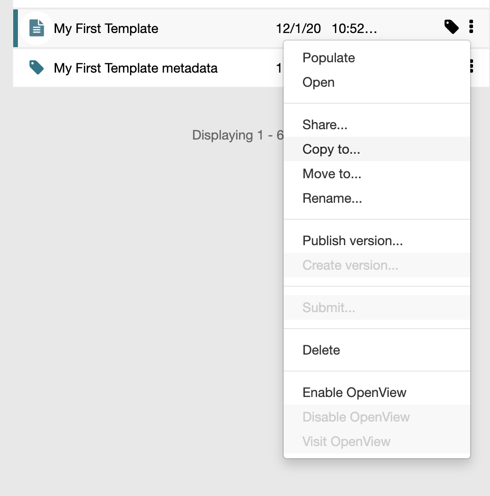 

The More menu also contains options for renaming and deleting your templates.

#### Step 6 - Share your template

When you create a template in your workspace or inside of a personal folder structure, you are the only person that can view and edit your template. The {{ page.cedarw }} facilitates the ability to grant other users and groups of users the ability to view and/or edit your templates.

If you wish to share your template with another user or group, click the More icon and select the "Share..." menu item to bring up the "Share settings" modal dialog:

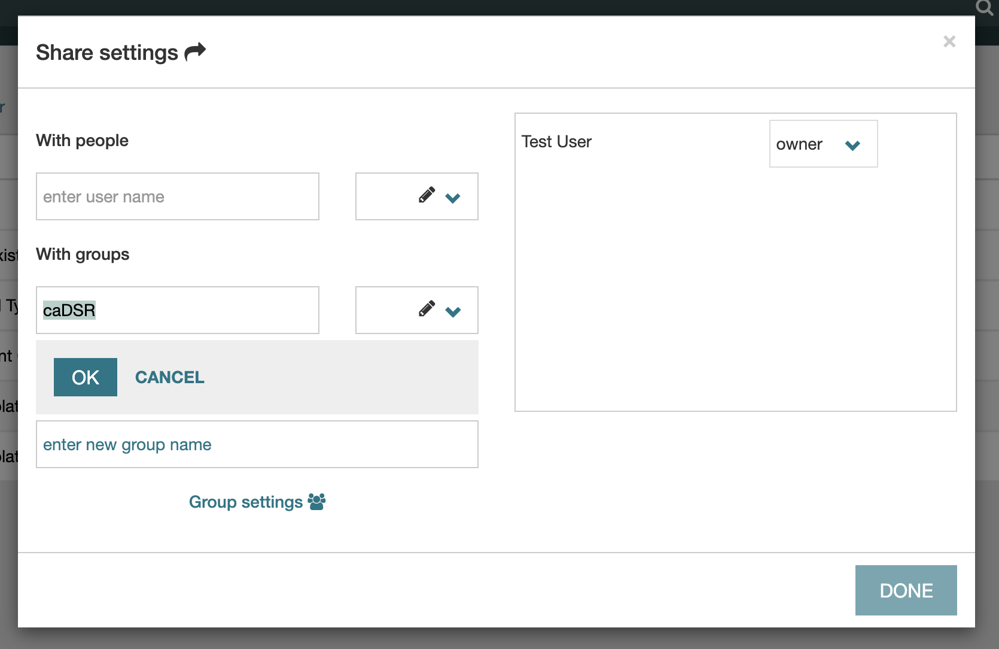 

Use the "With people" section to locate other users with whom you would like to share your template. After selecting a user name, you can use the dropdown on the right hand side of the user name to specify whether the user has read, write, or owner privileges for your template.

Use the "With groups" section to search for group names with whom you would like to share your template. The same read, write, and owner privileges are available to groups.

<!-- ## Modifying CDEs using the copy method

If you added one or more published CDEs to a template and later decide you want to modify those CDEs, you need to remove them from your template, make copies of the CDEs you want to change, and then add them back to your template after they've been modified.
 -->

## Use Case: Importing templates

This page covers the basics of importing caDSR Form Builder forms into the {{ page.cedarw }}.

---

### Introduction
{: #intro}

NCI's [Form Builder](https://formbuilder.nci.nih.gov/FormBuilder/){:target="_blank"} allows users to build forms that contain modules with questions. Before diving into the details of how these forms are imported into the {{ page.cedarw }}, it may be helpful to review the following high-level tips on application terminology and the import process:

* Forms are referred to as "templates" in the {{ page.cedarw }}.
* During import, modules are converted to "sections", i.e., forms with modules become templates with sections.
* Form customizations are preserved during import, with the exception of permissible value labels. For example, if you modify the Question Text associated with a question, that modification will be reflected in the {{ page.cedarw }} after import. However, any modifications made to the labels for permissible values are discarded.
* Ordering of the questions inside modules is preserved during import.
* The {{ page.cedarw }} only handles CDEs with statuses of released. Questions associated with CDEs that don't have a released status will be discarded during import, and will not appear in the resulting template.

Each of these bullet points is discussed in more detail in the step-by-step guide that follows.
 

### Import a template step-by-step

This section of the documenation will walk you through the mechanical steps of importing a template into the {{ page.cedarw }}.

#### Step 1 - Export your form(s) to XML format

The {{ page.cedarw }} allows users to import forms in XML format. For any given form that you want to import into the {{ page.cedarw }}, you first need to use the Form Builder application to export the form to XML format. 

On this documenation page, we plan to use the form with a public ID of 3918956 (Diagnosis Gross Pathology NCI Standard Template) as an example.

Navigate to the [Form Builder application](https://formbuilder.nci.nih.gov/FormBuilder/){:target="_blank"}, locate form 3918956, and download the XML format version of the form. If you need instructions for downloading forms in XML format, please refer to [this section](https://wiki.nci.nih.gov/display/caDSR/10+-+Downloading+and+Printing+in+Form+Builder#id-10DownloadingandPrintinginFormBuilder-DownloadFormtoXML){:target="_blank"} of the [Form Builder User Guide](https://wiki.nci.nih.gov/display/caDSR/Form+Builder+User+Guide){:target="_blank"}.

#### Step 2 - Go to your Workspace

Navigate to the [{{ page.cedarw }}](https://cedar.metadatacenter.org/){:target="_blank"} and make sure you're logged in. If you need help creating an account and logging in, see the [Accounts and Logging In](accounts-and-logging-in.md) section of this guide.

Click the Workspace link in the upper-left portion of the window to start out in your personal workspace.

#### Step 3 - Select XML files for import

Click on the "New +" button in the upper-left portion of the window, and select "Import" from the resulting dropdown menu.

This will launch the "Import files" modal dialog where you can select XML files for import:

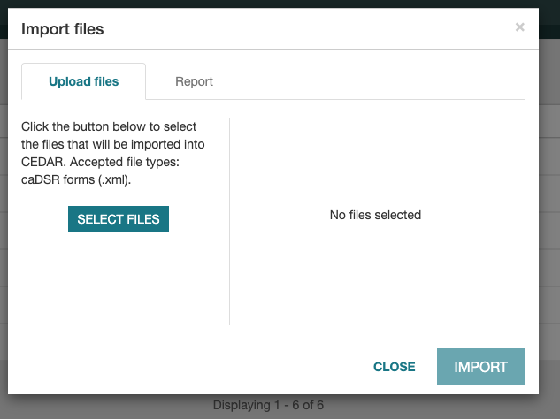 

Click the Select Files button and select the XML file for form 3918956 that you exported in a previous step. This will put the XML file in the right-hand pane of the dialog that lists XML files ready for import:

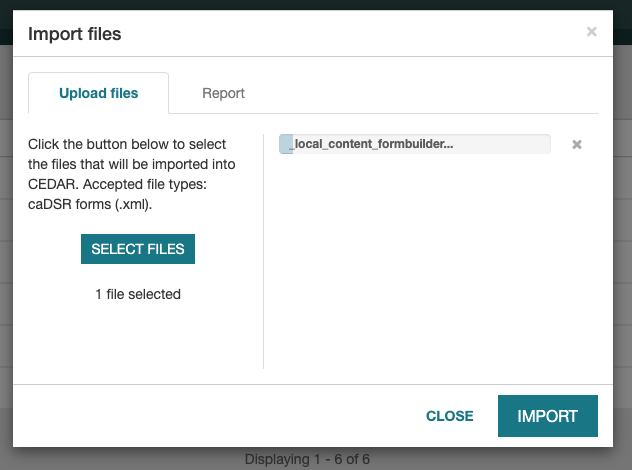 

_Note:_ The {{ page.cedarw }} allows you to import multiple XML files at a time. If desired, you can continue selecting XML files for import, which will be displayed in list format in the right-hand pane until such time that you proceed with clicking the Import button.

#### Step 4 - Perform the import

Click the Import button in the Import files dialog to begin the import process. The dialog will show a progress bar while the import is performed:

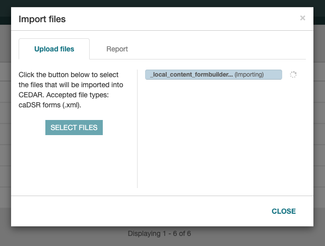 

During import, the {{ page.cedarw }} converts each module to a section, i.e.:

**Original Form Builder form structure**

~~~
|-- Form
|   |-- Module
|   |-- Module
|   |-- Module
~~~

**Resulting {{ page.cedarw }} template structure**

~~~
|-- Template
|   |-- Section
|   |-- Section
|   |-- Section
~~~
 

Once the import is complete, the dialog will show a completion message:

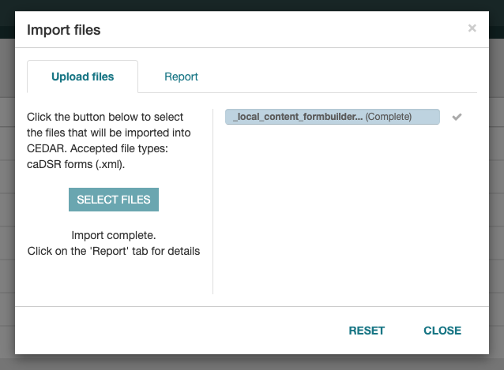 

#### Step 5 - Examine the import report

This step is optional, but helpful if you want to be aware of any issues encoutered during an import process. After template import is complete, the Report tab displays a detailed log of the import process that typically includes:

* Form metadata, e.g., the public ID, name, version, and status
* Addition of sections
* Addition of CDEs into sections, including the CDE public ID and version

The following screenshot shows the log from importing form 3918956 in the previous step with addition of a section with CDEs highlighted:

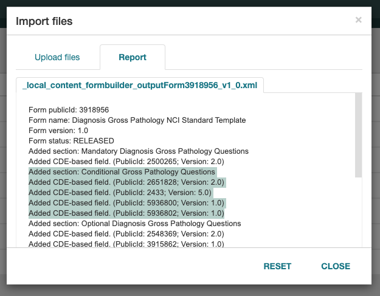 

_Note:_ The {{ page.cedarw }} only handles CDEs with released statuses. If you build a form in the Form Builder application that contains questions associated with CDEs that don't have a released status, these CDEs will be dropped from the template during the import process. You may want to pay special attention to lines in the import report that indicate removal of CDEs from templates, e.g.:

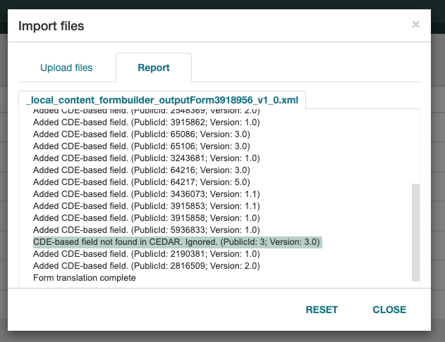 

If you import multiple XML files at once, the Report tab will contain a set of subtabs where each subtab contains the log output for a single XML file. The following screenshot shows the Report tab after the import of two XML files:

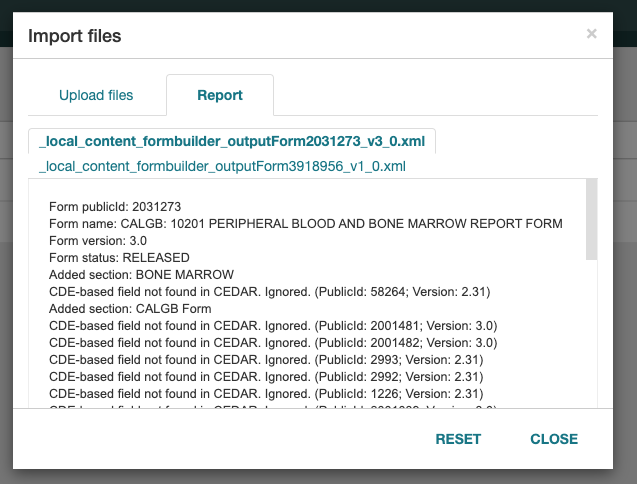 

#### Step 6 - View the imported template

After optionally reviewing the import report, click the Close button to dismiss the Import files dialog box. The newly imported template will now be visible in your workspace. The template title is created by concatenating the form's Long Name and Public ID in parenthesis. If you select the template and click the Details button (lowercase 'i' in the upper right), a details pane will be displayed with additional information about the template, e.g., description, location, persmissions, etc.:

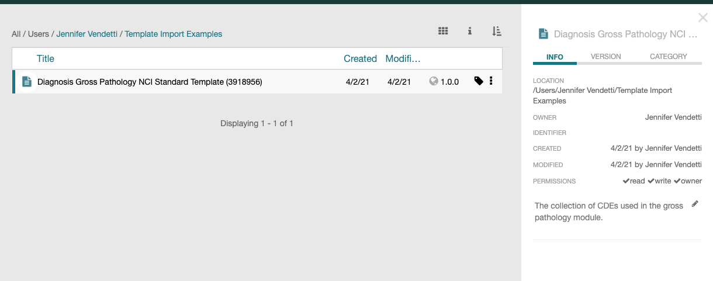 

To view the contents of the template, double-click on the template in your workspace to open the template designer view. Each artifact will be listed in a collapsed format. To examine sections and fields, click anywhere in the header bars to expand the contents:

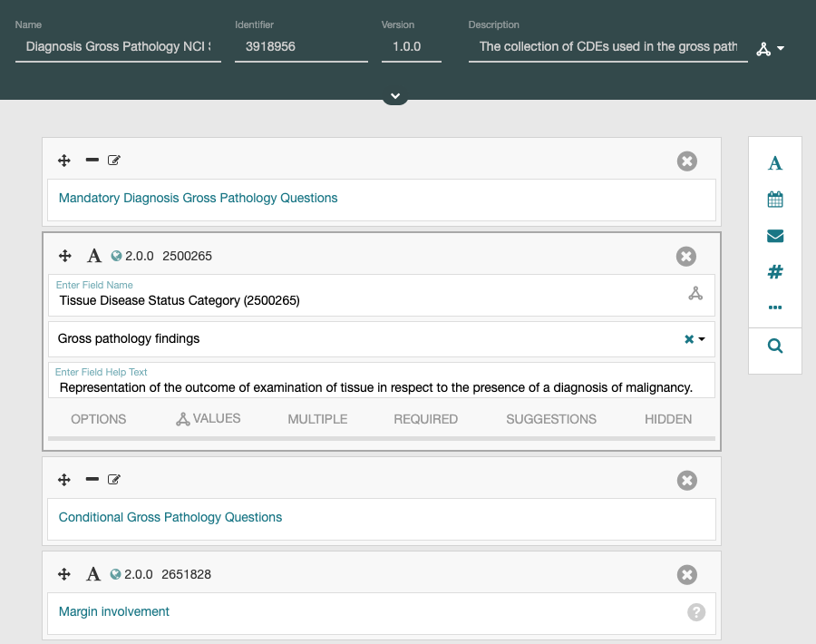 

It is also possible to create instances of templates so that you can see what they will look like to end users that need to populate the templates with data. Exit the template designer view by clicking the back arrow in the upper left corner of the window. Click the Populate button next to any imported template to open the metadata editor, which allows you to populate an instance of your template with values:

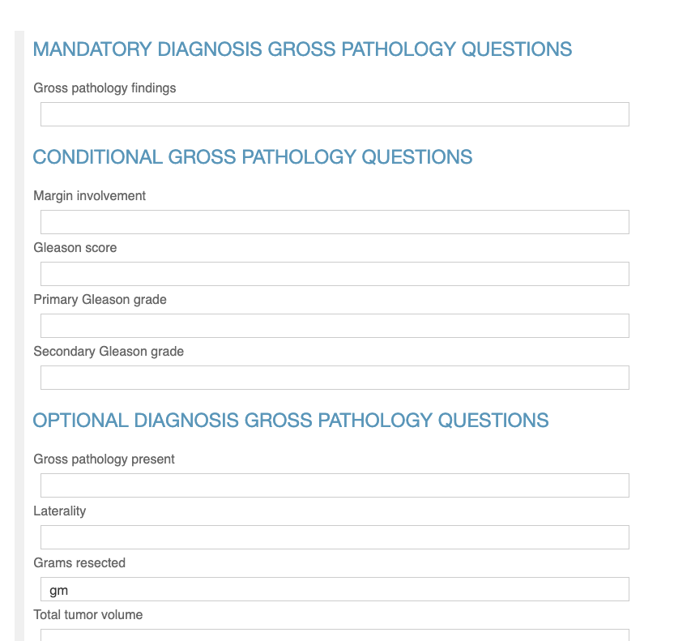 

### Editing imported templates

When forms are imported into the {{ page.cedarw }}, the resulting templates are assigned a status of "published":

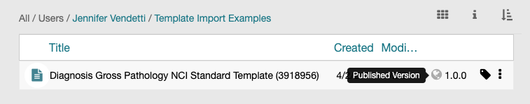 

Published templates are unmodifiable. If you wish to make changes to an imported template, you first need to make a copy of the template. Click the More menu (three vertical dots), select Copy to..., and save a copy of the template to a location of your choice.

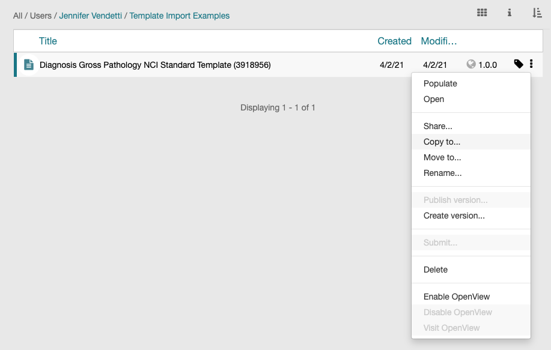 

The copied template will not have a published status and will allow you to make any desired modifications:

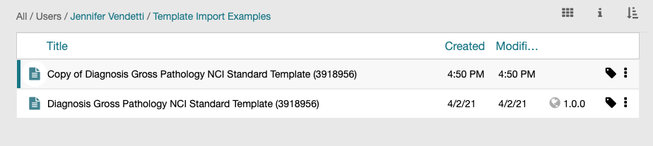 

If you need general instructions for editing templates, please refer to the following sections of the user guide:

[Building Basic Templates](building-basic-templates.md) 
[Configure CDE Options](#step-4-configure-cde-options)

## Use Case: Building resusable groups of CDEs

This page covers the basics of building elements in the {{ page.cedarw }}, with a special focus on CDEs.

***

### Introduction

Modules in the NCI Form Builder act as containers for one or more questions, allowing end users to create reusable groupings of questions for placement on forms. Equivalent functionality is available in the {{ page.cedarw }}, i.e., users can create elements with one or more fields and add them to templates.

Refer to the following graphical representations for terminology comparison:

**Form Builder**

~~~
|-- Module
|   |-- Question/CDE
|   |-- Question/CDE
|   |-- Question/CDE
~~~

**{{ page.cedarw }}**

~~~
|-- Element
|   |-- Field/CDE
|   |-- Field/CDE
|   |-- Field/CDE
~~~
 

### Step-by-step guide: build an element

This section of the documentation will walk you through the mechanical steps of creating elements in the {{ page.cedarw }}.

#### Step 1 - Go to your Workspace

Navigate to the [{{ page.cedarw }}](https://cedar.metadatacenter.org/){:target="_blank"} and make sure you're logged in. If you need help creating an account and logging in, see the [Accounts and Logging In](accounts-and-logging-in.md) section of this guide.

Click the Workspace link in the upper-left portion of the window to start out in your personal workspace.

#### Step 2 - Create a new element

Click on the "New +" button in the upper-left portion of the window, and select "Element" from the resulting dropdown menu:

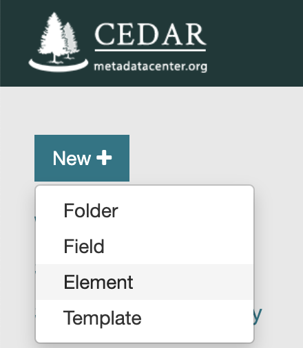 

This will create a new element and open the element designer view. 

In the dark gray header at the top of the page, enter a name and description for your element, leaving the Identifier field blank:

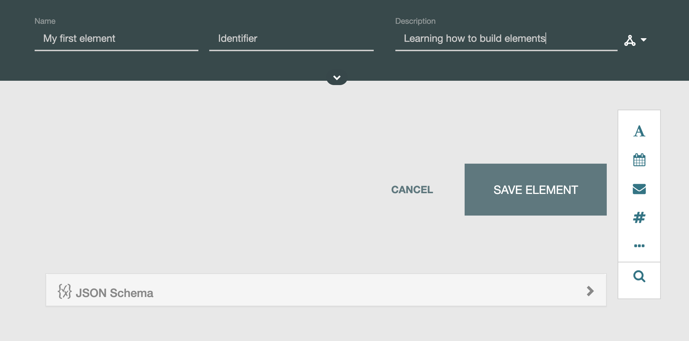 

Click the "SAVE ELEMENT" button. This will ensure that your new element is saved in the {{ page.cedarw }}. If you need to exit your browser and return to this tutorial at a later time, your new element will appear in your workspace, and you can double-click on it to reopen the element designer.

#### Step 3 - Add some CDEs

Locate the vertical toolbar on the right-hand side of the element designer and click the "Search for fields and elements" button (depicted with a magnifying glass icon):

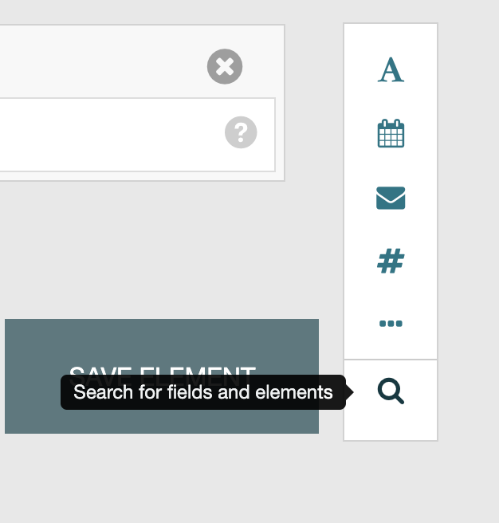 

This will launch a modal dialog where you can use the search bar across the top to locate the desired CDE by entering, e.g., the Public ID or double quoted CDE title. Use the search icon or press the Enter key to perform a search and view the results:

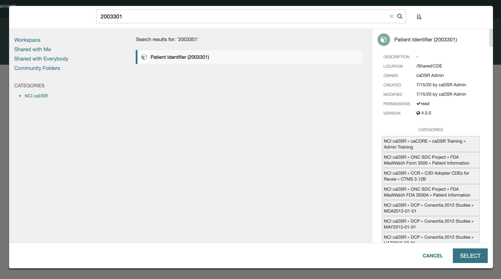 

You can select items in the list of search results to display a details pane on the right hand side of the dialog for viewing informaton such as the CDE owner, storage location, version number, etc.

If you need more information about how to efficiently search for CDEs in the {{ page.cedarw }}, please refer to the ["Finding CDEs"](#finding-cdes) page.

Once you locate the desired CDE, select it in the middle pane of the search dialog and click the "SELECT" button. This will insert the CDE into your element and return to the element designer.

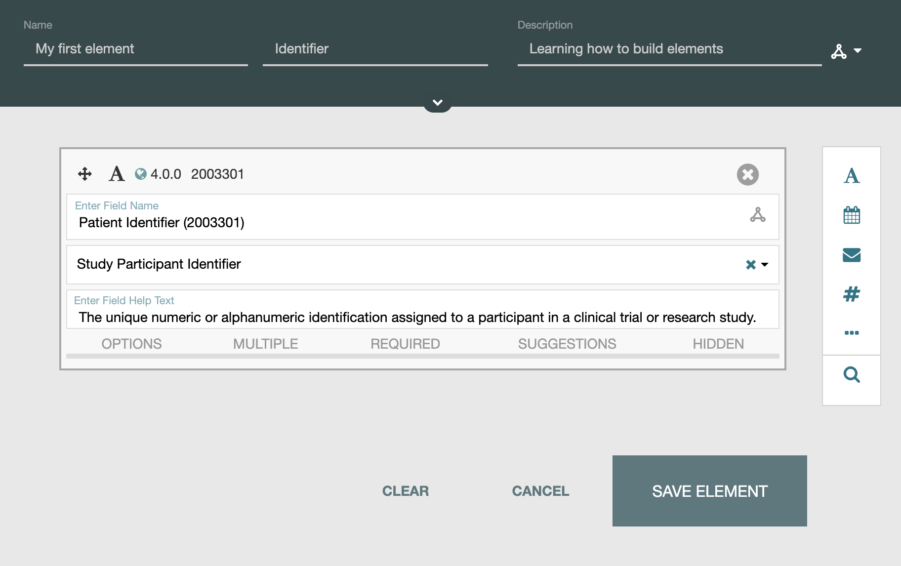  

Feel free to practice by adding several more CDEs of your choice to your element:

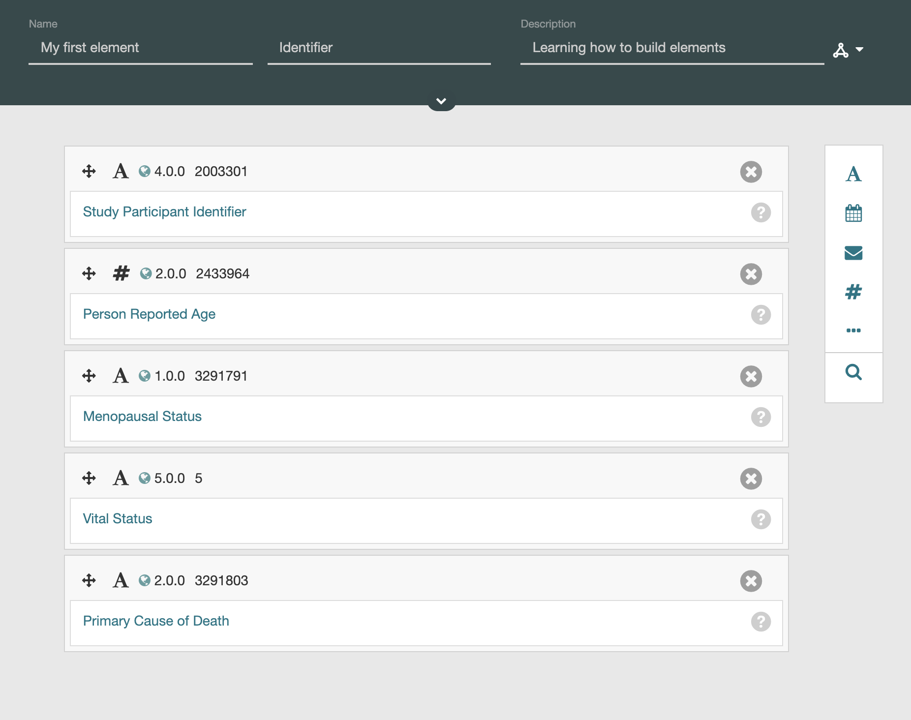 

Note that CDEs aren't the only type of fields you can add to elements. The {{ page.cedarw }} has a large variety of field types such as short or long text, links, images, section breaks, multiple choice, etc. All of these fields are accessible via the vertical toolbar on the right hand side of the element designer. For more detail on the various field types, you may find the [Field Type Reference](building-basic-templates.md#field-type-reference) page in the [Building Basic Templates](building-basic-templates.md) portion of the user guide helpful.

Don't forget to periodically click the SAVE ELEMENT button to save your changes as you work your way through the documentation.

#### Step 4 - Configure CDE options

Click on the header bar (shows the field type and CDE's public identifier) of any of the CDEs you added to your element to show the expanded view of the CDE:

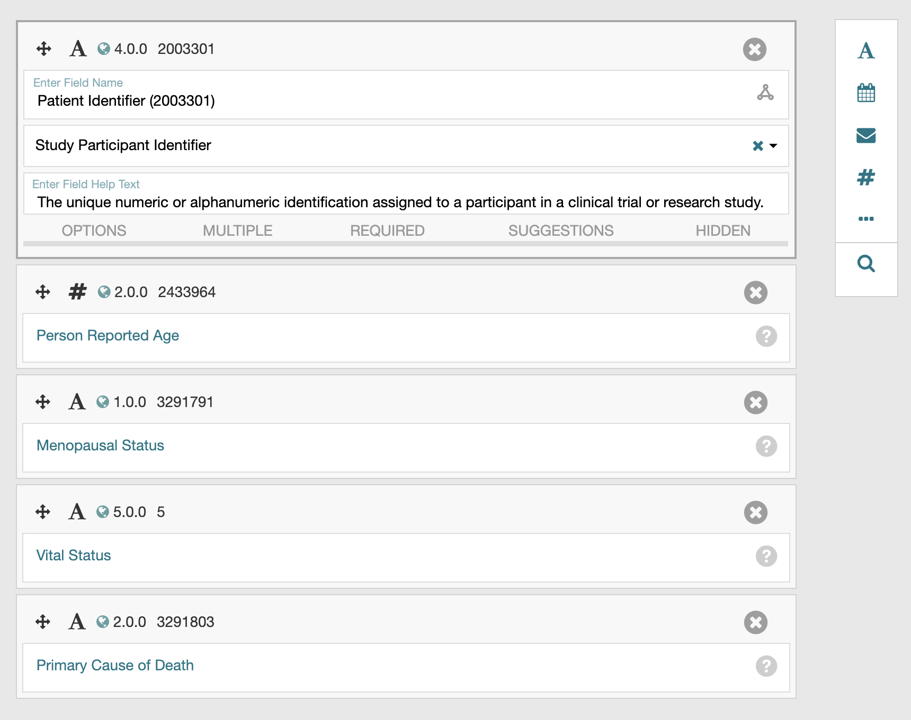 

CDEs are imported into the {{ page.cedarw }} as trusted artifacts, which means that many of the options are write protected and unmodifiable, e.g., the CDE's name and help text. There are some common options however, that users are allowed to configure.

##### Preferred labels

To modify the preferred question text (aka "preferred label" in the {{ page.cedarw }}), click the second text box from the top to display a dropdown list of alternate preferred labels. You can also click the "OPTIONS" link at the bottom of the CDE to view a tag group depiction of all possible labels:

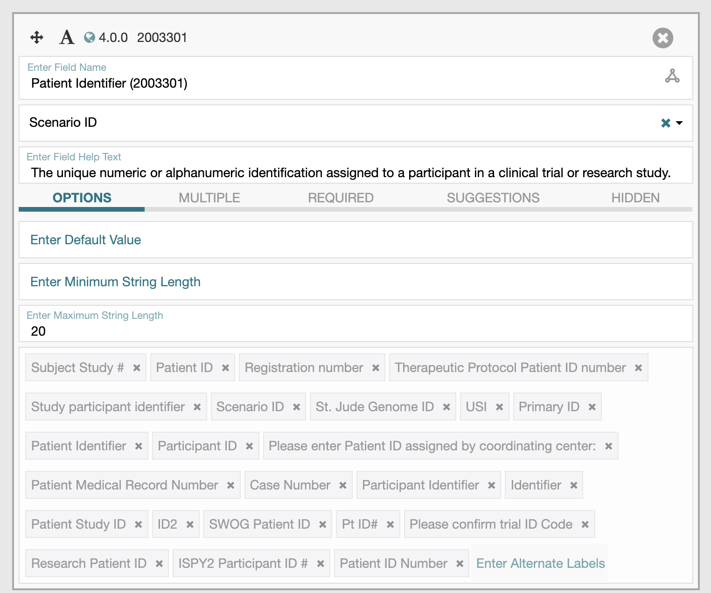 

The other bits of information displayed under the OPTIONS link are unmodifiable, but still may be of interest because they allow you to see configurations specific to the CDE type. In the screen shot above, minimm and maximum string length options are displayed because the CDE is a text type field. If you open the options for a CDE that is a numeric type field, you see a different set of options, e.g., unit of measure, decimal places, etc.:

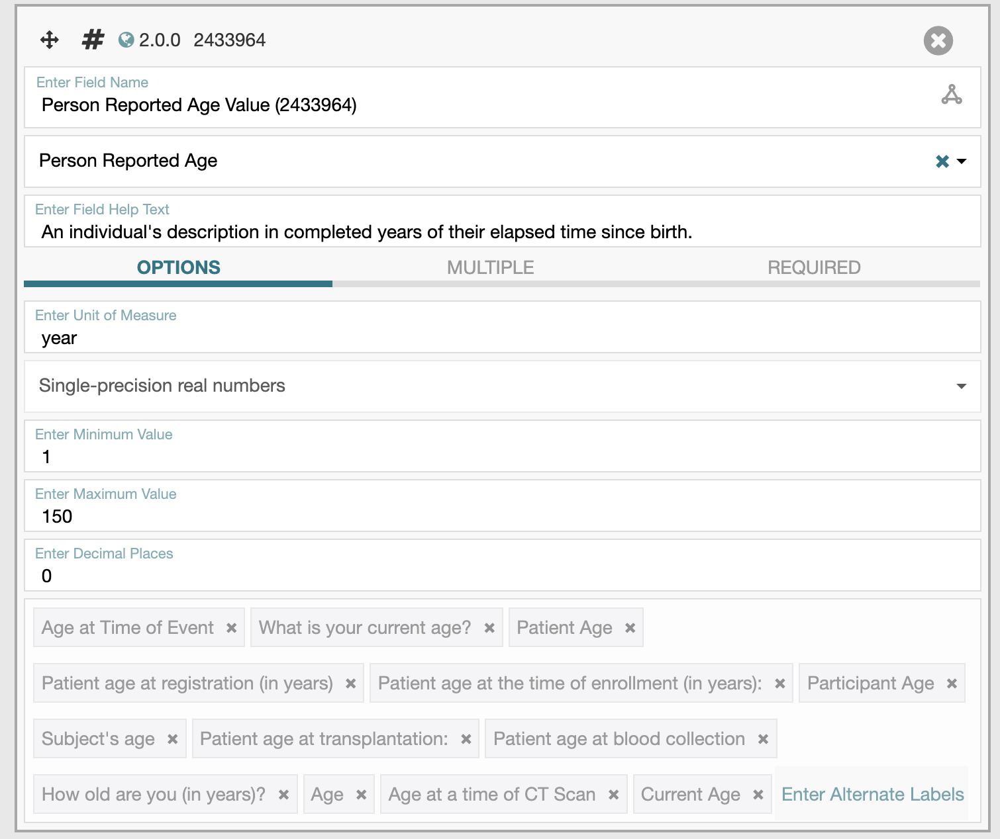 

##### Cardinality

Use the MULTIPLE link at the bottom of any CDE to specify whether the CDE is allowed to appear multiple times (or not at all) in your element. Click the horizontal bar under YES, and use the MIN and MAX buttons to specify the number of allowed occurrences:

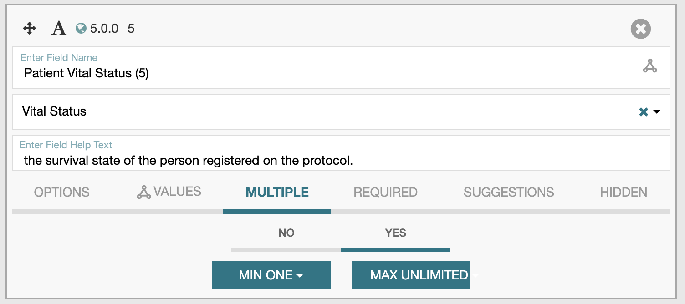 

If you specify a cardinality and click the SAVE ELEMENT button, note that the cardinality is then shown as part of the field header, e.g., "1..N" for minimum of one, maximum of unlimited:

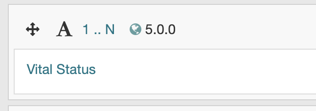 

##### Required vs. optional

The REQUIRED link allows you to specify whether or not the CDE needs to be filled out. If YES is selected, a red asterisk appears in the CDE header:

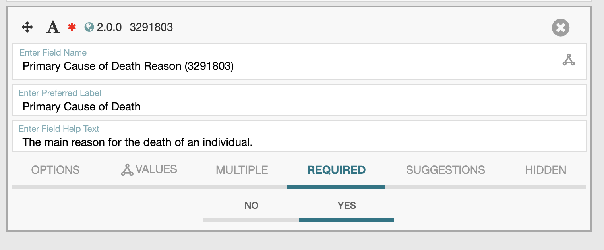 

##### Suggestions

Setting SUGGESTIONS to YES enables the {{ page.cedarw }} intelligent authoring suggestion system for the field. For a detailed explanation of this functionality, see [Understanding the Suggestion System](advanced-template-topics.md#understanding-the-suggestion-system).

##### Hidden

Use HIDDEN if you want a particular field/CDE to be hidden from the end user during template population.

##### Permissible values

If you added a CDE to your element with permissible values, aka "values" in the {{ page.cedarw }}, you will see a VALUES link at the bottom of the CDE:

 

To view the values, click the ARRANGE link, which launches the Arrange Values modal dialog:

 

Hover your mouse over individual values to display right hand icons that allow you to either delete a value, or move the value to the top and/or a specific position in the list:

 

Adding values is not currently possible from within the {{ page.cedarw }}. Requests for new values should be submitted via email to the following address: [caDSR.RA@mail.nih.gov](mailto:caDSR.RA@mail.nih.gov).

### Arranging CDEs in elements

The {{ page.cedarw }} user interface has full drag-and-drop support. To rearrange the ordering of your CDEs and other fields, simply click on the headers and drag to the desired location.

### Deleteing CDEs from elements

To delete CDEs and other fields from your element, click the 'X' icon on the top right corner of the header:

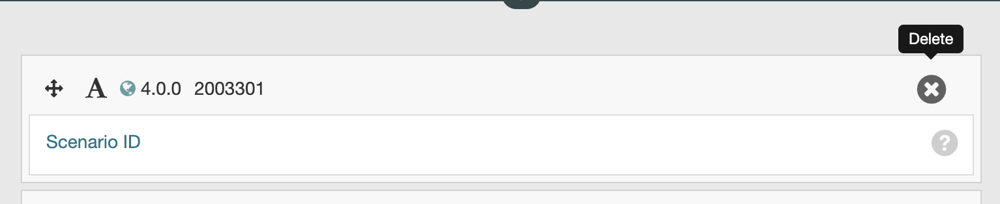 

### Nesting elements

The {{ page.cedarw }} allows users to nest elements inside of other elements. Note that nesting is restricted to one level deep. Adding an element to your element is done in the same way that you added CDEs. Click the "Search for fields and elements" button in the vertical toolbar, and select your element using the modal search dialog. When you add an element inside of another element, the user interface uses a slightly different border display to indicate the nesting:

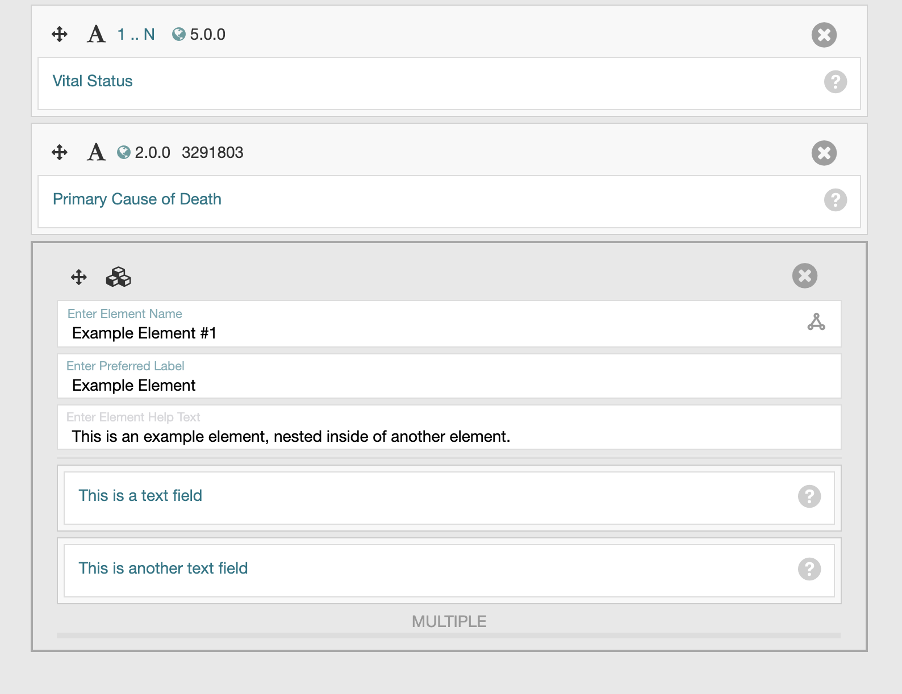 

### Adding elements to templates

Once you have created and saved elements in the {{ page.cedarw }}, you are now able to add those elements to any templates for which you have write access. As a quick example, navigate to your workspace, click the "New +" button, and select Template from the resulting dropdown menu. Use the "Search for fields and elements" button in the vertical toolbar to launch the modal search dialog and select one of your newly created elements. The following screen shot depicts a new template that contains the element created in this step-by-step guide:

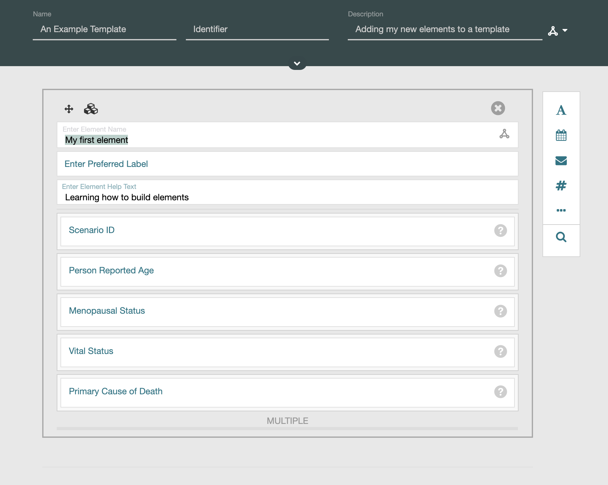 

A key thing to note about elements embedded within templates is that only the element name, preferred label, and help text are modifiable. If you need to make changes to the fields within an element, this can't be done from inside the template. 

If you find that you added an element to a template and later decide you want to make changes to the element, you could use a workflow something like the following:

- Remove the element from your template
- Exit your template
- Locate the element, make the desired changes in the element designer, and save the element
- Reopen the template
- Add the element with the desired modifications

## Finding CDEs

Common Data Elements (CDEs) are imported into the {{ page.cedarw }} on a 
nightly basis.

This page describes the four main ways to browse and search for CDEs:

***

### Browse CDEs via the CATEGORIES pane

The "All Program Areas" tab in the {{ page.cdeb }} displays a list of caDSR 
contexts on the left-hand side of the window. These contexts have been 
imported into the {{ page.cedarw }} and presented as a tree structure in the 
CATEGORIES pane, located on the left-hand side of the window.

In the {{ page.cedarw }}, contexts and classifications are simply referred to 
as "categories". 

To browse CDEs by category, open the root node of the tree structure in the 
CATEGORIES pane entitled "NCI caDSR":

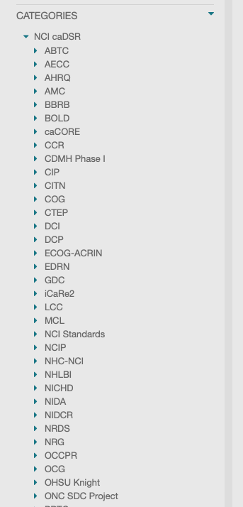 

Select a top-level category, e.g., "ABTC" to see all the CDEs in the category:

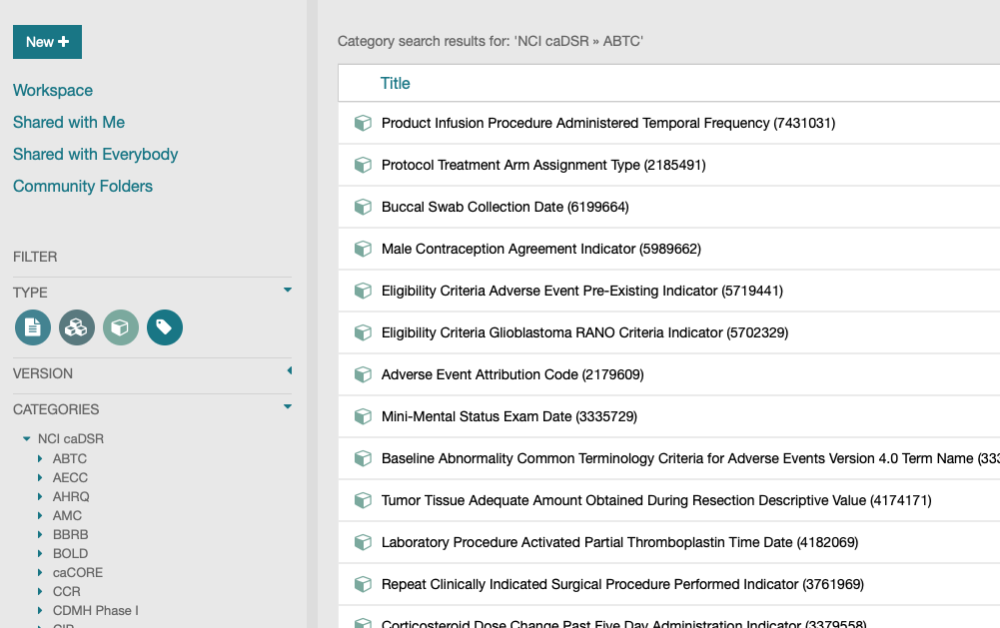 

Continue navigating deeper in the tree to further refine the list of CDEs 
displayed in the center pane:

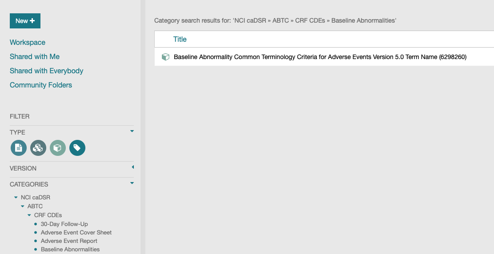 

To see more information about any of the CDEs listed in the center pane, 
select the CDE, click the "Details" button (lowercase 'i'), and look to the 
righ-hand side of the window where the {{ page.cedarw }} displays a details 
pane. The details pane has several tabs that show a wide variety of attributes 
including location, permissions, version, etc.:

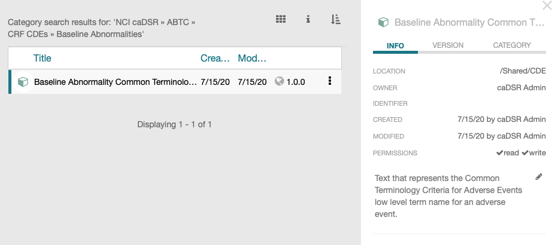 

### Browse CDEs via the Community Folder

The authors of the {{ page.cedarw }} maintain a "Community Folder" that 
contains CEDAR artifacts they feel may be of interest to the entire user 
community. 

To browse CDEs from the Community Folder, click the Community Folder link in 
the upper left portion of the window. In the center pane double-click the 
folder entitled "CDE":

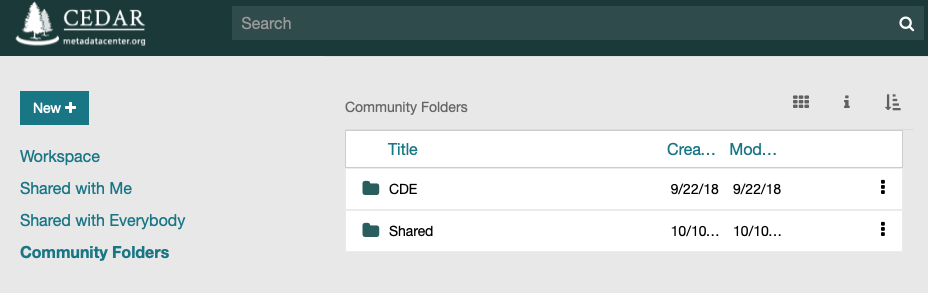 

All of the CDEs imported into CEDAR are shown in the center. The buttons at 
the top right-hand side of the window are useful for tweaking how the CDEs 
are displayed, e.g.:

- Use the View button to toggle between grid and list views
- Select any CDE and use the Details button to show and hide the details pane
- Use the Sort button to sort CDEs by creation date, modification date, or title
  

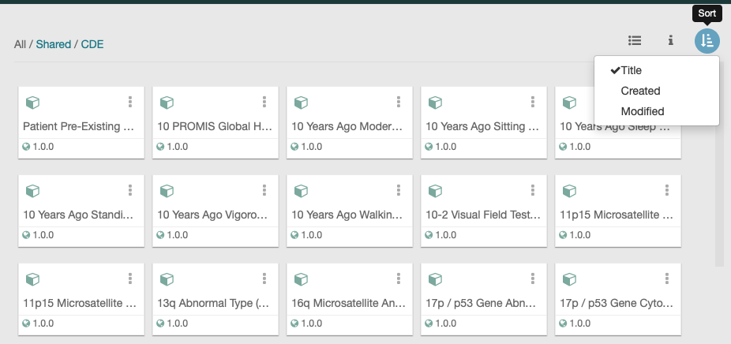 

### Search for CDEs from the Desktop

The {{ page.cedarw }} displays a search box at the top of what is referred to 
as the "Desktop". One way to make sure the Desktop view is displayed is to 
click on the Workspace link in the upper-left portion of the window. For a 
more in-depth explanation of the Desktop and other components displayed in 
the Workspace, refer to the section entitled 
"[Your CEDAR Workspace](desktop-and-navigation.md#your-cedar-workspace)" in the 
"[Desktop and Navigation](desktop-and-navigation.md)" chapter.

When CDEs are imported into the {{ page.cedarw }}, they are named by 
concatenating the Long Name of the CDE with it's Public ID in parentheses. For 
example, the CDE with a Public ID of 62 is imported as "Patient Gender 
Category (62)". To follow are several examples of what to enter in the search 
box to efficiently locate CDEs:

Perform a string search by entering the Long Name of the CDE, surrounded by 
double quotes:

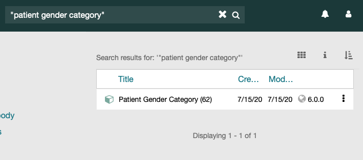 

Searching for a shorter Public ID like 62 will sometimes returns too many 
results. Instead, enter the Public ID in parentheses surrounded by double 
quotes:

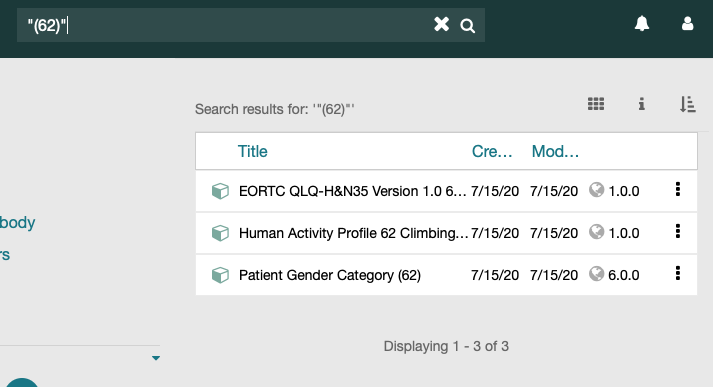 

For longer Public IDs, simply entering the ID in the search box is sufficient:

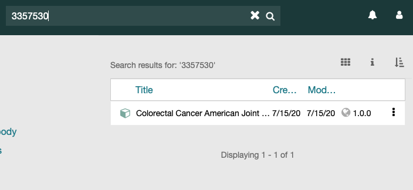 

Perform a search by CDE Version number to see a list of CDEs with a 
particular version:

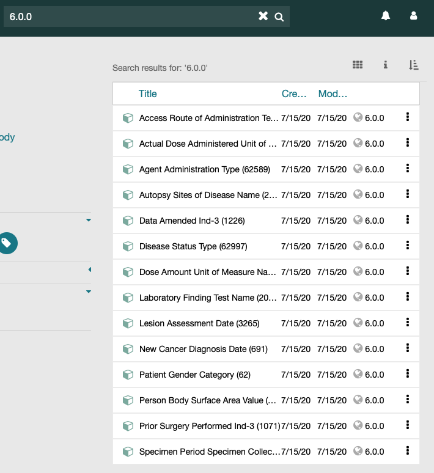 

Perform a string search by entering the CDE Definition (known as "Description" 
in the {{ page.cedarw }}) surrounded by double quotes:

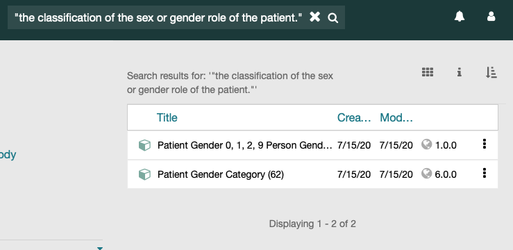 

The {{ page.cedarw }} offers several more sophisticated methods of search 
including the use of wildcards, boolean expressions, and the ability to search 
by field names and values. More information is available in the 
"[Finding Resources](finding-resources.md)" chapter.

### Search for CDEs from within templates and elements

This section assumes basic knowledge of creating and/or editing templates and 
elements in the {{ page.cedarw }}.

To search for a CDE from within a template:

1. Create a new template, or open an existing template.
2. In the resulting template designer interface, click the Search button 
   (magnifying glass icon) in the vertical finder toolbar:
   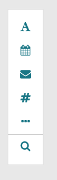
3. Use the search box in the resulting dialog to search for the desired CDE.

To search for a CDE from within an element:

1. Create a new element, or open an existing element.
2. In the resulting element designer interface, click the Search button 
   (magnifying glass icon) in the vertical finder toolbar.
3. Use the search box in the resulting dialog to search for the desired CDE.

### Search for CDEs by permissible values
The CEDAR Workbench also supports a flexible syntax to search for CDEs by permissible value. This syntax is based on the patterns `[pv]VALUE` and `[pv]=VALUE`, which enable partial and full exact matches, respectively.

For example, the query `[pv]Female` will retrieve all the CDEs with the word `Female` in at least one of their permissible values. CDEs with values `Female` and `Female person` would be returned by this query. Adding an `=` sign to the query enforces exact-phrase matches. For example, the query `[pv]=Female` will return the CDEs with `Female` as one of their values, but it won't return CDEs with value `Female person`, since the query doesn't match the full value.

The syntax described in this section is enabled when searching CDEs from the Desktop and from templates and elements. Note that the syntax is case insensitive, such that `[pv]Female` will return the same results than `[pv]FEMALE` and `[pv]female`.

The following table summarizes the different types of permissible-value queries supported by the CEDAR Workbench, providing examples for each of them.

| Query Type | Example | Description |
| --- | --- | --- |
| Phrase | `[pv]female` | It will match "**Female**", "**Female** person". It won't match "Females" |
| Phrase | `[pv]"eye and orbit"` | It will match "**Eye And Orbit** Anatomic Site", "**Eye and Orbit**". It won't match "Orbit and Eye" |
| Exact phrase | `[pv]=female` | It will match "**Female**". It won't match "Female person" |
| Exact phrase | `[pv]="Eye and Orbit"` | It will match "**Eye and Orbit**". It won't match "Eye and Orbit Anatomic Site" |
| Wildcard | `[pv]fem*` | It will match "**Fem**ale", "**Fem**ale person" |
| Wildcard | `[pv]f*e` | It will match "**F**emal**e**", "**F**in**e**" |
| Wildcard | `[pv]fem?le` | It will match "**Fem**a**le**" |
| Boolean | `[pv]=female AND [pv]=male` | It will return CDEs that have both "**female**" and "**male**" in their list of permissible values |
| Boolean | `[pv]=female OR [pv]=woman` | It will return CDEs that have either "**female**" or "**woman**" in their list of permissible values |
