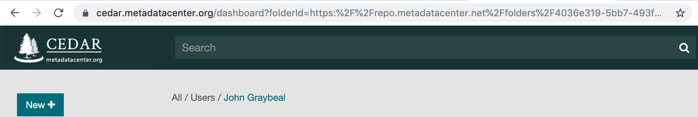

# CEDAR Identifiers and IRIs

Most people are familiar with the term URL, for Uniform Resource Locator. These are the web page identifiers you put into the browser to arrive at a web page. Sometimes we would use the term URI, which referred to any Uniform Resource Identifier—some of them weren't URLs, but even the URLs did not strictly have to be resolvable and could be used as identifiers.

The URL has been replaced by a newer standard, called an IRI, for Internationalized Resource Identifier. These can contain international characters and often resolve to web pages (when they begin `https://`) but like URLs, they do not have to be resolvable to serve as a unique identifier.

Throughout our manual, we usually refer to our CEDAR identifiers as IRIs, and will typically use URL to refer to a web address you'd put in your browser. 
But it's useful to understand that all of the identifiers and locators we are referring to are both IRIs and URLs.

## Browser Address URLs in CEDAR

When you run CEDAR, the first page you see will be your Workspace home page, and the top of your browser may look something like this:

{:width="100%"}

The bar at the top of the browser shows part of the IRI describing CEDAR's location. 

### **Workspace Home Directory IRI**

When you log in for the first time or go to your home directory, the URL in the browser will be like the following:
```
https://cedar.metadatacenter.org/dashboard?folderId=https:%2F%2Frepo.metadatacenter.net%2Ffolders%2F4036e319-5bb7-493f-8fe5-31a004f65a94
```

The first part of this is straightforward: `https` is the protocol, `cedar.metadatacenter.org` is the path for the application, and 
`dashboard` is the application type that is presenting the content.

After the dashboard you will usually see the query character `?` followed by `folderID=`. 
This means that the following string will be the (encoded) unique identifier of the location that the CEDAR Workbench is displaying. 
If you've just logged in, this will identify your own home folder.

You'll notice that the identifier has a number of escape characters, usually just `%2f` for a slash in this case. 
You are seeing an _encoded_ version of the identifier. 
You can see the actual identifier by passing this string through an encode-decode site (e.g., https://www.url-encode-decode.com)
and asking to decode the string. Doing so for this string results in the identifier
```
https://repo.metadatacenter.net/folders/4036e319-5bb7-493f-8fe5-31a004f65a94
```
which is the actual unique identifier for the viewed location.

### **Template Creator or Metadata Editor IRI**

If you open an existing template, you'll see an IRI like

```
https://cedar.metadatacenter.org/templates/edit/https://repo.metadatacenter.org/templates/4595e3d3-b0c5-467b-a967-fec870801624?folderId=https:%2F%2Frepo.metadatacenter.org%2Ffolders%2Feaa65a39-1706-43b6-b4ca-2bf9d7d1166d
```

Breaking that down, we've replaced `dashboard?folderID=` in our previous example with `template/edit/`, 
which tells us we are in the template editor.
(For a metadata instance, we would see `instances/edit/`, 
and if we were just creating an instance for the first time, `instances/create/`.)

Everything that follows the `template/edit/` string, until reaching the `?`, is a template identifier:
```
https://repo.metadatacenter.org/templates/4595e3d3-b0c5-467b-a967-fec870801624
``` 
That is the unique identifier that you will see inside the template as its own ID.

Then we see the `?folderID=` string again. 
In this case the following string indicates to what page in your Workspace CEDAR will return to after leaving the template editor;
it is the (encoded) IRI of the folder to which CEDAR will return. 
That will usually point to the previous *non-search* page you saw before entering the template creator. 
But if someone sent you the IRI from _their_ browser, it will try to return you to the previous non-search page in _that_ session.
(If it fails because you don't have permission to see that page, it will return to your workspace homepage.)

## Building Shareable Metadata Creation IRIs

Given a template IRI, you can preface it with the metadata creation IRI base, which is `https://cedar.metadatacenter.org/instances/create/`. 
So if your template looks like
`https://repo.metadatacenter.org/templates/f7d62955-ed10-4912-b4db-1b366ad4ff00` (_not a real template!_),
you would get an IRI (URL) like 
`https://cedar.metadatacenter.org/instances/create/https://repo.metadatacenter.org/templates/f7d62955-ed10-4912-b4db-1b366ad4ff00`
(entering this won't do any good because that wasn't a real template).

When such an IRI is clicked or put into the browser, it would launch CEDAR, log in (or create account for) the user if necessary, 
and put the user into a new metadata creation form for that template. 

Because there is no 'return folder' specified in this URL, 
when the user saves the created metadata, it will be put into his or her home folder, and the user will be returned to that folder.
If the user will have write access to a particular folder where this metadata should go, appending the folderID 
(with `?folderID=`and the encoded ID of the target folder) will result in the saved metadata going into that folder.  
(However, in that case the user may not realize how that happened or how to return to it, so this approach should be used with caution.)

## How CEDAR Defines and Applies IRIs (URIs, URLs)

The advanced user may wish to consult the [CEDAR Template Model Specification](https://more.metadatacenter.org/tools-training/outreach/cedar-template-model) for more information.

A CEDAR artifact has a unique identifier that is of the following form:
`https://repo.metadatacenter.org` / `[type]` / `[UUID]`

Here, `type` can be any of template-instances, template-fields, template-elements, templates, or folders.
A UUID is a unique 36-character string with 4 hyphens embedded, as in the following: `4595e3d3-b0c5-467b-a967-fec870801624` .

These IRIs are not directly resolvable, but can be plugged into one of the following forms to try to resolve them:

- Folder: `https://cedar.metadatacenter.org/dashboard?folderId=` followed by the _encoded_ IRI 
- Template: `https://cedar.metadatacenter.org/templates/edit/` followed by the IRI
- Element: `https://cedar.metadatacenter.org/elements/edit/` followed by the IRI
- Field: `https://cedar.metadatacenter.org/fields/edit/` followed by the IRI
- Metadata Instance: `https://cedar.metadatacenter.org/instances/edit/` followed by the IRI

CEDAR users also have unique identifiers, which are encoded in any artifact that the user creates or updates. 
These are of the form 
`https://metadatacenter.org/users` / `[UUID]`

CEDAR metadata instances also create another kind of template-element-instance identifer, 
but these are not of practical use to anyone using the CEDAR user interface.
