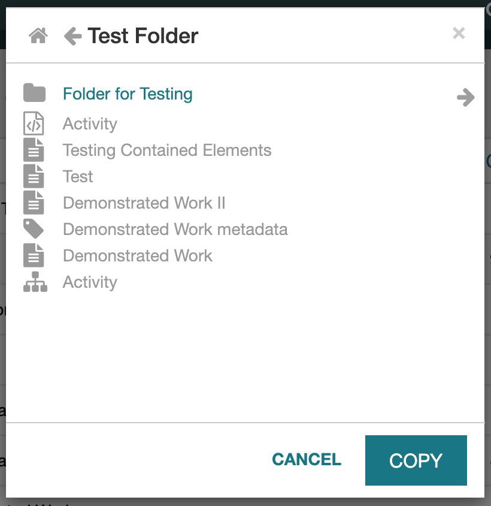
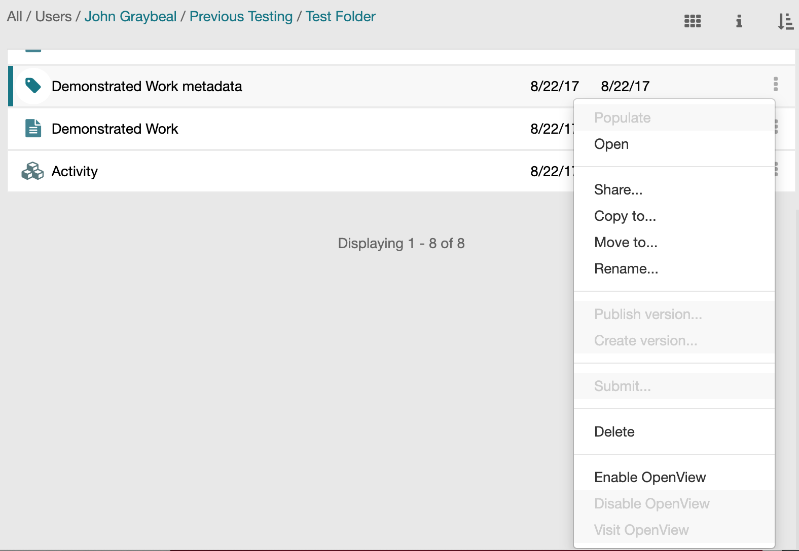
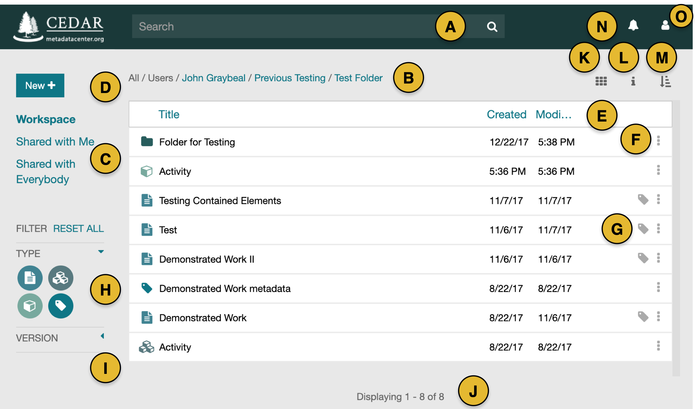
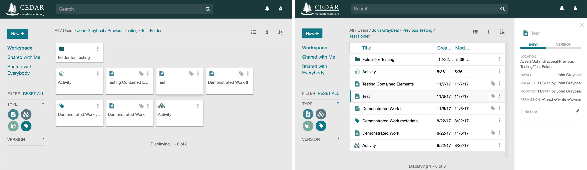

# Desktop and Navigation

## Managing CEDAR Resources

### **Introduction**

In CEDAR, resources include the various artifact types (templates, elements, fields, metadata instances) and folders. These are all managed through the CEDAR Desktop,
typically through your [workspace view](#your-cedar-workspace).
Management operations include copying, moving, renaming, and deleting resources, and
setting sharing permissions on resources.

If you want to fill out metadata for a particular template,
the **Populate** command will open the Metadata Creator set up to fill in metadata for that template.
If you want to edit an artifact (including a populated metadata instance),
the **Open** command will open the appropriate tool
(Template Editor for templates, elements, and fields; and Metadata Creator for metadata instances) with that resource.
For a folder, the Open command changes the Resources box view to show the selected folder.

Other artifact-related commands like Publish/Create version, Submit, and Enable/Disable/View OpenView are addressed
in their respective sections of the User Guide.

### **Resource Menu**

All the resource options are managed through the menu of the resource (shown below).
Access the resource menu by clicking on the vertical dots (the 'kebab menu', **⋮**) on the right side of the resource.
A drop-down menu provides access to the options for moving, copying, renaming, deleting, and sharing the resource.
If a menu item like Copy… is grayed out, it is not available for that resource.
If **all** menu items are grayed out, either no resource is selected, or there is a permissions inconsistency.

#### Destination Commands and Selection Window

The Copy to… and Move to… commands will display a window for you to choose the destination for the command, shown here.
The starting location is your current workspace folder.
To navigate in this window, click on the left arrow to move up in the folder hierarchy,
click on the right arrow for a folder to move into that folder, and
click on the Home icon at upper left go to to your workspace (home folder).

If you try to navigate to a folder to which you do not have needed permissions, an error message will be displayed.

There is always a destination folder selected.
If no folder is highlighted in the window, the destination folder is the currently displayed folder.
If a folder is highlighted in the window, the highlighted folder is the target folder that will be used.

{:width="50%" class="centered"}

##### ***Copy to…*** Command

After selecting the Copy… command, you will be asked to select the destination folder, and can then complete the operation by clicking on COPY.

This operation requires read permission for the resource.
You can copy any CEDAR artifact to another directory for which you have write permissions.
However, you can not copy an entire CEDAR folder with a single command.

##### ***Move to…*** Command

After selecting the Move… command, you will be asked to select the destination folder, and can then complete the operation by clicking on MOVE.

This operation requires write permission for the resource.
You can move any CEDAR artifact or folder to another directory for which you have write permissions.

#### ***Rename*** Command

After selecting the Rename… command, you will be asked for the new name. This operation requires write permission for the resource.

#### ***Share…*** Command

The Share… command opens a sharing configuration window.

In this window you can perform all sharing and group management operations needed to control resource access in CEDAR.
See the [Sharing Your Content](sharing-your-content.md)
section for detailed information about sharing resources in CEDAR.

#### ***Delete*** Command

The delete command displays a confirmation box, then deletes the item.

Use this command with caution, as there is no undo command. Contact the CEDAR team to restore content you have deleted.

{:width="75%" class="centered"}

## Navigating Within CEDAR

### **Introduction**

CEDAR (the "CEDAR Workbench") has 3 tools:

* the Desktop (which includes [your workspace](#your-cedar-workspace)),
* the Template Editor, and
* the Metadata Creator.

### **The Components**

For [managing CEDAR content](#managing-cedar-resources)
you'll use the Desktop, which can either display a Workspace, or search results. (More on search results below.)

When you want to create a template, element, or field, you will use the Template Editor.
This is a form-building tool that lets you drag-and-drop form components.

To fill out a form, you'll use the Metadata Creator, which lets you edit and save metadata, and view it in JSON-LD or RDF.

### **Browsing in the Desktop**

When the location bar is shown at the top of the Resources box,
you can click on any of the highlighted components of the location to go to that folder.

In any Desktop view, if you want to navigate into any of the folders that are listed,
double-click on the folder.
(You can also use the resource menu (*⋮*) and click on Open.)
This works in either search or browse mode to display the contents of folder in the Desktop.

Note that when My Workspace is the selected viewing mode (see [Your CEDAR Workspace](#your-cedar-workspace) for more details on viewing modes), you only see resources at the current folder level. In either of the Shared views you will see all the folders and artifacts that explicitly satisfy the chosen criteria.

### **Moving Back and Forth**

From the Desktop, you'll move to one of the other tools by opening an artifact or populating metadata for a template.
Once in the Template Editor or Metadata Creator, you can't perform any Desktop functions.
The only way back to the Desktop is via the *CEDAR* back button in the upper left of the template or metadata instance.
Think of these tools as 'modal overlays' on the Desktop view—they replace the Desktop view until they stop.

The Desktop can also move into a search mode, either by entering a search string in the search bar,
or by selecting the Shared with Me or Shared with Everybody search links from the left side.
In these modes, the current location is not shown above the Resources box,
but is replaced by a string indicating what information is being shown.
To return to the Desktop from one of these search modes, you can click on the Workspace link at upper left.

**Key Tip:** If you open another tool (by opening an artifact) from the search mode of the Desktop,
clicking on the left arrow in the CEDAR window will return you to your last Desktop location,
not to the search interface (with the previous results in it).
To return to your previous results in the search interface, click on the *browser* back button.

### **Navigating Long Screens**

When searches or folders contain a lot of content, CEDAR uses paging to quickly display the first set of results
(usually 100 results).
In this case, if you search for content via the browser, you may not see it if it has not been paged into view.
You can see from the *Displaying i of j* message at the bottom of the screen whether more results are available.

To display more results, scroll the list by using the faint scroll bar on the right of the list,
or using your computer's 'swipe' gesture to move the list upward.
You may have to repeat this gesture several times to see all the content.
You'll know all the content is displayed when the final message reads *Displaying j of j*.

## Your CEDAR Workspace

After you first log in to CEDAR, you will be in your own workspace, which will look something like the first annotated screenshot below. 
(Your workspace will not include any of the resources in the middle of this diagram.) 
The two smaller screenshots that follow present slightly different views of the CEDAR workspace. 

We will walk you through the content of this screenshot using the letters in the yellow circles.

* (A) The search bar lets you find other CEDAR resources. 
* (B) The location string tells you the local folder for this display. (If it is not present, you are in a search display, and can click on Workspace (C) to return to this folder view. You can navigate to higher level folders by clicking on them in the location string.
* (C) These 3 options on the left of the window control which kind of resources you will see. The Workspace view shows your home directory. The Shared With Me view shows content that has been explicitly shared with you, or a team you are on. The Shared with Everybody view shows content that has been shared with everyone on CEDAR.
* (D) To start creating your own content—templates, elements, fields, and folders—you will click on the New+ button and select what you want to create. (If you want to create a metadata instance, you must find the template that you want your metadata to follow.)
* (E) The large white Resources box lists the resources you can view. Controls (A), (B), (C), (H), and (I) affect what content you see in this box. You can sort the items in this box by clicking on the header of each column, or by clicking on the sort icon (M). 
* (F) Each resource in the Resources box has its own menu dropdown, selected by these vertical triple-dots at the right of the resource. With this menu you can rename, copy, move, share, and perform many other functions with the item.
* (G) Any template can create a form for you to fill in metadata that follows that template. Click on this metadata tag to enter the Metadata Creator and start filling out metadata following that template.
* (H) These round icons on the left side of the window filter what kind of content you can see. If the icon is green (with white figures), it is highlighted and you can see the corresponding content. If the icon is white (with green figures), that content type is disabled. (Folders are always visible.)
* (I) The Version selector dropdown menu lets you control whether you see only the latest published version of a template (including a draft version if it exists), or all versions. The default lets you see only the latest published version (and any draft) of a template.
* (J) The number of items listed in the Resources box is shown here. If the number of items is larger, only a subset are shown. Scroll  the display up to see more items.
* (K) In this location is an icon to let you switch your Resources box to cards or list format. The cards format is shown in the left-hand smaller image. 
* (L) The 'i' icon will bring up an information panel to the right side of your display, providing additional information (metadata) about the selected resource. If no resource is selected, the 'i' icon presents metadata about the folder (B) shown in the Resources box. The right-hand smaller image below shows the information panel for one of these artifacts.
* (M) The sort icon lets you choose the sort criteria for the Resource box contents.
* (N) The bell icon indicates whether you have any messages from CEDAR. A white icon indicates no messages.
* (O) The profile icon lets you see information about your CEDAR profile, including your API key, and offers features like 'Support' and 'Logout'.

{:width="95%" class="centered"}

The left-hand image below shows the cards-based view of the Resources box. The right-hand image below shows the informational panel with metadata displayed for the highlighted resource.

{:width="95%" class="centered"}
