# Filling Out Metadata

## Creating the Metadata Form (Instance) for Filling

### **CEDAR's Metadata Instance**

In CEDAR, the forms to fill out with metadata are created as what we call metadata forms,
or to avoid confusion with templates, Metadata Instances or Instances.
The instances contain provided answers for each of the fields, 
and if the answers are unique identifiers for controlled terms,
the instances also contain the labels so that tools can display the values without performing a lookup.
When instances allow multiple entries for a field or element, 
entered values are stored in arrays. 
CEDAR stores all of this information in JSON-LD-formatted documents

CEDAR instances contain contextual metadata describing the instance, 
just as templates contain contextual metadata for template artifacts. 
One of those contextual fields specifies the CEDAR Metadata Template (and its version)
from which the instance was created. 

CEDAR instances do not contain detailed descriptions of the questions being asked,
nor details about the possible answers for those questions. 
Anyone who wants this information can use the identifier of the instance's source template
to get a copy of the instance and look up those values.  

### **Creating the Instance**

CEDAR offers several strategies for initiating a metadata form. 
These are described below according to the needs they satisfy, 
and ordered from simplest to most complex.  

#### **From a Workspace view of the template**

This is the most common way to create an instance.
If the workspace doesn't have a view of the template, navigate in the workspace or
perform a search to bring the template into view in the List or Cards workspace view.

There are two variants to create a new metadata instance from the Workspace view: 
either click on the metadata tag to the right side of the template box (Item 1), or 
click on the dropdown menu (Item 2a, the kebab, `:`) and select Populate Template (Item 2b).

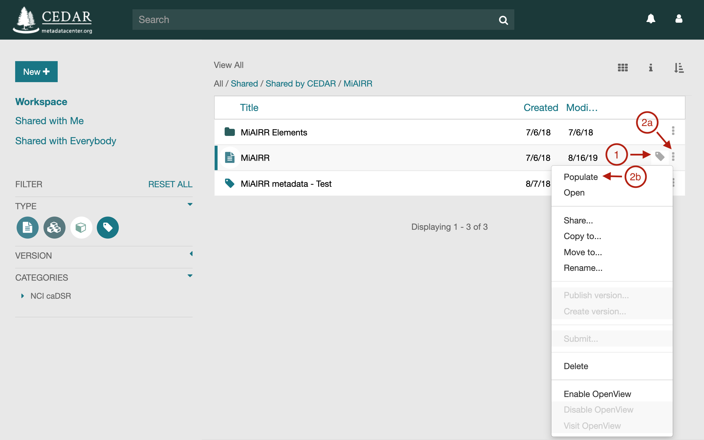{:width="60%" class="centered"}


#### **Via a Web Link (An External IRI)**

In this scenario, the template creator has obtained a web link (an IRI) that, 
when entered into a browser or included clicked on as a link in a web page,
will create a metadata instance for that template. (To create such a link
for a template, see [Building Shareable Metadata Creation IRIs](cedar-identifiers-and-iris.md#building-shareable-metadata-creation-iris).

For example, clicking on the following link will start the process of creating 
an instance to be filled out for the Adaptive Immune Receptor Repertoire community's minimum information model (MiAIRR). 
The string after 'templates/' is the UUID for the MiAIRR template.
```
https://cedar.metadatacenter.org/instances/create/https://repo.metadatacenter.org/templates/ea716306-5263-4f7a-9155-b7958f566933
```

A logged-in user will proceed directly to the Metadata Editor with 
the newly created instance already opened. 

If the user activating the link does not have a CEDAR account or is not logged in, CEDAR will redirect 
the person's browser to the CEDAR authentication page. 
At that point the user can log in or register for an account, and will be returned to
the Metadata Editor with the newly created instance already opened.

Below is the Metadata Editor opened to the MiAIRR instance requested by the link above.
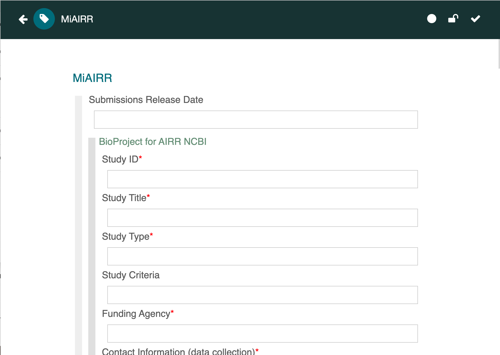{:width="60%" class="centered"}

#### **From an existing instance made from that template**

If you will be creating a number of metadata instances with many of the fields populated exactly the same, you can create a instance profile with those 
fields pre-populated. 
For example, if your template is called Study Object, 
you can populate it as an instance profile called 
"MyLab Study Object Metadata name date",
pre-filling it with all the values that will be the same for every instance.

Before starting to create individual instances, make the instance read-only
so that it is not accidentally overwritten. Make sure all the people who will 
be filling out a copy of it have read permission on the object or its enclosing folder.
(You may also wish to add a dedicated folder for all the saved instances, with
a title like "MyLab Study Object Completed Metadata".)

When you or any other user wants to create a new metadata instance, 
make a copy of the instance profile and replace 'name' and 'date' in the title with 
the name of the author and the date of this copy (or a short instance sequence number),
or any other appropriate unique labeling. 
(Note that the intended location to receive the filled-out instances must be
writable by all the people who are creating metadata.)  See [Sharing Your Content](sharing-your-content.md) for more information on creating writable folders.

The copied instance will have all the information that was in the instance profile,
and can be filled out and saved normally. 

#### **From an API call to CEDAR**

The Template Instance API can be used to create or update an instance:

* [PUT of an existing metadata instance](https://resource.metadatacenter.org/api/#!/Template32Instances/put_template_instances_template_instance_id)
* [POST of a new metadata instance](https://resource.metadatacenter.org/api/#!/Template32Instances/post_template_instances)

Each requires inclusion of the JSON content to use for that instance.

To copy an existing instance, you would have to first download the instance using 
a GET, then upload your copy to a new instance (using the POST as above).

## Filling Out Metadata

### **Basic Steps**

When the metadata instance opens, you can click in any field to start adding metadata.

To move to the next field, you can hit return (once or twice depending on the field type). In a few cases you may have to click in the next field. 

In some cases (see the image below), the metadata instance may show elements as an outline, with their content hidden. To view and fill out metadata fields within those elements, click on the element header to show the element's contents.

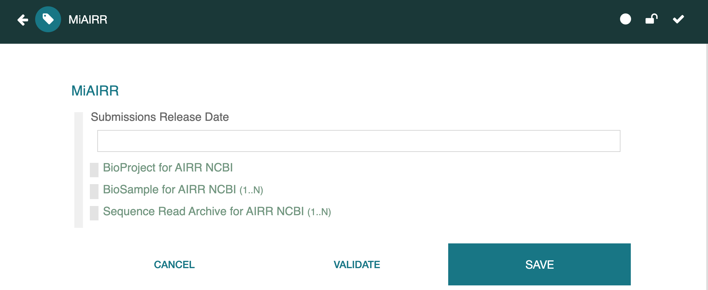{:width="80%" class="centered"}

Your metadata is not saved until you hit the SAVE button, visible in the image above. 
You may have to scroll to the end of a long template to see the Save button in the lower right corner. We recommend you save your metadata often, so that little is lost if your browser window is accidentally closed. See [Saving and Validating](#saving-and-validating) for more details.

### **Viewing JSON-LD and RDF**

You can see the JSON-LD and RDF versions of your metadata by clicking on the appropriate controls at the bottom of your metadata instance. For more information see [Viewing Resource as Raw JSON](viewing-resource-information.md#viewing-resource-as-raw-json).

### **Multiple Fields**

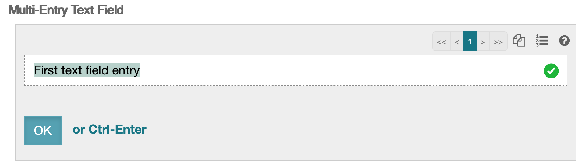{:width="40%" class="right"}
Most of the field types can be enabled as "multiple" fields by the template creator. 
If a field is set to multiple, you will see controls that let you add additional
values. Internally multiple fields are represented as an array of values.

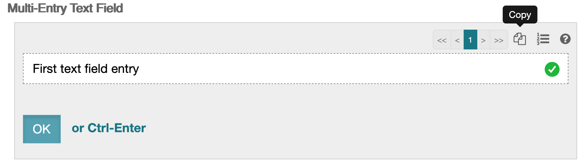{:width="40%" class="right"}
From any field, you can click on the Copy icon (pointed to by black tip) to create another instance of the field. This instance makes a copy of the field value
that was in view when the Copy icon was selected, 
and inserts that value after the original field.

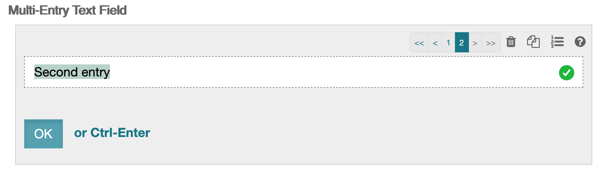{:width="40%" class="right"}
In our case, this results in a second field (third image), into which you can put the desired value for that field. 

The numbers shown in the right-hand multiple fields controls are part of the array navigation controller, which lets the user navigate to any particular field item in the array of fields.

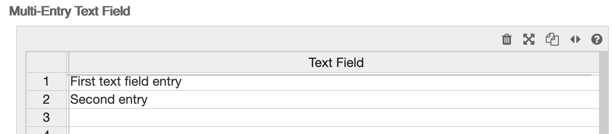{:width="40%" class="right"}
In many cases the field values can be viewed and edited in an array 
using "spreadsheet view", 
by clicking on the Format icon (which shows a 3-item bullet list in its regular view). 
This results in the display to the right. 

If you click on the format icon again (now shown as two opposed arrows), you will return to the list view. Any changes made in one viewing mode will be reflected in the other.

### **Multiple Elements**

CEDAR elements can also be enabled as "multiple" entry items, allowing users to fill out a set of metadata multiple times.
A CEDAR element that is enabled for multiple entries
looks like the following (note the controls on the right side of the Element header):
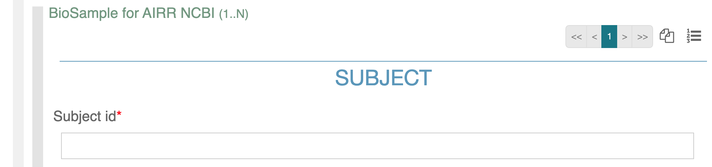{:width="70%" class="centered"}

The process of filling out multiple elements is the same as described for fields above,
with one exception. 
The format control that enables filling out arrays ("spreadsheet view") is only visible if the element just contains simple fields. 
If the element contains other elements or fields that allow MULTIPLE entries, 
viewing and editing it as an array is not possible. 
See the **Spreadsheet-compatible Elements** subsection of [Adding Elements](building-basic-templates.md#adding-elements)
to learn how to set up this feature.

CEDAR's spreadsheet view of arrays automatically performs 
validation and auto-completion of controlled term lists, 
and supports cutting and pasting of sub-tables of information anywhere in the spreadsheet.

You can copy and paste from an Excel, Numbers, or Google spreadsheet into the spreadsheet view in CEDAR.

Note that while CEDAR does not support the import of spreadsheet data or direct ingestion of CSV-formatted values,
such data could be transformed from its CSV-based form into an array structure within the CEDAR Instance
(following the required syntax of an appropriately structured Template),
then imported into CEDAR.

### **Advanced Tips for Fields**

#### Multiple free-text fields

If you are entering multiple free-text fields, these are stored as values in an array. 
The user interface presents all the entries at once, separated by commas. 
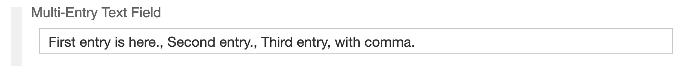{:width="70%" class="centered"}

To see the exact contents of each field, click on the field to enable editing, which brings up the array navigation controller.

#### Drop-down fields

Drop-down fields indicate a set of terms, which are often controlled terms from one or more ontologies. In many cases, there are hundred, thousands, or even hundreds of thousands of controlled terms for a field.

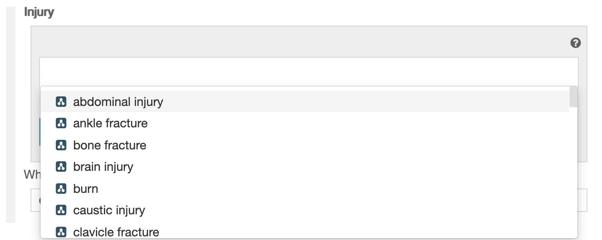{:width="35%" class="right"}
The drop-down menu can not display all these terms, so it presents examples from throughout the list of possible terms. 
To see only those terms that might be relevant, 
you must begin entering the appropriate term (or some string from within it).

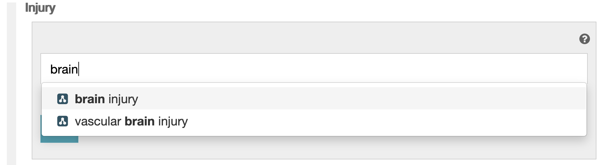{:width="35%" class="right"}
Immediately (within a second or two after you stop typing), 
you will see a list of term labels that contain the string you've entered. 
(See example at right.)
You can either pick the term you want by clicking on it, 
or return to the field to continue entering a search string.

Note that synonyms are not considered when looking for matches,
so it may help to know whether the vocabulary contains, for example,
'human' or 'homo sapiens' as the label for humans. 

#### Field suggestions

In some cases a field may be enabled for Suggestions. In this case,
you may see some entries that appear (out of alphabetic order)
at the top of the list, with numbers in the range 50-100. 
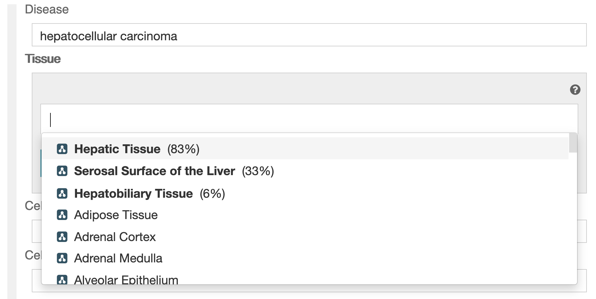{:width="35%" class="right"}
These fields are suggestions, and the numbers represent 
the *strength* of the suggestion. (To be explicit, the numbers are not
the likelihood of the particular value.) To choose a suggested item,
simply click on it.

The suggestions are based on an intelligent authoring algorithm
in CEDAR that considers previously entered metadata for the given template,
and creates rules based on frequently occurring patterns in that metadata.
If there are any patterns in your entered metadata that suggest 
what answers may be appropriate in the current field, 
CEDAR will make the most likely answers visible to you as the suggested
values we describe here (and show below).

More details about the suggestion system in CEDAR may be found at 
[Understanding the Suggestion System](understanding-the-suggestion-system.md).

#### Attribute-value fields

Some forms give users the ability to add their own attributes, for example, 
to add metadata about certain attributes that are not in the form.
An attribute-value field looks like the following:
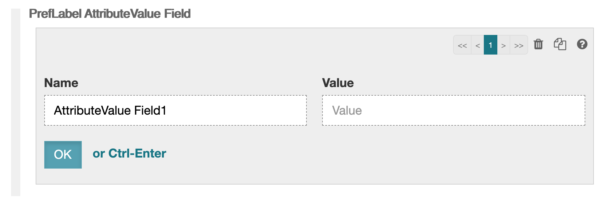{:width="70%" class="centered"}

In an attribute-value field, you get to enter both the name of the field, 
the corresponding value, which is always free text. 
Often any number of attribute-value fields may be added,
but the template creator may limit the maximum number for a given form.

## Saving and Validating

### **Saving**

To save the instance, click on the Save button at the bottom right of the instance.

{:width="75%" class="centered"}

While an instance is being edited in the Metadata Editor, it can be saved at any time.
If you have made changes and try to leave the instance without saving it, 
CEDAR will issue a warning. If you click Continue, any changes you made will be lost. 
Choosing Go Back will return you to the instance, where you can save it.

Because there is no undo, should you need to recover a previous version of the document,
you can contact CEDAR staff to restore a version from before the time you started editing.
If you plan to make significant changes to a template, 
especially if you are experimenting with it, 
we recommend saving a copy before you start changing it.

At the top right of the instance, there are 3 icons that indicate the instance status.
The left-most icon (the circle) is filled when the instance is saved, 
but is a hollow yellow circle when there are unsaved changes.

If the lock is yellow and locked, you will not be able to save your changes, 
even to a separate file. 

### **Validation**

CEDAR is always performing syntactical validation of an edited instance against the template. This checks that the schema conforms to the corresponding schema, 
which should always be true and yields a white checkmark in the third icon.
If the syntactical instance validation fails, there is a problem in the CEDAR 
system, and the checkmark turns yellow. You may be able to work with the instance,
but it is best to contact the CEDAR team to alert them to the problem.

Whenever CEDAR saves an instance with entered content, it attempts to verify the metadata content of the instance satisfies the instructions in the JSON Schema 
specified by the template. 
This detects issues with missing fields and malformed fields (e.g., a link field that 
contains data that is not a link).

On a successful metadata content verification, CEDAR issues a green "Instance saved successfully" notification.
If the verification fails due required fields being missing, 
CEDAR issues a report listing the missing fields.
If the verification fails due to a more fundamental error,
CEDAR issues a red "Instance not saved" message, 
along with basic error messages. 

In some cases—for example, MiAIRR submissions—
CEDAR may even run an external validator on the metadata produced by CEDAR.
If this validation fails, CEDAR presents a more detailed error report 
offering the report from the external validator.

## Special Case—Submitting Your Metadata

In some cases, it may be possible to submit your data to external repositories
using the CEDAR system. 
The first major instances of this capability are the pipelines for submitting to repositories
at the National Center for Biotechnology Information (NCBI), 
in particular the BioProject, BioSample, and SRA repositories.

### **Assessing Instance for Submission** 

To determine if a CEDAR metadata instance can be submitted to an external repository,
click on the 'kebob' menu (the vertical dots) for that metadata instance. 
If the menu list shows the Submit menu is enabled (as in the image below),
the artifact is capable of being submitted externally.

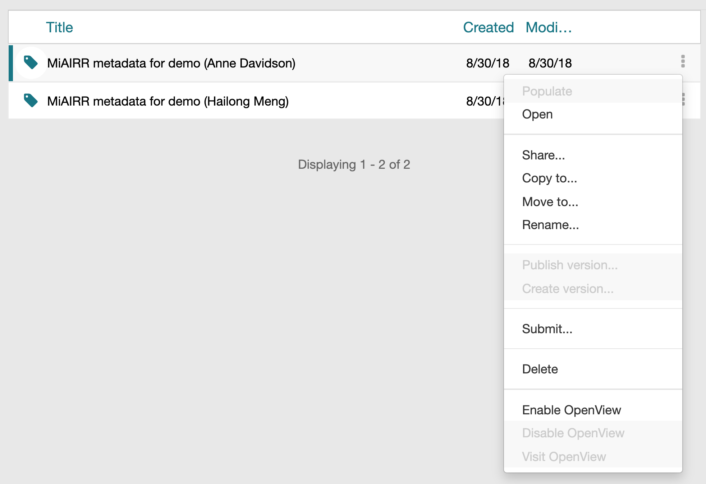{:width="80%" class="centered"}

When you click on the Submit menu, CEDAR will displays a dialog box (shown below) with a list of the repositories to which these metadata can be submitted. 

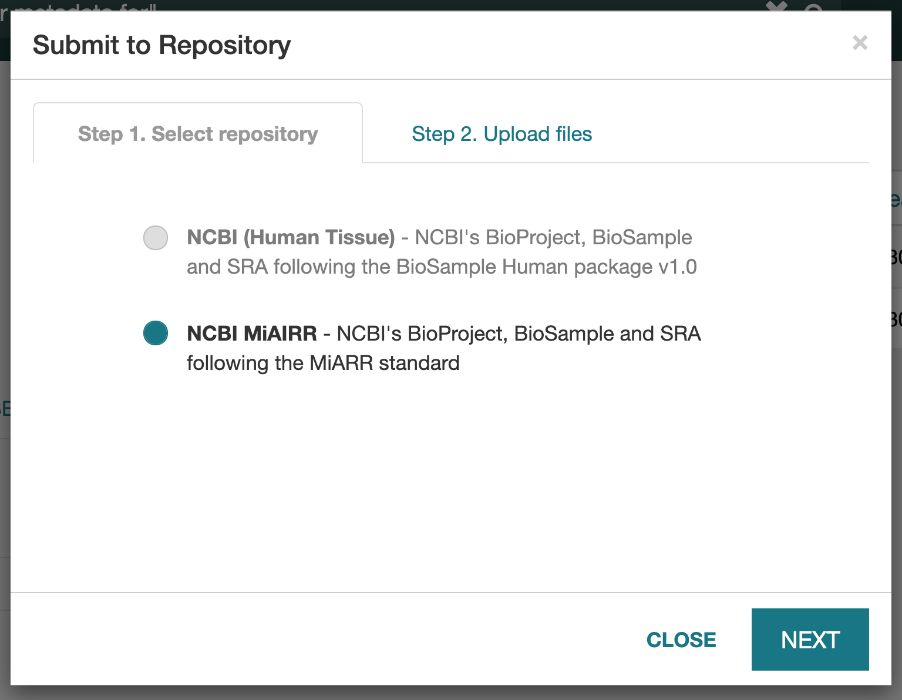{:width="50%" class="centered"}

### **CEDAR Submission Workflows**

The submission workflows described above are documented externally in some detail.

#### CAIRR Pipeline for the MiAIRR Standard

This pipeline accepts metadata for NCBI's BioProject, BioSample, and SRA repositories
in a single template, and distributes the metadata and associated data to the three repositories.
It is described in an [overview of the CEDAR AIRR (CAIRR) pipeline](http://docs.airr-community.org/en/latest/cairr/overview.html).
Detailed instructions are found in the [MiAIRR Submission Manual](http://docs.airr-community.org/en/latest/miairr/manual_miairr_ncbi.html#miairr-ncbi-submission-manual-option-1).

You can read more about this pipeline in the article [The CAIRR Pipeline for Submitting Standards-Compliant B and T Cell Receptor Repertoire Sequencing Studies to the National Center for Biotechnology Information Repositories](https://www.ncbi.nlm.nih.gov/pmc/articles/PMC6105692/).

#### CEDAR Pipeline for Human Tissue

The CEDAR-to-NCBI Human data submission pipeline provides an interface to transmit SRA datasets to the NCBI SRA and BioSample repositories from the CEDAR Workbench following the BioSample Human package v1.0.
It is described with detailed instructions in this [overview of the CEDAR-to-NCBI Human data submission pipeline](https://github.com/metadatacenter/pipelines/wiki/CEDAR_to_NCBI_Human-Pipeline).

### Other Submission Techniques

In other CEDAR integrations, submission to remote repositories is accomplished when
the remote repository pulls data from CEDAR. 
If you are filling out metadata that is destined for a remote repository using this method,
you could receive special instructions regarding which template to use and how to 
indicate when your metadata is ready for ingest by the remote repository.

Further information about these and other CEDAR submission pipelines can be found on the [CEDAR GitHub pipelines wiki](https://github.com/metadatacenter/pipelines/wiki).
