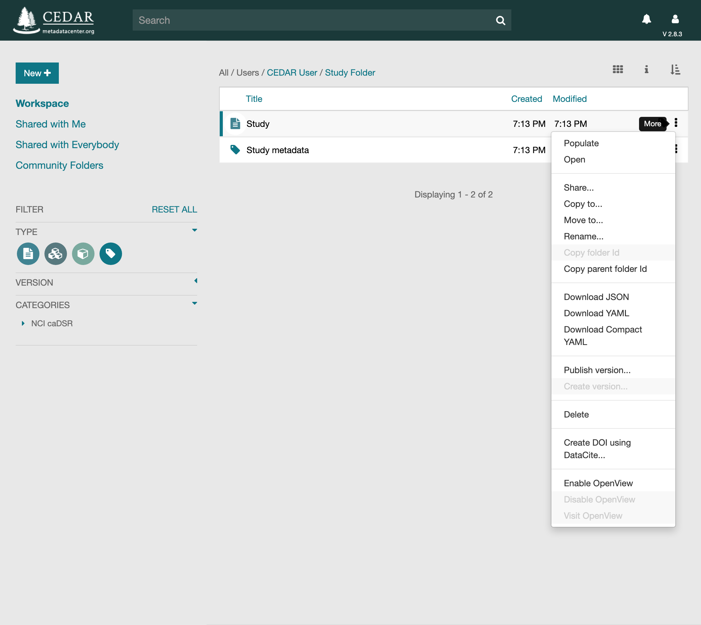
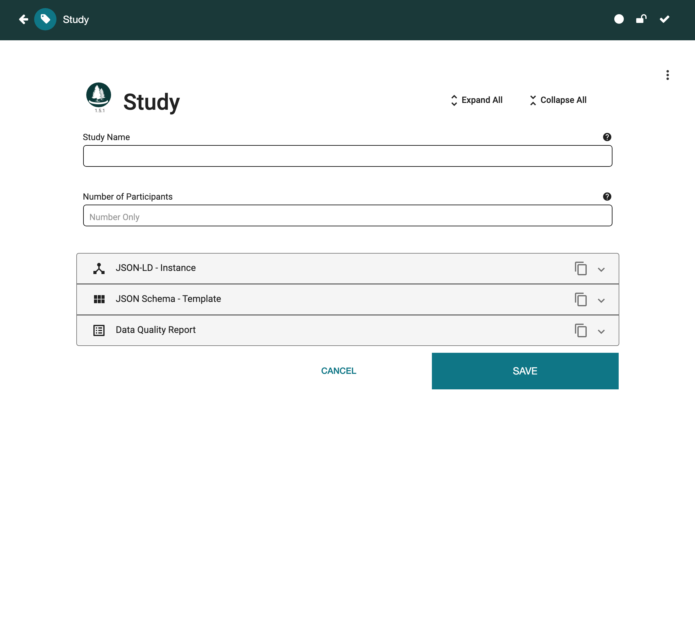
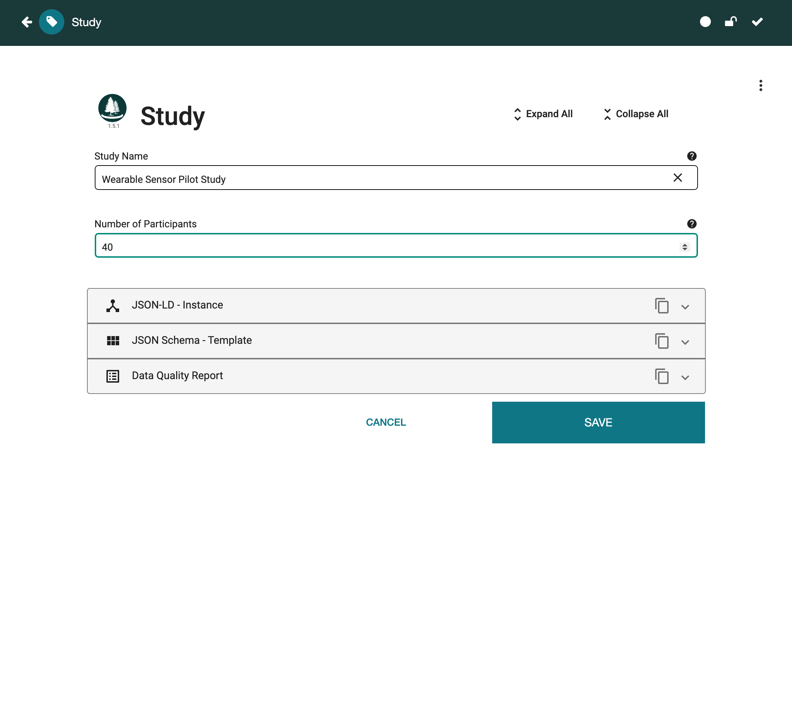

# Filling Out Metadata

A template becomes a form you can fill out. The filled-out form is a **metadata instance**, or
just an instance. This page covers how to start an instance from a template, how to fill it
out, and how CEDAR saves and validates it.

## What an Instance Holds

An instance holds an answer for each field of its template. When an answer is a controlled
term, the instance stores the term's label alongside its identifier, so tools can show the
value without looking it up. Fields and elements that allow more than one entry store their
answers as a list.

An instance also records which template, and which version of it, the instance was created
from. It does not repeat the questions or their answer options. Anyone who needs those follows
the reference back to the template.

## Creating an Instance

CEDAR offers several ways to start a metadata form, ordered here from simplest to most
involved.

### From the Workspace

This is the most common way. Bring the template into view in the workspace, navigating or
searching for it if needed. Then either click the metadata tag on the right of the
template's row, or open its dropdown menu (the kebab `⋮`) and choose Populate.

{:width="75%" class="centered"}

### Via a Web Link

A template can have a web link (an IRI) that creates an instance when opened in a browser or
clicked in a page. To make such a link, see
[Building Shareable Metadata Creation IRIs](cedar-identifiers-and-iris.md#building-shareable-metadata-creation-iris).

For example, the following link starts an instance of the Adaptive Immune Receptor Repertoire
community's minimum information model (MiAIRR). The string after `templates/` is the template's
identifier.

```
https://cedar.metadatacenter.org/instances/create/https://repo.metadatacenter.org/templates/ea716306-5263-4f7a-9155-b7958f566933
```

A logged-in user goes straight to the Metadata Editor with the new instance open. A user
without an account, or not logged in, is sent to sign in or register first, then returned to
the same editor with the instance open.

{:width="60%" class="centered"}

### From an Existing Instance

If you will create many instances that share the same values, prepare one instance as a
template of sorts, an instance profile, with the shared fields already filled in. For a Study
Object template, you might save a profile named "MyLab Study Object Metadata name date",
pre-filled with everything common to every instance.

Make the profile read-only so it is not overwritten by accident, and give everyone who will
copy it read permission on it or its folder. To create a new instance, copy the profile and
replace the placeholder parts of the title, such as "name" and "date", with the author and
date of the copy. The copy carries all the profile's values and is filled out and saved
normally. See [Sharing Resources](sharing-resources.md) for setting up folders others can write
to.

### From the API

The Template Instance API can create or update an instance:

* [PUT of an existing metadata instance](https://resource.metadatacenter.org/api/#!/Template32Instances/put_template_instances_template_instance_id)
* [POST of a new metadata instance](https://resource.metadatacenter.org/api/#!/Template32Instances/post_template_instances)

Each call includes the instance content. To copy an existing instance, GET it first, then POST
your copy as a new instance.

## Filling Out the Form

When the instance opens, click in any field to start entering metadata. To move to the next
field, press Return, once or twice depending on the field type; in a few cases you click the
next field instead.

{:width="80%" class="centered"}

Some instances show elements as a collapsed outline, with their fields hidden. Click an
element's header to expand it and fill out the fields inside.

Your metadata is not stored until you click **SAVE**, in the lower-right corner; you may need
to scroll to the end of a long form to reach it. Save often, so little is lost if the browser
window closes. See [Saving and Validating](#saving-and-validating) for details.

### Multiple Values

{:width="40%" class="right"}
The template creator can mark most field types as accepting multiple values. When a field is
set to multiple, you see controls for adding further values.

{:width="40%" class="right"}
Click the Copy icon (black tip) to add another entry. It duplicates the value in view and
inserts the copy after it.

{:width="40%" class="right"}
The result is a second entry, into which you type the value you want. The numbers in the
right-hand controls are the array navigator, which steps through the entries.

{:width="40%" class="right"}
Many multi-valued fields can also be viewed and edited as a table, in "spreadsheet view", by
clicking the Format icon (a three-item bullet list). Click it again (now two opposed arrows) to
return to the list view. Changes in one view appear in the other.

### Multiple Elements

An element can also be set to accept multiple entries, letting you fill out a group of fields
more than once. A repeatable element shows controls on the right of its header.

{:width="70%" class="centered"}

Filling out multiple elements works as it does for fields, with one exception. Spreadsheet
view is available only when the element contains simple fields. If it contains other elements,
or fields that themselves allow multiple entries, the table view is not offered. See the
Spreadsheet-compatible Elements part of
[Adding Elements](building-basic-templates.md#adding-elements) to set this up.

Spreadsheet view validates and auto-completes controlled-term lists as you go, and supports
cutting and pasting blocks of cells. You can paste from Excel, Numbers, or a Google
spreadsheet directly into it. CEDAR does not import spreadsheets or CSV files directly, but
such data can be reshaped into the structure a template expects and then loaded.

### Tips for Specific Field Types

**Multiple free-text fields.** Multiple free-text entries are shown together, separated by
commas.

{:width="70%" class="centered"}

Click the field to edit it and bring up the array navigator, which shows each entry
separately.

**Dropdown fields.** A dropdown offers a set of terms, often controlled terms from one or more
ontologies. A field may draw on hundreds, thousands, or hundreds of thousands of terms.

{:width="35%" class="right"}
The dropdown cannot list them all, so it shows a sample. To narrow it, start typing the term,
or any part of it.

{:width="35%" class="right"}
Within a second or two of your stopping, a list of matching labels appears. Click the term you
want, or keep typing to refine the search. Synonyms are not matched, so it helps to know which
label the vocabulary uses, for instance "human" versus "homo sapiens".

**Field suggestions.** A field may be enabled for suggestions. Suggested terms appear at the
top of the list, out of alphabetical order, each with a number from roughly 50 to 100.

{:width="35%" class="right"}
The number is the *strength* of the suggestion, not the likelihood of that value. Click a
suggestion to choose it. Suggestions come from an authoring algorithm that learns from
metadata already entered for the template and surfaces the answers that commonly follow the
pattern you are filling in. See
[Understanding the Suggestion System](understanding-the-suggestion-system.md).

**Attribute-value fields.** Some forms let you add your own attributes, capturing metadata the
template did not anticipate.

{:width="70%" class="centered"}

In an attribute-value field you enter both the attribute name and its value, which is always
free text. You can usually add as many as you need, though the template creator may cap the
number.

## Saving and Validating

### Saving

To save the instance, click the Save button at the lower right.

{:width="75%" class="centered"}

You can save at any time while editing. If you try to leave with unsaved changes, CEDAR warns
you: Continue discards the changes, Go Back returns you to the instance to save. There is no
undo, so if you need an earlier version, contact the CEDAR team, who can restore one from
before your edits. Before making significant or experimental changes, save a copy first.

Three icons at the top right show the instance's status. The circle is filled when the
instance is saved and a hollow yellow circle when there are unsaved changes. When the lock is
yellow and closed, you cannot save your changes.

### Validation

CEDAR continuously checks that the instance is well-formed, shown by a checkmark icon. A white
checkmark means all is well. A yellow one signals a problem inside CEDAR itself; you may still
be able to work, but it is worth alerting the CEDAR team.

When you save an instance with content, CEDAR also checks the content against the template's
rules. This catches missing required fields and malformed values, such as a link field holding
something that is not a link. A successful check shows a green "Instance saved successfully"
notice. If required fields are missing, CEDAR lists them. If something more fundamental is
wrong, it shows a red "Instance not saved" message with the errors.

In some cases, such as MiAIRR submissions, CEDAR also runs an external validator on the
metadata and, if that fails, presents its report.
