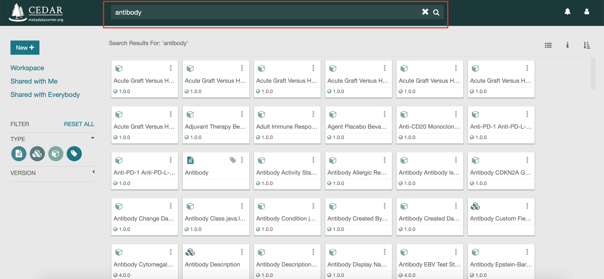
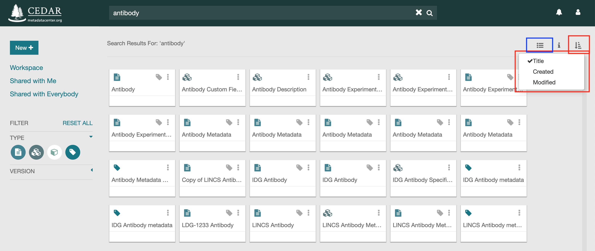
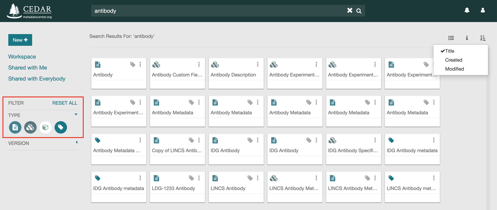
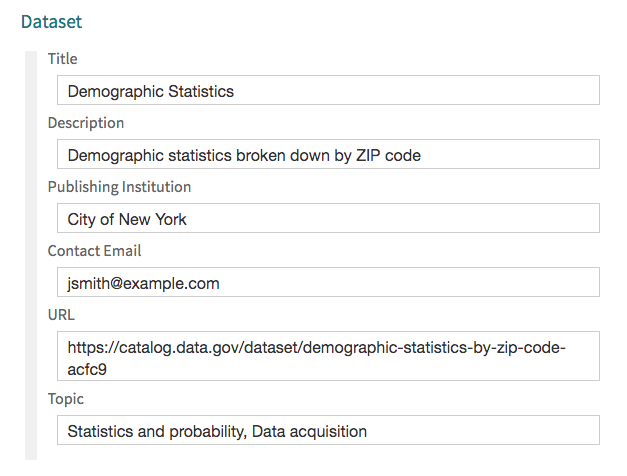
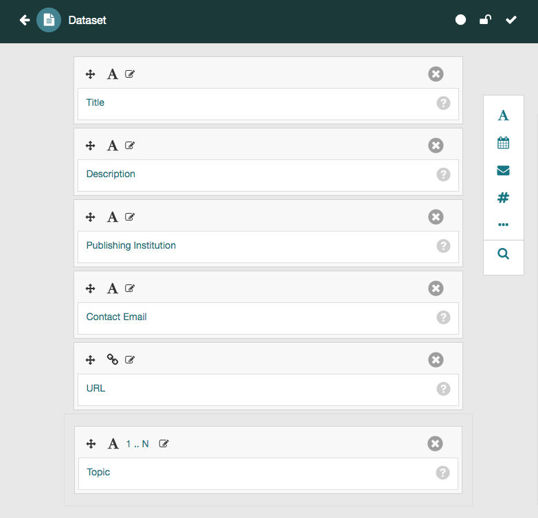

# Finding Resources

## Simple Searching

### Searching With the Search Bar

Finding a resource is simple when you know text from its title, description, or version. Type
the search string as free text (for example, "Antibody") into the search bar in the navigation
header. CEDAR shows every resource with that string in its label, version, or description.

More advanced search patterns, using wildcards and boolean expressions (with AND, OR, NOT, and parentheses), and searching on fields and their values, are addressed in the following sections.

### Narrowing the List of Returned Resources

A search can return more resources than you want to scan. CEDAR groups resources into three
sets by ownership and sharing: resources you created, under the **Workspace** tab; resources
shared with you; and public resources shared with everyone.

To search within one set, click it (for example, **Shared With Everybody**) and type the
search string as before. CEDAR shows only the resources in that set whose label, version, or
description matches.

You can also constrain the resulting resources by their type, as described in [Constraining the Results by Type](#constraining-the-results-by-type).

The search results are illustrated in the Figure below.

{:width="75%" class="centered"}

## Organizing the Results

You can view the search resources either as a grid of different resource tiles (as shown in the figure below) or as a list of different resources. You can switch between these views using the icon highlighted in the small blue rectangle in the upper right of the figure. 

You can also sort the different resources based on their titles, creation dates, and modification dates. To sort the resources, click on the sort icon highlighted in the small red rectangle at upper right, and select from the desired option that pops up. You can also click on the column header to sort by that column.

{:width="75%" class="centered"}

## Constraining the Results by Type

When you search for resources (for example, all resources that mention "Antibody"), by default all types of matching resources are shown, including folders, templates, elements, fields, and metadata instances. If you have access to many resources, you may find it hard to navigate these lists of matching resources. 

The type filter constrains the results by resource type. Click the icons in the left sidebar,
highlighted below; from left to right they are Template, Element, Field, and Metadata, and
hovering over one shows its type. A white icon hides that type from the results; the figure
below hides Field resources. Click the icon again to turn it green and show that type once
more.

There is no way to disable the folder resource, as it is used to navigate to lower levels of content.

These settings also apply to any other view of resources in the Workspace window, for example in the user's home directory. Note the settings persist from one session to the next, as long as the user stays logged in, so subsequent searches will have the same resource type constraints.

{:width="75%" class="centered"}

## Advanced Searching - Search Fields

This section contains some examples of the query syntax that can be used to find CEDAR artifacts by field name and/or value.

In this section, the term 'field name' refers to the internal name (not displayed label) of fields that 
are defined for that metadata instance. 
It does not refer to the metadata attributes for the instance artifact, for example, the assigned Title of the metadata instance.
Those artifact metadata fields can not yet be searched individually by CEDAR.
(When a search pattern is entered into CEDAR without a prefixed field name, 
CEDAR will search through the title, description, and version number of the artifact for the entered search pattern.)

### Finding Metadata Instances by Field Name and Value

Suppose the following metadata instance:

{:height="100%" width="100%"}

Examples of queries that will retrieve the instance above:

- Search by field name and value:

  `title:statistics`
  
  `publisher:"City of New York"`

  `"publishing institution":"City of New York"` *(note that 'Publishing Institution' has been defined in the template as the preferred label of the field 'Publisher')*
  
- Search by field name (any value):

  `publisher:*`, or `publisher:`
  
- Search by field value (any name):

  `*:"New York"`, or `:"New York"`
  
- Boolean queries:

  `title:Statistics OR title:Math` *(the OR is optional—it is the assumed conjunction)*
  
  `title:(Statistics OR Math)`
  
  `title:Math OR (title:Statistics AND publisher:"New York")`
  
  `Dataset OR disease:CRC`  *searches for Dataset anywhere, OR a field 'disease' with value 'CRC'*
  
- Wildcard queries: 

  - One or more characters: `title:stat*`
  
  - Single character: `title:stat?stics`
  
- URLs: 

   - `url:https://catalog.data.gov/dataset/demographic-statistics-by-zip-code-acfc9`
   
- Ontology terms: 

    - Search by term label: `topic:statistics`
    
    - Search by term URI: `topic:http://edamontology.org/topic_2269`

    - Search by term label and URI: `topic:http://edamontology.org/topic_2269 AND topic:data`
    
### Finding Templates, Elements, and Fields by Field Name

Given the template for the previous instance:

{:height="100%" width="100%"}

Here are some examples of queries that can be used to find the template above:

  `title:*`, or simply `title:`

  `Publish*:`

  `"Contact Email":`  *use quotes for multi-word strings*

  `to?ic:`

## Advanced Searching - Patterns

This section describes the more complex search patterns available in CEDAR. 
You can find examples using these patterns with fields and values in the previous section.

Regular expressions (beyond the ones described below) are not yet available in CEDAR.

### Multi-Word Strings

To search for a literal string that contains spaces (e.g., a multi-word phrase), surround the phrase with double quotes, like this: "Injury Type".

### Boolean Queries

Boolean expressions let you combine different search patterns. These expressions include AND, OR, and NOT, and they can be organized with parentheses following algebraic rules. 

#### OR

Use OR to broaden your search results by connecting multiple keywords or phrases. The OR operator is interpreted as “at least one of the search terms is required" for the resource to be returned in the search list.

A space between two words is interpreted as an OR condition.

#### AND

Use AND to narrow your search: all the search terms that have been combined with AND must be present for the resource to be returned.

#### NOT

To indicate that a resource should be excluded if a term is present, the term can be preceded by the NOT expression. "Injur NOT Template" will find "Articles about Injuries" but not "Injury Template".

#### Parenthetical Expressions

The logical priority of the searches is determined by parentheses. For example, 
`injury AND (health or operation)` will find resources with the term injury and *either* health or operation. The AND operator takes precedence, so without the 
parentheses, the same search pattern would find resources with both injury and health, or with just operation. 

In complex searches, using parentheses to make all your patterns explicit is the
best way to be sure you will get what you want in your returned results.

### Wildcard Queries

You can use special characters to replace a single character, or any number of characters. However, you can only use each special character once in each word.

#### Replacing Multiple Characters

You can use an asterisk (*) in your search term to indicate that any number of characters can be substituted in place of the asterisk.

For example: 'injur*' will return resources with any of these words: injury, injuries, and injured.

CEDAR treats single-word search patterns as if they have an asterisk at the beginning and end, so 'injur' or 'jur' will also find the three examples above.

#### Replacing a Single Character

The question mark (?) replaces any single character when searching in the resources.
`injur?` will find anything containing the word injury, injured, or injuries.
