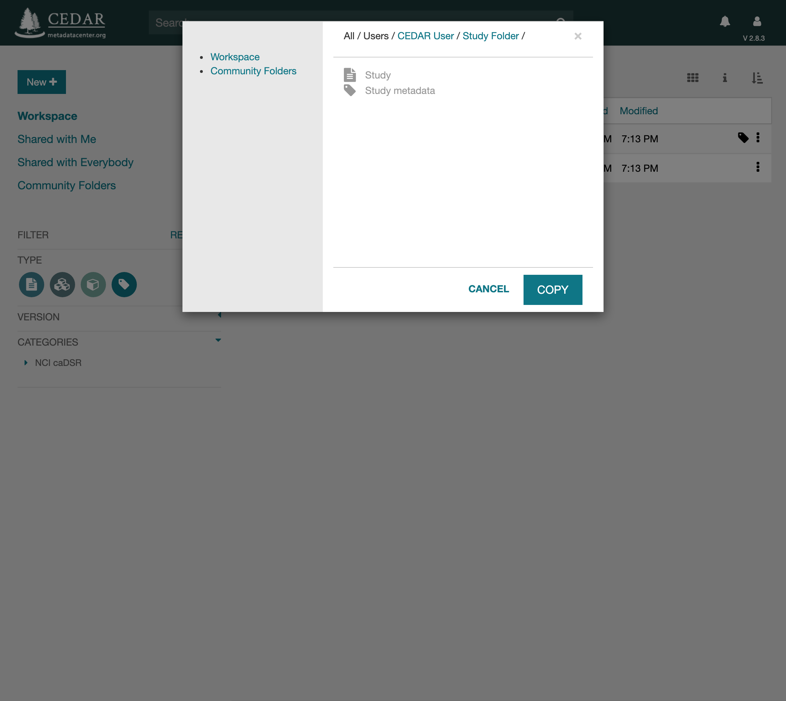
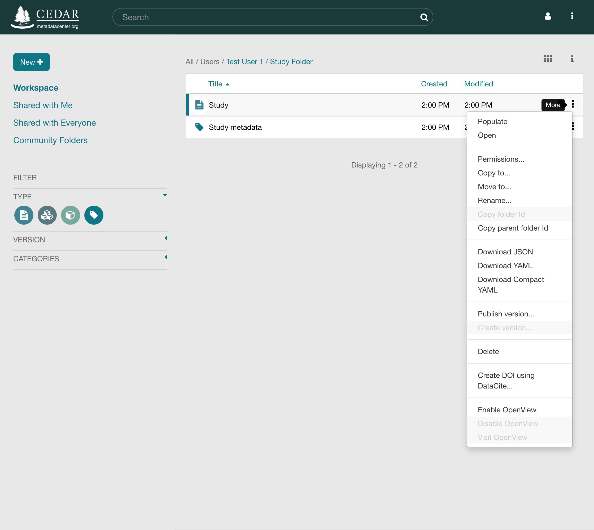

# Managing Resources

In CEDAR, resources are the artifacts (templates, elements, fields, and metadata instances)
and the folders that hold them. You manage them from your
[workspace](your-cedar-workspace.md). Management covers copying, moving, renaming, and deleting
resources, and setting who can reach them.

To fill out metadata for a template, the **Populate** command opens the Metadata Creator set
up for that template. To edit an artifact, including a filled-out instance, the **Open**
command opens the right tool: the Template Designer for templates, elements, and fields, and
the Metadata Creator for instances. For a folder, **Open** shows that folder in the middle
pane. The version commands are covered in [Artifact Versioning](artifact-versioning.md), and the
OpenView commands in [OpenView](openview.md).

Every command lives on a resource's menu, opened by the vertical dots (the kebab menu, **⋮**)
at the right of the resource. From it you can move, copy, rename, and delete the resource, and
set who can reach it. A grayed-out item is unavailable for that resource, such as Copy folder
Id on an artifact, which only folders have, or Create version on a template that has never been
published. If *every* item is grayed out, no resource is selected, or there is a permissions
inconsistency.

## Choosing a Destination

The **Copy to…** and **Move to…** commands open a window for choosing where the resource
should go, starting from your current folder. Click the left arrow to move up the hierarchy,
the right arrow on a folder to move into it, and the Home icon at the upper left to return to
your workspace. Navigating to a folder you lack permission for shows an error.

A destination is always selected. With no folder highlighted, the destination is the folder on
display; with one highlighted, that folder is the destination.

{:width="50%" class="centered"}

### Copy To

After choosing **Copy to…**, select the destination folder and click COPY. Copying needs the
Viewer role on the resource and the Editor role on the destination. You can copy any artifact
to a folder where you are an Editor, but you cannot copy a whole folder in one command.

### Move To

After choosing **Move to…**, select the destination folder and click MOVE. Moving needs the
Manager role on the resource and the Editor role on the destination. You can move any artifact
or folder to a folder where you are an Editor.

## Rename

After choosing **Rename…**, enter the new name. Renaming needs the Editor role on the
resource.

## Permissions

The **Permissions…** command opens the Permissions dialog, which shows who can reach the
resource and lets its owner or a Manager grant, change, and remove access. See
[Sharing Resources](sharing-resources.md) for details.

## Delete

**Delete** shows a confirmation box, then removes the item. Use it with care: there is no undo.

{:width="75%" class="centered"}
