# More FAIR Templates Using Semantics

The principles of FAIR metadata—Findability, Accessibility, Interoperability, and Reusability—
are useful to understand metadata good practices. 
We made semantics a key technology in the CEDAR system, because semantics support
all of the principles that make up FAIR metadata.

## Why Semantics Are Important

### Introduction: The Problem

Everyone is familiar with the two challenges of search: not finding everything you want;
and finding things you don't want. 

Finding things you don't want (the problem of _precision_) 
almost always comes from the basic truth that words
(the usual coin of the realm for searching) have many meanings, 
some of which may be much more popular than yours.
So your search for "python" may not find the horror film, but instead snakes, 
people of ancient Greece, roller coaster, or (most likely) the programming language.
Even adding terms for disambiguation ("python movie") doesn't narrow the search much.

And then, you can't be sure all the relevant things will be found 
(the problem of _recall_) . 
Maybe the person creating the description of their post is a film snob, and 
never uses the word 'movie'. 
Without understanding that 'film' is a synonym for 'movie',
software will not find conceptual matches that aren't spelled the same way, or
that are similar in important ways. 
For example, a search may be looking for treatments for a disease 
but not finding drugs for the disease, 
even though drugs are clearly treatments.

This is especially challenging when you are trying to get precise results
as you analyze data, look for similar data sets, or find anything specific 
in a large set of candidates. 
You want the system you are using to understand what you mean—in other words,
to understand semantics. 
And you want the understanding, and results, to be as precise as possible.

And yet what happens instead is that the original questions were unclear,
the descriptive answers that the users tried to provide—
and that you are now working with—are confusing and ambiguous,
and now there is no way you can obtain any sort of meaningful result from your efforts.

### Semantics: The Solution

To seriously reduce these problems, we use semantic technologies 
to give more precise meanings to the words people are using.
To increase precision, we can use exact identifiers
(identifiers that are unique across the whole internet) 
to refer to concepts,
so the user can enter an unambiguous string that precisely means a python snake.
To increase recall, we can help software easily collect and apply precise names—
identifiers again—when users are entering descriptions.
We can also give the software tools to understand the relationships 
between those precise identifiers. 
In this way descriptions collected from different communities can be 'translated'
from one set of precise terms to another, 
with some confidence that the original meaning will be preserved.

Semantic standards like OWL, RDF, and SKOS, 
and semantic tools that understand these standards,
provide a baseline for building systems that are semantically interoperable.
CEDAR is one such tool—
it lets form developers specify questions more thoroughly, and 
specify answers in semantically precise ways,
so end users filling in metadata create well-defined descriptions.
And it can use semantic and other insights to understand when
questions and even whole questionnaires might be about the same topic,
and to suggest relationships between them.

### Using Semantics in CEDAR

The following sections in this chapter describe how you can use CEDAR 
to create more rigorous metadata forms that are *easier* for users to understand 
and fill out.  This process is rarely perfect, 
but it can offer much, much more precision and recall for the person 
finding or re-using the data.  
And even easier for you to set up the data collection system.

## Defining Your Answers with Term Lists

To go to a particular topic, click on that link.

* [Introduction](#introduction)
* [Basic Interactions](#basic-interactions)
  * [Searching for Terms](#searching-for-terms)
  * [Reviewing Found Terms](#reviewing-found-terms)
  * [Selecting Terms, Branches, or Ontologies](#selecting-terms-branches-or-ontologies)
  * [Searching for Ontologies and Value Sets](#searching-for-ontologies-and-value-sets)
* [Adding Your Own Terms](#adding-your-own-terms)
  * [About Provisional Terms](#about-provisional-terms)
  * [Adding your Own Single Term(s)](#adding-your-own-single-terms)
  * [Adding a New List of Terms](#adding-a-new-list-of-terms)
* [Customizing What You Have](#customizing-what-you-have)
  * [Rejecting Terms](#rejecting-terms)
  * [Putting Favorites First](#putting-favorites-first)
  

### Introduction

You don't have to know semantics to use these tools—
we'll give you some tips (in [Choosing Controlled Terms](#choosing-controlled-terms) that help you find good answers for your questions,
and know they are good enough for your needs.

For you semantic experts, we provide advanced details elsewhere in this User Manual:
* [Tips for Template Creation: Term Discovery/Selection](tips-for-template-creation.md#term-discovery-selection)
* [Advanced Template Topics: More Semantics](advanced-template-topics.md#more-semantics)

This section (except the Customization subsection at the end)
walks you through CEDAR interfaces that work hand-in-hand with the 
[BioPortal ontology repository](https://bioportal.bioontology.org). 
This repository contains over 800 public terminologies that offer precise semantic content
you can use for your metadata collection process. 
But if BioPortal does not contain a terminology that you want to use, you can add it!
See the subsection called "Adding Content to BioPortal" in the [More Semantics](advanced-template-topics.md#more-semantics) section for more information on this process.

All the following sub-sections assume you have created a basic text field, 
clicked on the Values tab for your field,
and clicked on the Add button to bring up the term search dialog box, 
as described in [Adding Fields](building-basic-templates.md#adding-fields).

### Basic Interactions

You may want to add individual terms or whole collections of them. 
First we will work at the level of individual terms, and 
progress to finding and adding collections of terms.

#### Searching for Terms

In the Template Designer,
as soon as you hit the Add button in the Values tab of a CEDAR field,
CEDAR opens a new search window, pre-configured with the name in your field, 
and the search for terms begins immediately.
In this case, the name is "Study Type", and a set of results has been returned.
You can see each term in the scrollable list—the most likely terms are listed first.

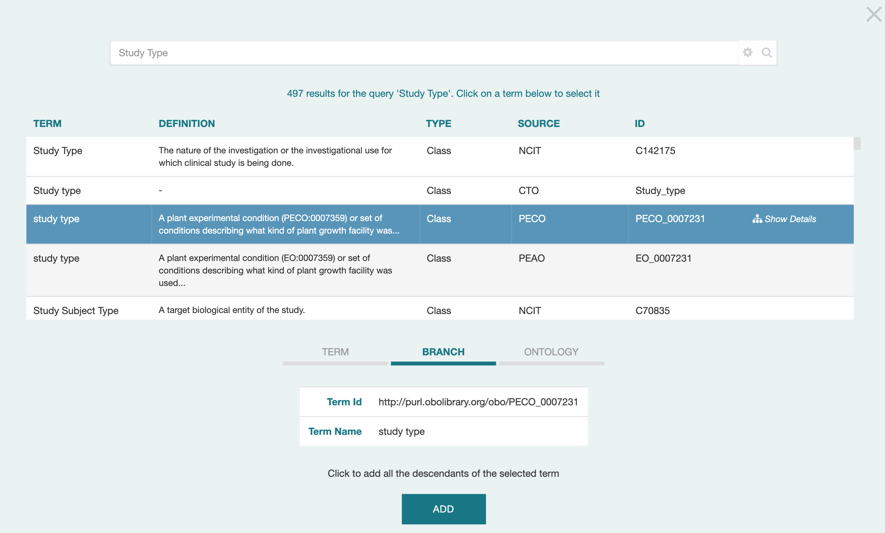{:width="80%" class="centered"}

You can change the search terms by typing in the search field. 
If you search doesn't begin immediately, click on the magnifying glass to start it.
The results list updates as more results are found,
and higher-value results may be inserted in front of results you are looking at.
Usually all the results are obtained quite quickly.
(A maximum of 500 results may be obtained.)

You may want to refine the search to meet particular needs.
By clicking on the settings gear at the right of the search field,
you will see a set of Advanced Search Options.
The first option, to search for a term anywhere in BioPortal, is pre-selected.
(We will discuss the other 'I want to…" options in later subsections.)

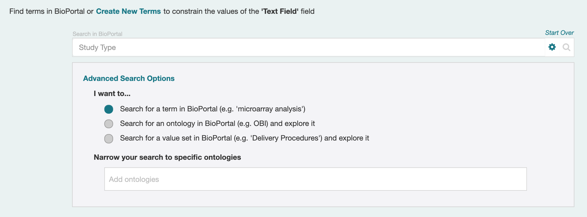{:width="80%" class="centered"}

For now, we want to focus on the "Narrow your search to specific ontologies" field.
If you know the ontologies in BioPortal that you want to use for your terms,
you can enter them into this field. 
Start typing either the ontology acronym or its full name, 
and CEDAR will offer a list of the matching ontologies.
Click on the one that you want to include as a restriction,
and its acronym will appear in the field.

You can begin typing again in the field, and select another ontology,
until you have found all the ontologies you want in your restriction list.
In this case, we have selected the ontologies with the acronyms CTO and NCIT.
This technique can be used to see more terms in the given ontologies,
or to exclude any other ontologies from being considered.

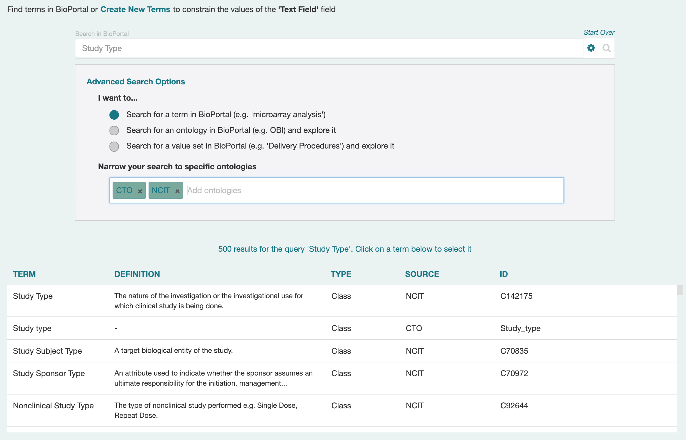{:width="80%" class="centered"}

#### Reviewing Found Terms

Now that you have some terms, you may want to examine some terms more closely,
to see if they are really what you want. 
The first thing you may notice is that earlier terms in your list are exact matches
of your string, while later terms do not match as closely. 
This is the first test used to order the terms presented to you.

Clicking on Show Details for a given term (at the right of that term's row) 
will unfold a new display underneath the list of terms,
which allows you to inspect the term more closely.
At the left side of this new display is a list of terms in the ontology,
in most cases scrolled to the specific term identified. 
(Sometimes the term appears multiple places in the ontology,
and you will need to explore to find it.)

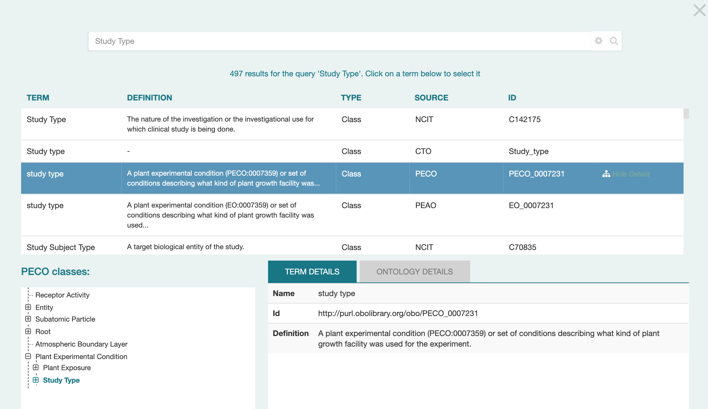{:width="80%" class="centered"}

Whenever you click on a term, its detailed information appears
in the Term Details tab on the right. 
(Click on the Ontology Details tab to see information about the whole ontology.)

You can navigate the tree by using your mouse to scroll up and down,
and open and close its branches by clicking on the + and - boxes on the left side.
Below we see the details of classes that were hidden under the Study Type branch 
in the screenshot above.

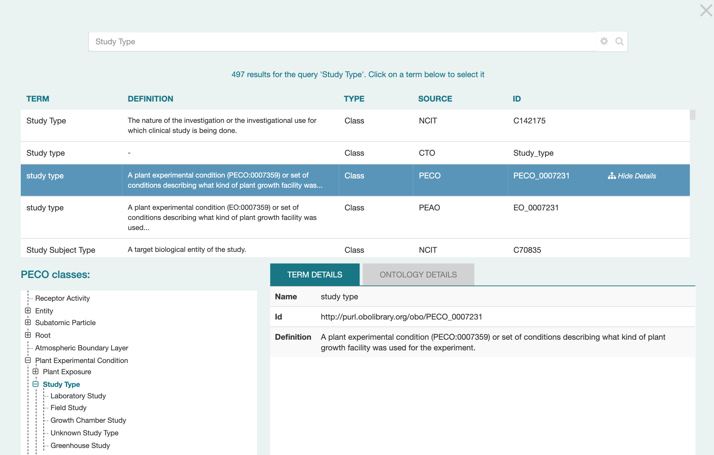{:width="80%" class="centered"}

In this case, we may decide this class is not appropriate, 
as it contains many Study Types that are particular to plant science.
By clicking on the Study type term in the CTO ontology,
we can see from examining its branch contents 
(in the left-hand display under 'CTO classes')
that it is a much more generic description of study types.

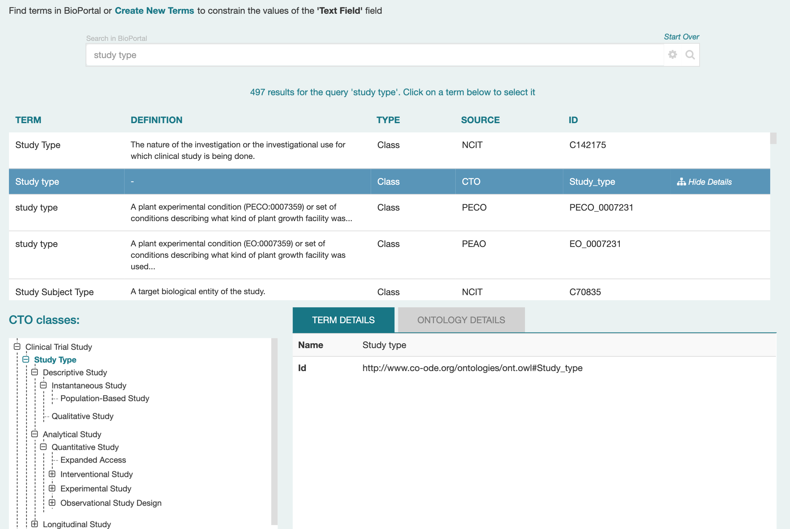{:width="80%" class="centered"}

#### Selecting Terms, Branches, or Ontologies

By scrolling down in the Term Finder window, you can see additional controls (below).
In particular, note the three tabs `TERM`, `BRANCH`, and `ONTOLOGY`. 
These control what you can select for your field's values.
(If the term you have selected does not have any subclasses,
you will not see the Branch tab, only Term and Ontology.)

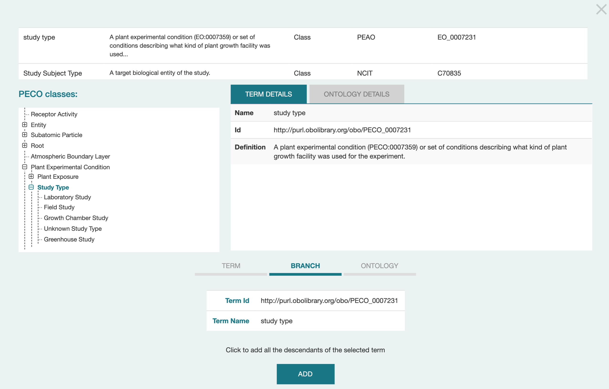{:width="80%" class="centered"}

In the screen shot, the BRANCH tab is selected; the term identifier and name are shown;
and the description says "Click to add all the descendants of the selected term."
If you click on the ADD button, all the classes under "Study Type' (5 are visible) 
will be added as acceptable responses for your field.

If you had selected the TERM tab, and then clicked ADD, only the Study Type term itself
would be added as an acceptable response. 
This is a less common choice, as usually you want users to select from a collection
of related terms in an ontology.

If you select the ONTOLOGY tab, all the terms _in the ontology_ (PECO in this case)
would be added as an accepted response. 
The only time you'd expect to select this tab is when the entire ontology
is devoted to a single concept.
For example, the Disease Ontology only contains disease terms,
and is sometimes the perfect choice for selecting a disease.

What if you just want to search for ontologies 
(or its simpler cousins, Value Sets) by name?
This takes us back to the control gear in the search box,
and is described in the next subsection.

#### Searching for Ontologies and Value Sets

The two other buttons in the "I want to…" section of the Advanced Search Options
let you search explicitly for ontologies or value sets.
When you click on one of these buttons, the text in the top search field
is used to find the results (by acronym or name).
In the following example, a search for a Study Type ontology is being conducted;
this will not find any results, since no Study Type ontologies exist in BioPortal.

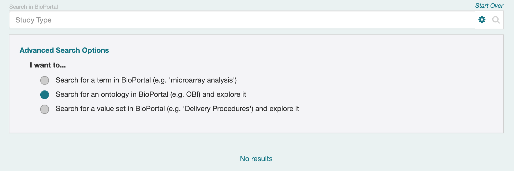{:width="80%" class="centered"}

A Value Set in CEDAR is like a very simple ontology; it consists only of a set of terms 
that have identifiers and labels. 
Value Sets tend to be smaller than ontologies as well,
and organized around a single topic. 
(In fact, they are often created to make lists of terms for filling out forms.)
In the following screenshot, you can see that there are a number of Value Sets
that deal with Study Type.
The Source column is the name of the ontology containing the Value Set;
in BioPortal Value Sets are typically grouped into organizational ontologies 
for easier management. 

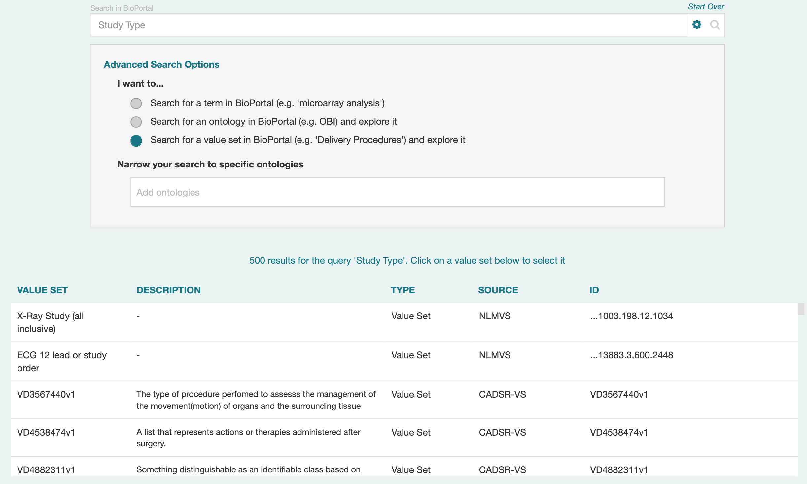{:width="80%" class="centered"}

### *Adding Your Own Terms*

You may not be able to find every term you want, or 
a list of terms that you think makes sense.
CEDAR can help you manage the process of adding such terms to use in your fields.

#### About Provisional Terms

Provisional terms are terms that the user is proposing to be added to an existing resource,
or perhaps independently as a stopgap measure.
In principal, they are meant to be used only for the time it takes to take action on the proposal:
either to accept it and add the term to the existing resource
(in which case the provisional term is deprecated in favor of the new term),
or to reject it for that purpose or simply declare it is no longer needed
(in which case the provisional term is simply deprecated). 
The provisional term should not be deleted,
so that any existing and archived used of it might still need to reference it.

CEDAR lets you *create* provisional terms,
and link them to the resource(s) and even the existing classes that are related.
However, it does not provide any mechanism yet for taking action on those terms,
like notifying owners of related resources of the proposed term,
or annotating deprecations of provisional terms and referencing terms to replace them (if any).
These features can not be implemented until there is support in BioPortal
for managing provision terms. (Such support has been proposed in an award to be evaluated in 2021.)

#### Adding your Own Single Term(s)

These screenshots show the process of adding your own individual terms for use in CEDAR. 
The new terms are created as provisional classes in BioPortal,
and can not be modified once they are defined (per above paragraph).

To begin the process of adding a new term, click on the Add New Terms link at the top of the term selection dialog box.
The link is highlighted in the image below. 

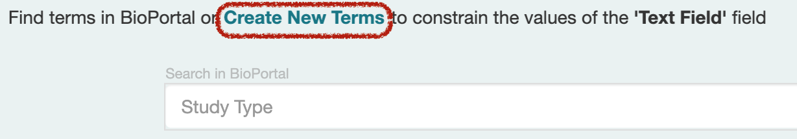{:width="60%" class="centered"}

The next two screenshots show the resulting dialog box,
and the entry of appropriate text into the fields.

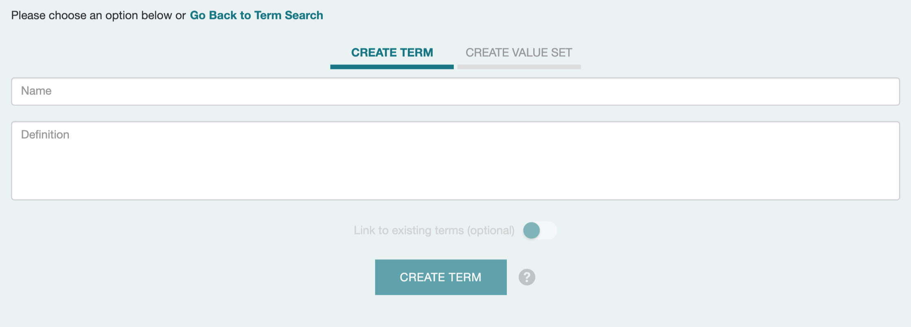{:width="70%" class="centered"}

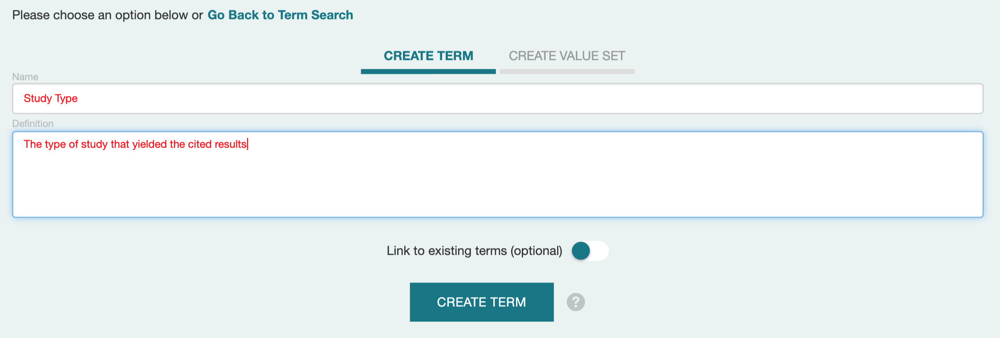{:width="70%" class="centered"}

If you click on the "Link to existing terms (optional)" rocker switch, you will be taken through additional dialogs (first one shown)
that let you add relationships from your term to existing terms in existing ontologies.
In the future, this information may support informing ontology resource authors
of your proposed addition to their ontology. 

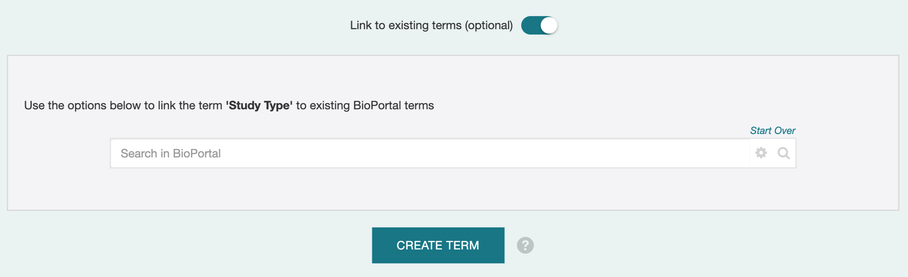{:width="70%" class="centered"}

#### Adding a New List of Terms

The feature to add a new list of terms is not available within CEDAR. 
To perform this action, you must create or modify an ontology in BioPortal to add your list of terms.

This is particularly straightforward to do as a SKOS vocabulary,
if you follow the appropriate  BioPortal practices for a SKOS vocabulary .
collaborators from our Metadata Center and the FAIR Data Collective have created
[a tutorial describing a simple way to create such a SKOS vocabulary](https://excel2rdf.readthedocs.io/en/latest/)
that can make SKOS vocabularies easy to build, register in BioPortal, and maintain in GitHub. 

### *Customizing What You Have*

When you are done adding terms, you may want to eliminate certain terms,
or put some terms ahead of others. CEDAR supports these capabilities.
Both use the Arrange button on the Values tab of the field in the Template Designer,
which brings up the following dialog.

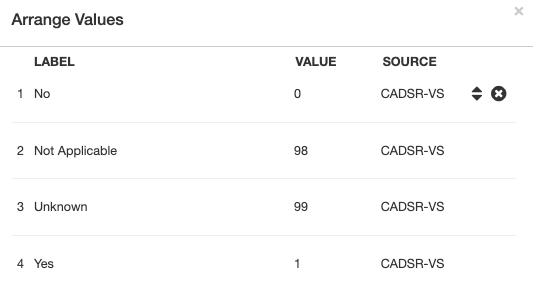{:width="60%" class="centered"}

#### Rejecting Terms

To eliminate a term, move your mouse pointer over the term.
Click on the X icon that appears and the term will not be shown to users.

#### Putting Favorites First

To move a term, click on the up-down arrow icon.
You will be shown a dialog box that lets you move the term to the top of the list,
or to any particular place in the list.
The locations of other terms are adjusted automatically.

## Choosing Controlled Terms

### *General Introduction*

This page presents a (relatively) brief and simple primer about 
choosing controlled terms. 

A thorough tutorial deserves several chapters, if not a whole book.
But you can do a very good job with just the advice offered here.

Perfect terms, or perfect lists of terms, can be elusive, 
just like perfect software tools.
It is often true that you can find many lists on a topic,
but none are exactly right for your needs.

CEDAR helps with this—you can add terms to your list, 
remove terms from your list, or reorder the terms in the list,
and you can combine different lists of terms.
If you find a list of terms that is almost perfect, 
we highly recommend using that list and tweaking it with your changes.

It will help if you are familiar with the domain that you want terms for,
especially if you already know vocabularies or people you can ask about vocabularies.
It can be very hard to find good vocabularies,
or to choose the best terms for your needs even if you have options.

The most likely sources for good terms and lists are authoritative sources,
for two reasons: (1) The authors thought a lot (usually) about the terms in the list.
(2) The terms in those lists are likely used often, so you get good interoperability.
So, term lists in popular ontologies, web sites, and reference books or articles 
(especially heavily cited ones) are often very useful.

And a final observation is that term lists for mundane things—
topics that aren't specialized, like "types of stores"
or "types of places for meetings"—
these handy types of terms are almost impossible to find.
You may well be on your own to create a term list like this.
(On the bright side, if a lot of people need your list, it could be very popular.)

#### Your criteria

There are so many criteria for deciding what term, list, or ontology is better,
and the most important one is "does it fit your needs?".
Since only you know what your needs are, 
we leave it to you to weigh these criteria for yourself.

The list of *General Criteria* that follows may be helpful
in establishing in your own mind what you are looking for in your search.

#### General Criteria

Whether you are talking about terms, term lists, or whole ontologies of terms,
each of the following categories embodies multiple specific evaluation criteria. 
Many of the criteria are objective, but many others are subjective or hard to measure. 

* Popularity
* Reuse of ontologies / terms (ontology as a whole, and individual terms, in either case)
* Community (as in, domain) relevance (usage, standardization, concept applicability)
* Governance  (is it well-managed with clear and open policies?)
* Adoption of best practices (including FAIRness criteria and metadata scope)
* Precision of matching to your term needs
  * if multiple terms, match frequency and specialization
* Criteria that cut across the above
  * Level of internationalization 
    * how widely used
    * 'level' of governing body
    * international re-use
    * use of multiple languages in text labels and definitions
  * Quality 
    * by metrics
    * by independent qualitative assessment(s)
* Analytics (ontology content and structure)

Because few of these are readily available in CEDAR, 
let's focus more directly in the following section on concrete evaluations
that are easy for CEDAR users to do.

### *What Makes a Term Better?*

These are the strategies to see if a particular *term* is the one you want 
as a choice for your template.
Note that most commonly, you are looking for branches containing lists of terms,
so that you can include everything you need at once.
But sometimes, choosing those branches requires that you examine a few terms,
and other times, you want to include a few specific terms that aren't in your core list.

#### Naming

Look at the name—which really means the 'label', in semantic talk—
for the terms you are comparing.
The term name should be clear and aligned with the way your users think of the concept.
Names are usually very short, and if the name is longer, consider whether it needs to be.

Sometimes it matters that the term name match exactly what users expect. 
Taxonomists would not expect to see the common name 'human', 
and lay persons wouldn't be looking for 'homo sapiens'. 
And it will be really awkward if the naming patterns aren't consistent. 

When the name of your field is long, the search executed by CEDAR returns more things,
and they often don't fit quite as well. 
(There are two reasons for this. Specialized terms are less likely to find matches,
and the words you use are less likely to match the words used in the ontologies.) 
For this reason you'll want to examine the concepts that are returned,
and maybe even change your search phrase to find more options.)

#### The Order of Things

In CEDAR, the order of the concepts that are listed for a term search is as follows:
* perfect matches for your search phrase;
* close matches for your search phrase (e.g., words that start with your search phrase, but keep going); and
* poorer matches for your search phrase, concepts that include your search phrase in the definition of the concept, or concepts that are synonyms for your search phrase.

Of all the concepts that are equally good syntactic matches, 
the first ones listed are the ones in ontologies that are the most widely used in BioPortal. 
Usually these are very common and well-known ontologies that have more credibility.
This works surprisingly well to identify 'better terms', 
but make sure the term makes sense for the ontology
(you are looking for an 'eye' of a hurricane but find it in a biomedical ontology).

#### Definition and Structure

You can see the definition of each term in CEDAR in the list of search term results.
If your term does not have a definition, it can be hard to know what it means.
Not only that, people looking up your term later (by its identifier, say)
also won't know what it means
And if (eventually) CEDAR shows the definition to people filling out forms,
_they_ won't know what it means either.
So we don't recommend the use of terms that don't have definitions.

The other way to understand what your term means is to look at its context.
When you click on a term, an option appears on the right side that says "Show Details".
Clicking on this option opens a tree browser, usually highlighting the term in question.
(If your term is not highlighted, you have to scroll through the tree to find it.
Note the term may be in multiple places, if it has multiple parents in the hierarchy.)

By examining the hierarchy, you can understand the nature of the term. 
Other terms at the same level and with the same parent tell you about sibling concepts.
If the term has a plus sign next to it, clicking on it will find children concepts, 
which themselves represent a kind of definition of the concept. 
And browsing up the tree to find the terms parentage tells you what category 
this concept fits into, which gives you another type of definition.

It may not matter for this use case, but you should know that
hierarchies in BioPortal can express 'subclass' relations (B is a type of A);
'part of' relations (B is a part of A);
or for SKOS vocabularies, simple 'hierarchy' relations (B is narrower than A, in some undefined way). 

To learn more about your term, you'll need to visit the term in BioPortal to see more details.

#### More Context

If you want to learn more about a term, you can usually get more details about it,
but not from within CEDAR. 

Often you can get a page describing the term by entering its full identifier. 
You can find this 'ID' by clicking on the term,
then look under the 'Term Details' tab below the list of responses. 
Copy the value of the ID and paste it into your browser—
often this will open a detailed page about the term.

If it does not, visit BioPortal at https://bioportal.bioontology.org. 
You can try pasting the ID into the Class Search box on the front page,
or go to the [class Search page](https://bioportal.bioontology.org/search)
and paste it in there, selecting 'Exact matches' under the Advanced Search section,
and clicking on the first result of the search.

(As a final resort, navigate to the ontology containing the term 
by pasting the ontology acronym from the source column into the "Find an ontology"
box on the front page, then select that ontology from the list that pops up,
then navigate to the Classes tab, then enter the name of the term in the Jump to box
and select the term of interest. Whew!)

You should see a Details tab that contains all sorts of information about your term.
If it is only 2 or 3 items listed there, your term is not very thoroughly defined—
possibly you'd like to look for one with more information.  
But if your term is well defined, you will see considerable information about it,
and can decide if any of the (inevitable) minor discrepancies would keep you from using it.

BioPortal doesn't list _everything_ it knows about the term, 
but most of the information in the source ontology is presented.

### Finding a Better Branch

What if you're looking for a rather specific list of terms, perhaps with just a few words?
You won't often find a whole ontology dedicated to just that list,
but you can often find specific branches from hierarchical ontologies that meet your need.
In fact most lists of terms used to answer questions are found in ontology branches.

#### Finding Ontologies with Branches

When you first look at the term, you may not be able to tell if it is the top of a branch.
The fastest way to check this is to click on the term, and see if the tab "BRANCH"
appears below the found term list (in addition to "TERM" and "ONTOLOGY"). 
if the selection tabs don't show the BRANCH option,
then your term is not the top of a branch.
You can quickly click through the list to see which entries are the top of branches.
(If the item on the far right of a selected term says "Hide Details",
choose this option to make the click-through process faster.)

If your term is not the top of a branch, then as described above, after clicking on a term,
select the "Show Details" option to show a hierarchical view of the ontology,
often with your term highlighted. 
You may be able to find a good branch by navigating up and down the tree from your term,
but just for one or two levels. 
Hunting around the whole ontology may not be effective,
and the strategies below may be better.

#### Likely Branch Names

Think about whether synonyms of your term may be better branch titles.
If you are searching for 'sex' but not finding many branches, try 'gender' instead;
for 'race' try looking also for 'ethnicity'.

Narrowing your search can be useful—for 'location' you might try 'geographic location'
or the specific kind of location, like 'country'. 
These refined names will also help eliminate overlapping meanings, 
like the location on a body.
An online synonym list may be valuable. 

In general when trying to name a branch,
you want to use the most specific category you can think of that includes all your terms.
But it's hard to know what others might have used to categorize your concepts.
A good alternative is to 'start lower down', searching for things *in* the category
instead of the category itself.

#### Starting Lower Down

Since category names can be specialized and sometimes rather arbitrary,
an effective search strategy can be to search for the entities you want to appears
in the drop-down list that users see.
So rather than searching for 'gender', you can try searching for 'female'.

Once you find a term that matches, use the Show Details option to bring up the tree view 
of the ontology containing that term. 
Ideally your term will be highlighted in the tree; if not you need to find it if possible.
Once you find the term, you can navigate up the hierarchy to see its parent category.
Examine the terms under that category (and possibly under higher categories)
to see if they are the terms you want to display.
If they are, select _that_ (parent) term in the hierarchy
to give you a good branch containing the terms you want.

### *Whole Ontologies*

Some of the strategies for finding branches can also find good ontologies.
For example, if instead of looking for 'location' or 'city' as an ontology name
you search for a typical location with an uncommon name (say "Sacramento"),
you can see ontologies containing items with that name. 
In this case, you may quickly see that BioPortal has only one good location ontology
(GAZ) and that it is flat, so you might [create your own vocabulary](#defining-your-answers-with-term-lists) for these purposes.

#### Serendipity and Reuse

If you keep your eyes open as you are using CEDAR and looking for your concepts,
you will start to learn what ontology content is already available in BioPortal,
and what ontologies others are using in their templates. 
Searching for templates like your own in CEDAR may help you find
some fields that you could re-use, or whole elements that are useful.
CEDAR is actually a responsive tool you can use to 
browse around a wide range of terms and ontologies.

#### Browsing (BioPortal)

While CEDAR is fast, [BioPortal](https://bioportal.bioontology.org) itself is more thorough and has more features.
You can search for terms from the front page,
or from the [search page](https://bioportal.bioontology.org/search),
and you can quickly see the context for a large number of terms
that match your search pattern.

You can use the [BioPortal Annotator](https://bioportal.bioontology.org/annotator)
to search for a large number of terms at the same time. 
Be sure to check out the advanced features within the Annotator page
to enhance your searching capability.

#### Finding the Best Ontology: BioPortal's Recommender

If you really want to find the best ontology for a number of related terms,
or even a single ontology,
the [BioPortal Recommender](https://bioportal.bioontology.org/recommender) 
is an extremely effective tool. 
It's use is fairly self-explanatory, but again be sure to check out advanced options,
particularly to match you terms with the best _combination_ of ontologies.

Discussing ontology recommendations is too complicated for this document 
(note the [General Criteria](#general-criteria) above), 
but the BioPortal Recommender is a good way to narrow your options.
You can then use the advanced features of the CEDAR search to narrow your term search
to just those good ontologies.
 
#### Browsing (Everywhere)

There are other sources for ontology terms, whether they are in formal ontologies
or just in published vocabularies.
Converting these sources to ontology resources in BioPortal can be tricky,
so you might email the [BioPortal support list](mailto:support@bioontology.org) 
for advice for your specific case.

## Creating lists in the metadata entry forms for users

There are several ways to present a list of terms for the user to select from in CEDAR.
Unfortunately, only one of these (described in previous chapters) is truly semantic.
(Eventually we will offer semantic options for all these list types.)

In the [Field Type Reference](building-basic-templates.md#field-type-reference), you can
find listed the 4 field types
that can generate lists of answers:
Basic Text; Multi-Choice; Checkbox; and Pick From List.

### Basic Text

(Values; Suggestions; Hidden; Default)

### Multi-Choice

(Default; _no Multiple_)

### Checkbox

(Default; _no Multiple_)

### Pick From List

(Single Select vs Multi-Select; Default; _no Multiple_ )

|  | | |
|----------| -----------              |---|
| Basic Text | | |
| Multi-Choice | | Default; _no Multiple_  |
| Checkbox | | Default; _no Multiple_ |
| Pick From List| | Single Select vs Multi-Select; Default; _no Multiple_  |
