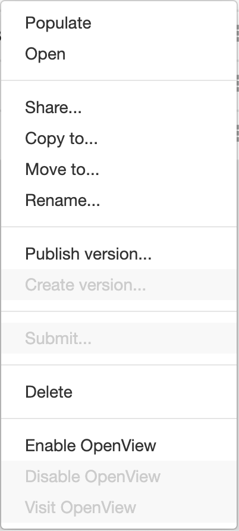

# OpenView

OpenView publishes a CEDAR resource to the web, where anyone holding its address can read it
without a CEDAR account. It works for templates, elements, fields, and metadata instances. Reach
for it when the people who need to read your work are not people you would add to a group:
reviewers, collaborators at another institution, or readers of a paper that cites the metadata.

Publishing stays under your control. You must own a resource to publish it, and you can withdraw
it at any time.

## Publishing a Resource

To publish a template, element, or field, choose Enable OpenView from its menu. CEDAR confirms the
share.

{:width="25%" class="centered"}

A metadata instance needs its template published as well, because the page draws the instance
through the template that gave it structure. Until the template is published, a reader opening the
instance sees an error in place of the metadata.

Enabling OpenView on a folder publishes that folder and everything below it, through every level of
nesting. A resource inside such a folder stays published even if OpenView is disabled on the
resource itself, so the folder is the thing to check when a resource is readable and you expected
it not to be.

## Reading a Published Resource

Choose Visit OpenView from a resource's menu to open its public page in a new tab. The address of
that page is what you give to a reader, and it asks them for neither an account nor a permission.

A template, element, or field appears as an empty form showing its fields, and a metadata instance
appears as a filled one. The down-arrow in the title bar unfolds the resource's metadata, among it
a link that opens the document in CEDAR — which resolves only for a reader whose account may
already view it. The foot of the page offers the raw representations, in JSON-LD and RDF, for
anyone who wants the source rather than the rendering.

## Withdrawing a Resource

Choose Disable OpenView from the menu of a published resource to withdraw it. Readers holding the
address lose access from that moment.

Withdrawing a resource that a published folder contains takes more than the resource's own setting,
since the folder continues to publish everything below it. Either move the resource out of that
folder or disable OpenView on the folder.

## What a Reader Never Sees

OpenView shows the published resource and nothing surrounding it. A reader sees no access control
list, no folder path, no group membership and no user profile data, and no API reachable through
OpenView permits a write. [The permission model](advanced-topics/permission-model/openview.md)
states these limits in full, alongside how a move between folders changes what is published.
