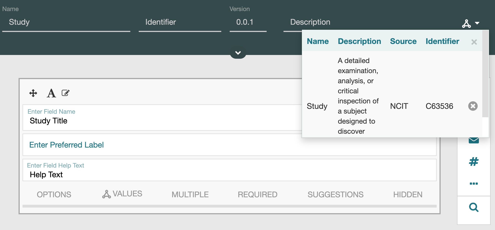
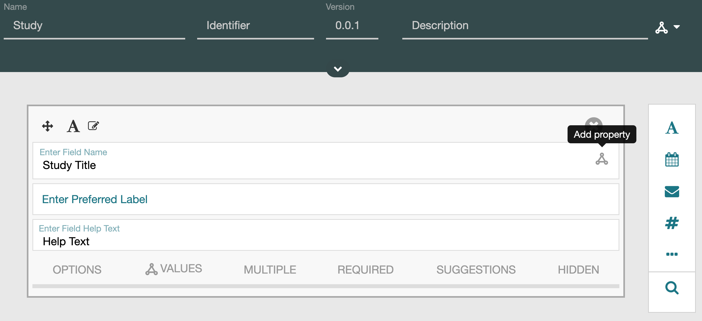
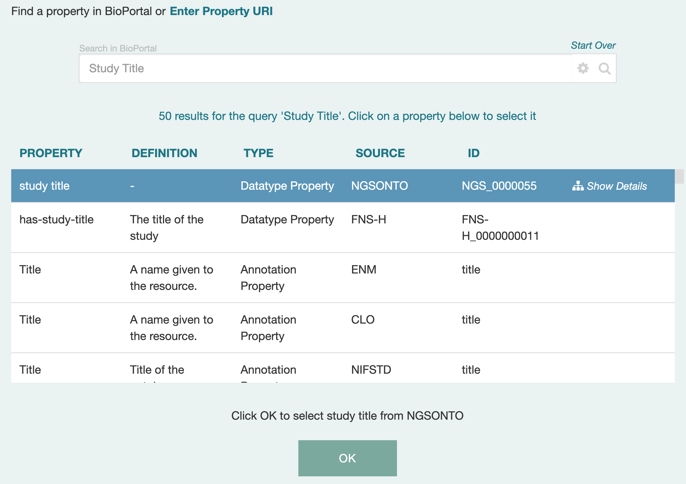
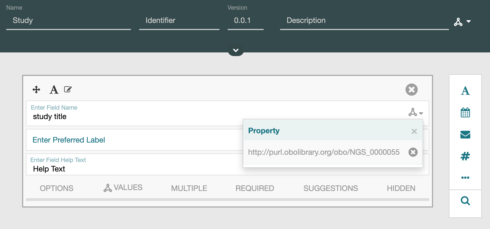

# More Semantics

We're sorry, this resource has not yet been developed. 
You are welcome to contribute to its development at the link below.

## Annotating Metadata with Ontology Classes

CEDAR allows metadata to be of a particular type like an ontology class. This can be easily achieved by few clicks. For example, say we have a simple template named "Study" with a single field named "Study Title".

We can indicate that the metadata is of a particular type by selecting the top right ontology icon and searching for study class in BioPortal. Image below shows selected Study class from NCIT.

{:width="90%" class="centered"}

Fields can also be annotated with properties in a similar way. For example, to select property for the "Study Title" field, you can select the ontology icon near the top right of the field:

{:width="90%" class="centered"}

This will bring up a property search dialog, which can be used to search for an appropriate property in BioPortal.  Here, we show that we are about to select the “Study Title” datatype property form the NGSONTO ontology.

{:width="90%" class="centered"}

Once selected, it is associated with the field.

{:width="90%" class="centered"}

Now, when metadata are generated using that template the generated JSON-LD and RDF will contain the selected classes and properties.

```
_:b0 <http://purl.obolibrary.org/obo/NGS_0000055> "My study title" .
_:b0 <http://www.w3.org/1999/02/22-rdf-syntax-ns#type> <http://data.bioontology.org/ontologies/NCIT/classes/http%3A%2F%2Fncicb.nci.nih.gov%2Fxml%2Fowl%2FEVS%2FThesaurus.owl%23C63536> .
```


## Characterizing your templating artifact


## Relating your Element or Field to its parent

{:width="60%" class="centered"}

{:width="60%" class="centered"}

{:width="60%" class="centered"}

{:width="60%" class="centered"}


## Characterizing your field (future)


## Versioning vocabularies you use


## Adding your terminology to BioPortal


