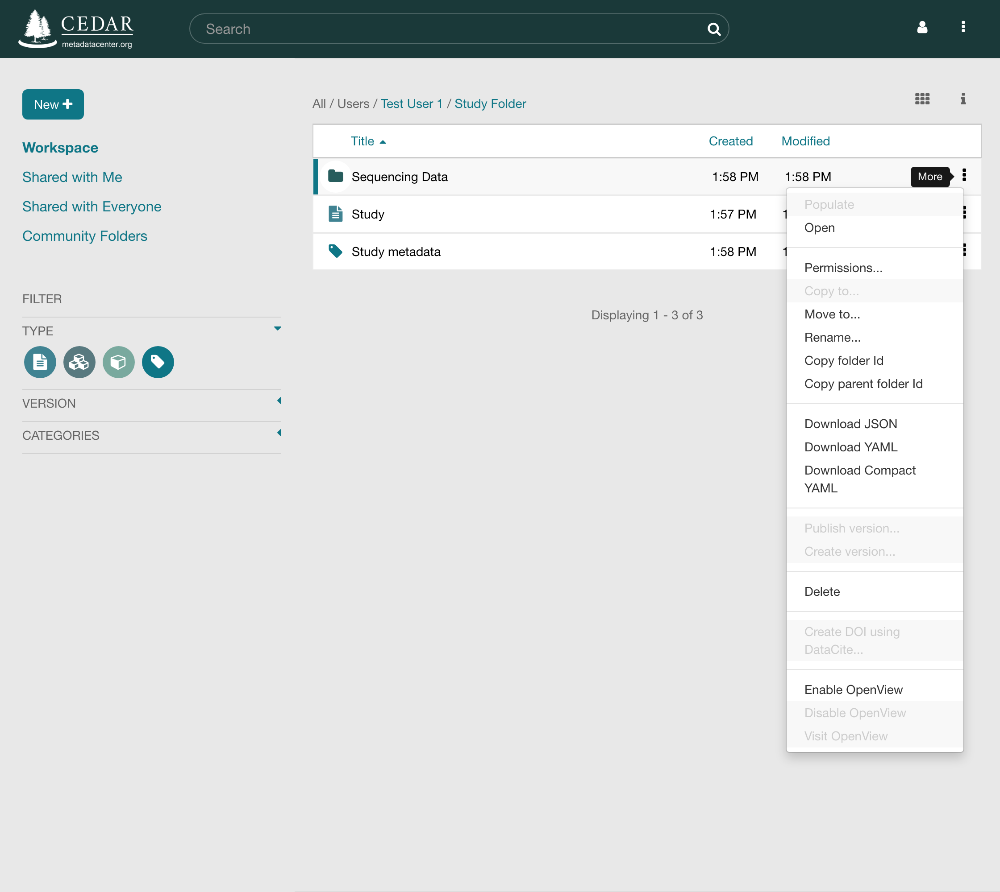
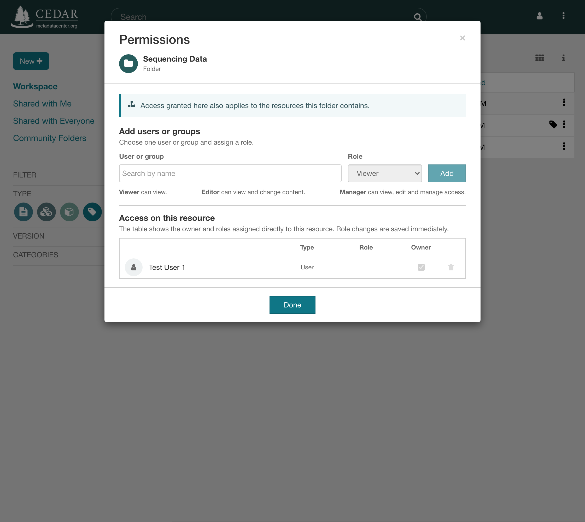
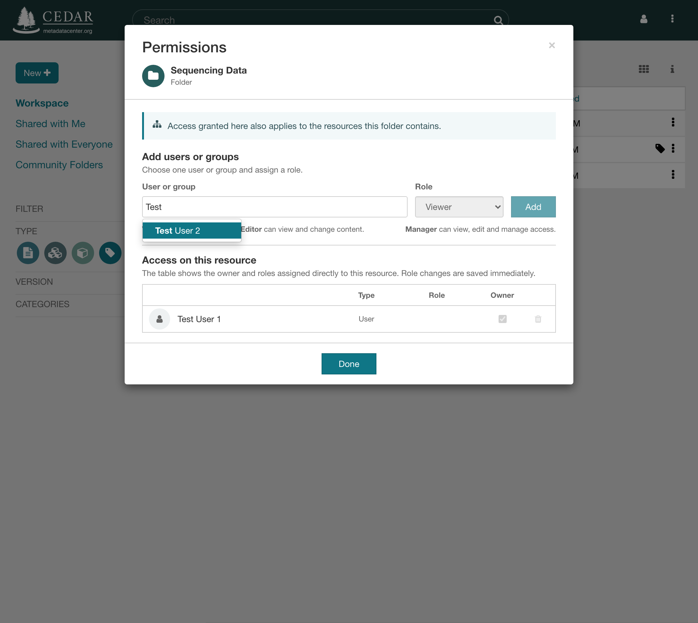
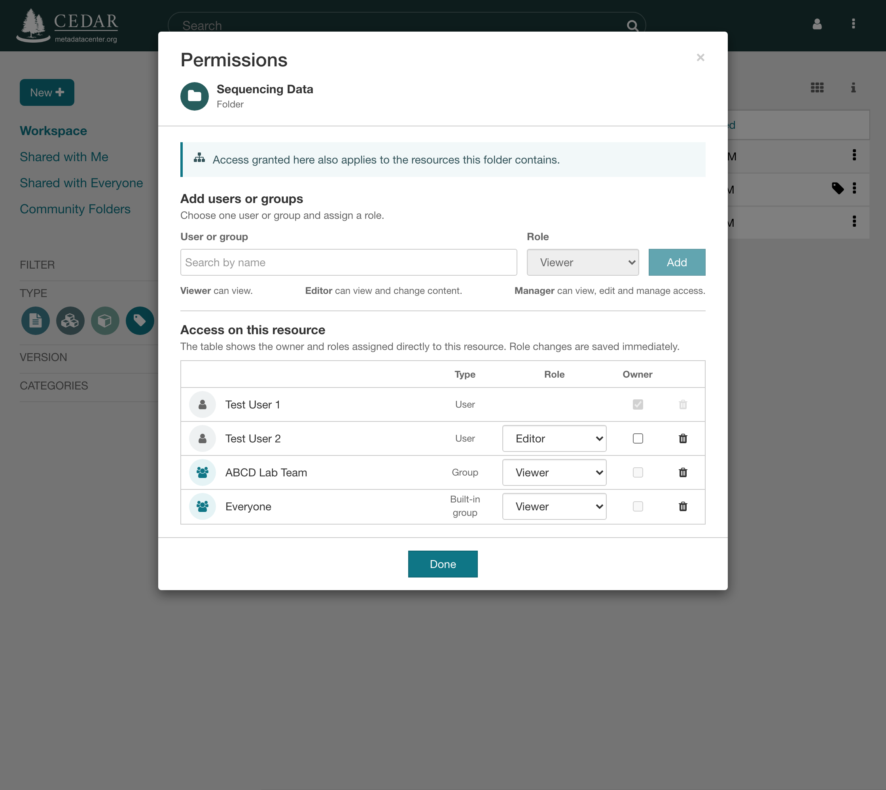
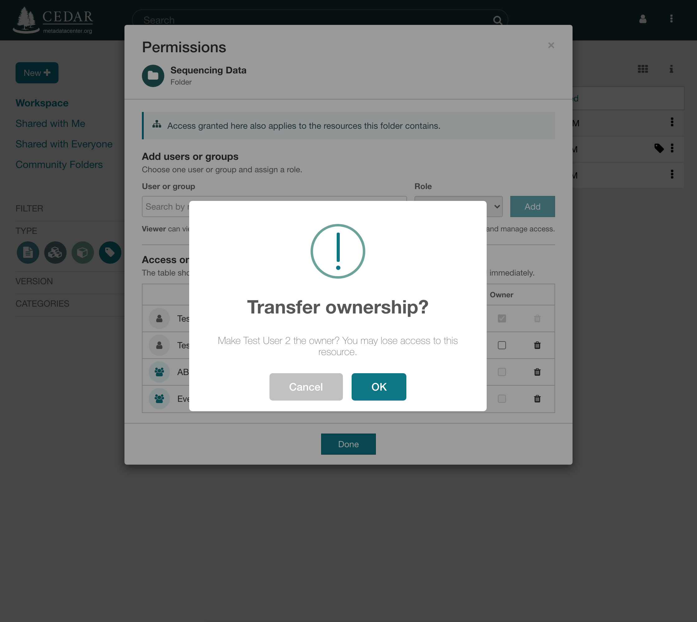
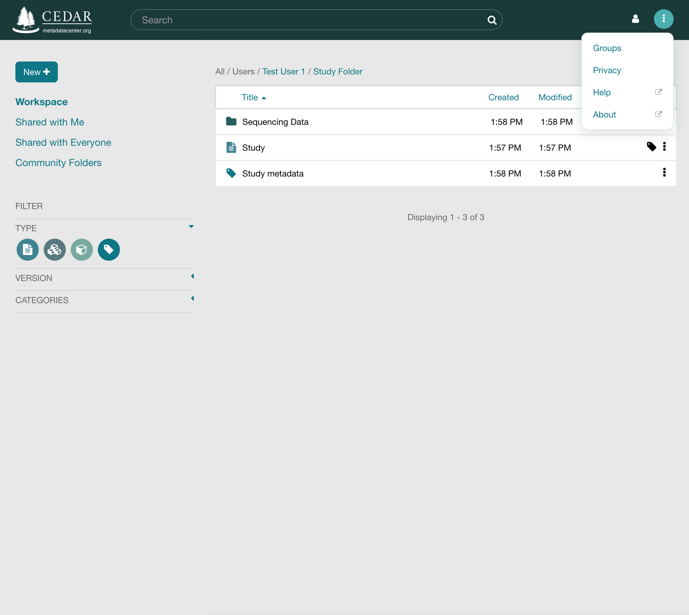
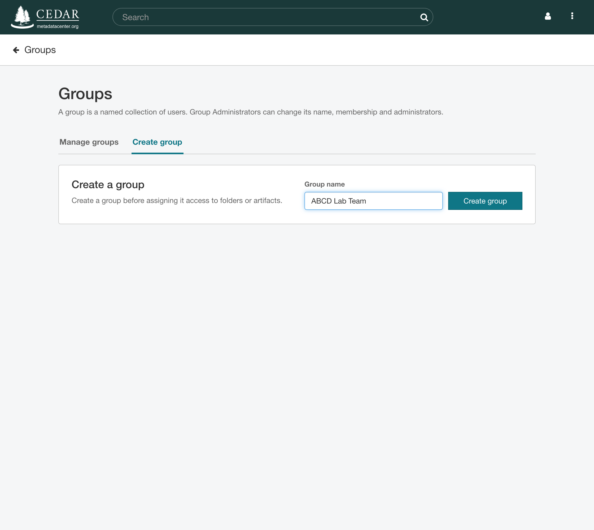
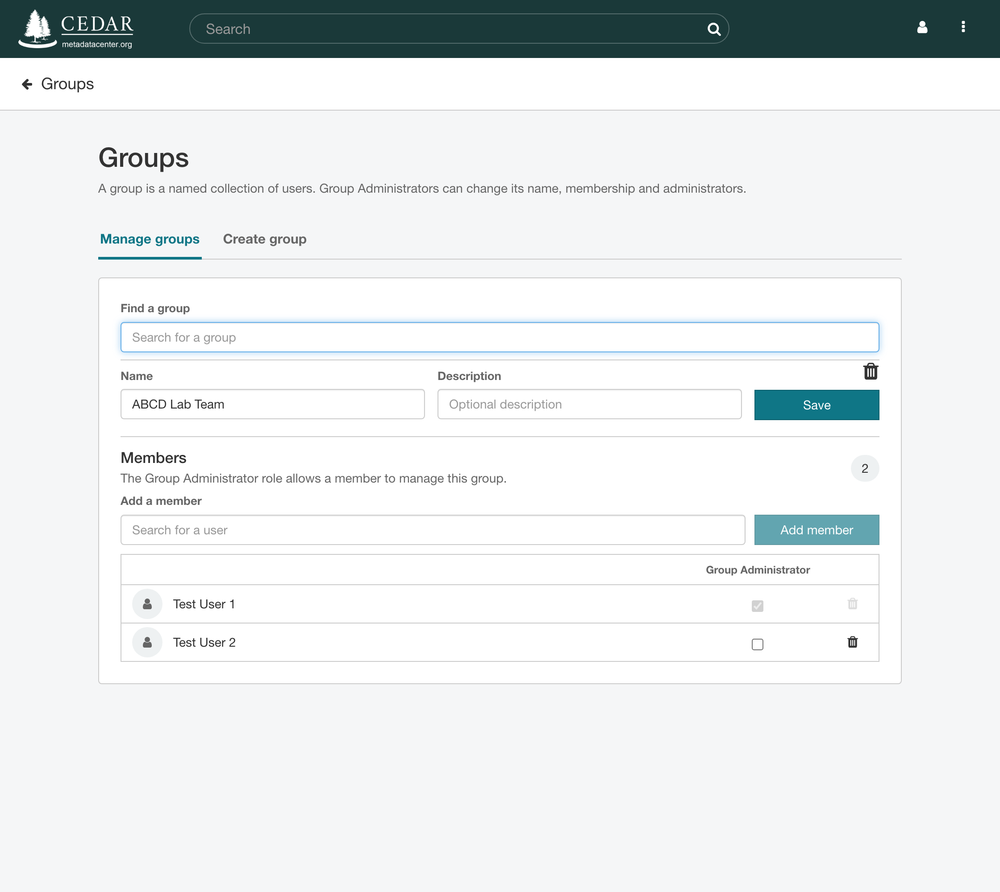
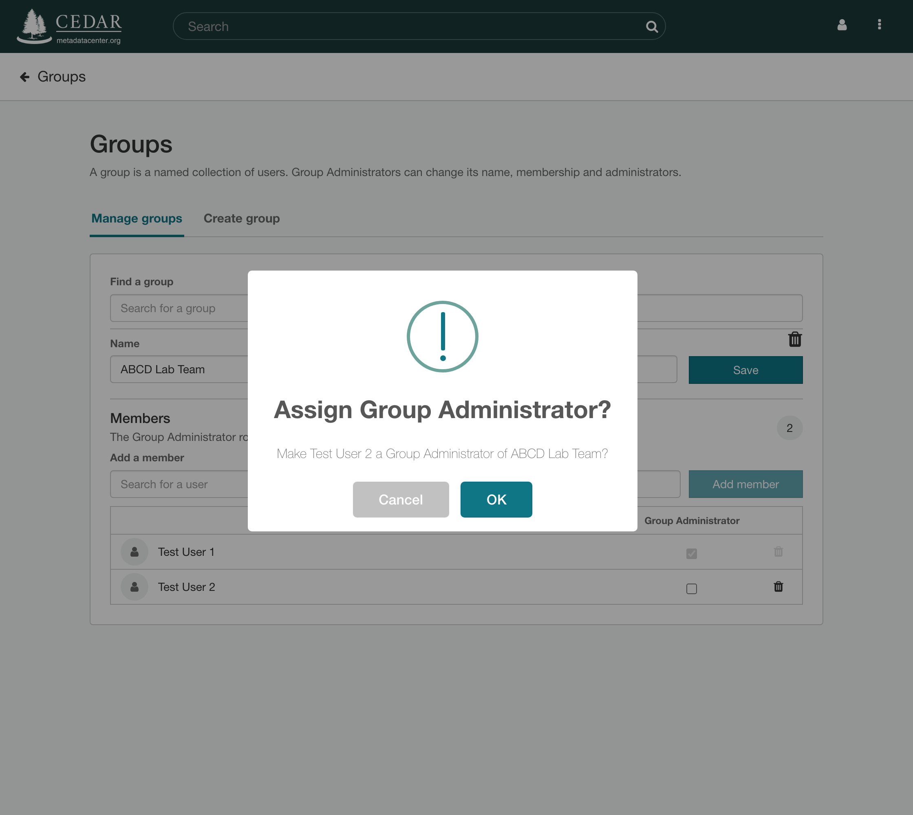
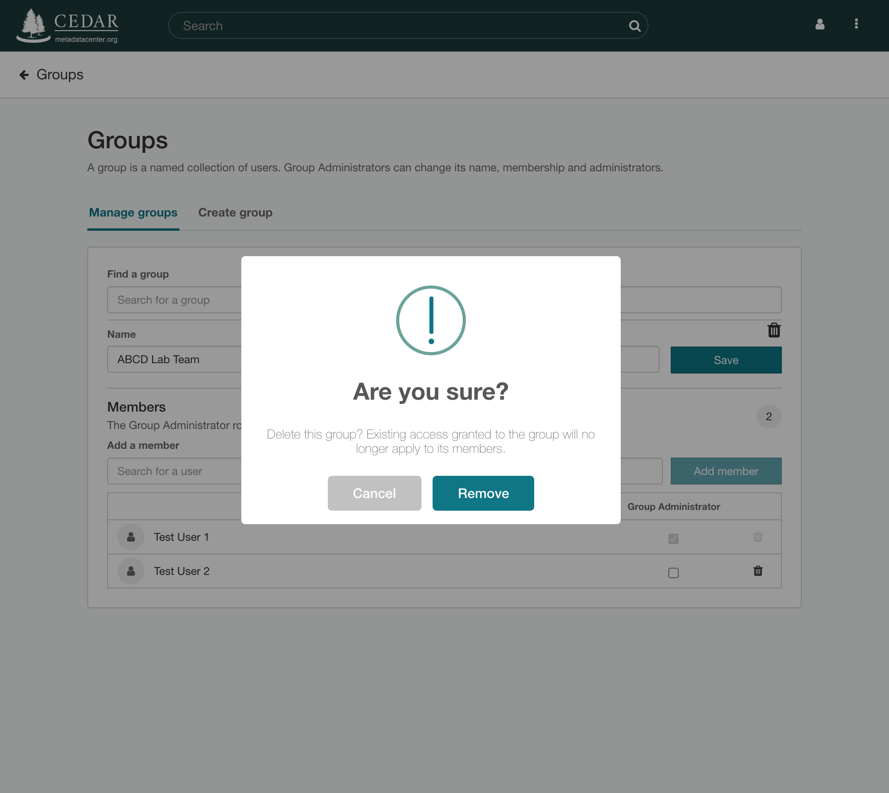

# Sharing Resources

A resource in CEDAR, whether a folder, a template, an element, a field, or a metadata instance,
starts out reachable only by its owner. To let other people see or work on it, you grant them a
role on the resource, or on a folder that contains it. Sharing rests on those roles, on the
Permissions dialog that assigns them, on groups that let you grant access to a whole team at
once, and on ownership. To publish a resource to the open web, for readers without a CEDAR
account, use [OpenView](openview.md) instead.

The Workbench applies the rules of the
[CEDAR permission model](advanced-topics/permission-model/index.md). That specification is the
authority on what each role permits. The Permissions dialog and the Groups page put it to work.

## Roles and the Owner

CEDAR has three roles for access to a resource. Each can be given to a user or to a group, and
giving one is called a grant.

| Role | What it permits |
|---|---|
| **Viewer** | Read the resource. On a folder, see what it contains. |
| **Editor** | Everything a Viewer can do, plus change the resource's content and descriptive metadata and delete it. On a folder, create resources in it or copy resources into it. |
| **Manager** | Everything an Editor can do, plus change who has access, move the resource, and enable or disable OpenView for it. |

The roles are cumulative, so a Manager is also an Editor and a Viewer. The line between Editor
and Manager is deliberate. An Editor can change what a resource says but not who can reach it.
[Roles and Grants](advanced-topics/permission-model/roles-and-grants.md) lists every capability
of every role, and [Required Authority](advanced-topics/permission-model/required-authority.md)
gives the minimum role for each operation.

Every resource also has exactly one **owner**, the user who created it. A copy belongs to
whoever made the copy. The owner has every Manager capability and is the only user who can hand
the resource to a new owner. Ownership is recorded apart from the roles, so the owner's row in
the Permissions dialog carries no role. A group cannot own a resource.

### Access Through Folders

A role granted on a folder applies to every resource inside it, through every level of nested
folders. Granting a team the Editor role on one project folder is therefore the usual way to let
it work on many resources at once. Access flows down the folder tree only. Holding a role on a
resource reveals nothing about the folder that holds it or about its neighbors.

Owning a folder gives you the Manager role on everything in it, without making you the owner of
those resources. Moving a resource keeps its owner and its own grants, but the grants of the old
location stop applying and those of the new location begin to. When several grants apply to one
user, the most capable role wins, and no grant ever reduces the access another grant supplies.
[Access to Resources](advanced-topics/permission-model/access-to-resources.md) states the full
evaluation order.

## The Permissions Dialog

**Permissions…** on a resource's menu, the vertical dots (**⋮**) at the right of its row, opens
the dialog. The command is available to the resource's owner and to anyone with the Manager role
on it, and grayed out for everyone else.

{:width="75%" class="centered"}

The dialog names the resource and its type. On a folder, a notice reminds you that whatever you
grant here applies to the folder's contents as well. The table under **Access on this resource**
lists the owner and every role assigned directly to this resource. Roles that reach the resource
through a containing folder are not listed, so to learn who else can reach it, look at the
folders above it.

{:width="75%" class="centered"}

Every change made in the dialog is saved as soon as you make it. **Done** closes the dialog and
refreshes the workspace.

### Granting Access

Under **Add users or groups**, start typing a name into the **User or group** box. Users and
groups that match appear as you type, and you pick one. Choose a role, Viewer unless you change
it, and click **Add**. The new grant joins the table.

{:width="75%" class="centered"}

Repeat for each person or group. The **Type** column distinguishes a user, a group that you or a
colleague created, and the built-in group Everyone.

{:width="75%" class="centered"}

### Sharing with Everyone

The built-in group **Everyone** contains every CEDAR user. Granting it the Viewer role makes a
resource readable by anyone who is signed in, and the resource then appears under *Shared with
Everyone* in the left pane of every user's workspace. Everyone can hold no role other than
Viewer, so nobody can open a resource to editing by all users at once. The grant reaches
signed-in users only. Readers without an account need [OpenView](openview.md).

### Changing and Removing Access

To change a grant, choose another role in its row. To remove one, click the trash icon at the
end of the row. Both take effect at once. Removing a grant removes only that grant. A user who
also belongs to a group with access, or who holds a role on a containing folder, keeps the
access those grants supply.

Revocation applies immediately to every access check. The lists and search results that show a
user their resources come from a search index, which can take a little longer to reflect the
change.

### Transferring Ownership

Only the owner can transfer ownership, and only to a user. In the new owner's row, check the box
in the **Owner** column. The dialog asks you to confirm, because you may lose your own access to
the resource.

{:width="75%" class="centered"}

Once you confirm, the other user becomes the owner. Any direct grant that user held on the
resource is removed, since ownership supersedes it, and all other grants stay as they were. You
keep only the access that other grants still give you, such as a role through a group or a
containing folder, or ownership of a containing folder. The dialog then closes, since you may no
longer be able to manage the resource.
[Ownership Transfer](advanced-topics/permission-model/ownership-transfer.md) covers the
remaining cases.

## Groups

A group is a named set of CEDAR users. A role granted to a group applies to every current
member, so someone who joins the group gains that access and someone who leaves it loses it. Use
a group whenever a set of people should have the same access to some content, such as a lab team
or a set of curators.

Groups have a page of their own. Open the menu at the top right of the Workbench, the vertical
dots (**⋮**) next to your user icon, and choose **Groups**.

{:width="75%" class="centered"}

### Creating a Group

On the **Create group** tab, enter a name and click **Create group**. You become the group's
first member and its Group Administrator. A group name must be unique across CEDAR.

{:width="75%" class="centered"}

### Managing a Group

On the **Manage groups** tab, type the group's name into **Find a group** and pick it. The page
then shows the group's name and description, which a Group Administrator can edit and **Save**,
and its members.

{:width="75%" class="centered"}

To add someone, search for them under **Add a member** and click **Add member**. To remove
someone, click the trash icon in their row. Every member can view the group, and the
**Group Administrator** checkbox in each row marks those who may also change its name,
membership, and administrators.

Granting that role, or taking it away, asks you to confirm and names both the member and the
group. Nothing is saved until you confirm, so the checkbox stays as it was if you cancel.

{:width="75%" class="centered"}

A group must always have at least one Group Administrator, so the last one can neither be
removed from the group nor lose the role. Their checkbox and their trash icon are disabled, and
hovering over either says why.

The trash icon beside the group's name and description deletes the whole group, after a
confirmation that states the consequence. Every grant that named the group stops applying to
its former members, though a member may still have access through another grant.

{:width="75%" class="centered"}

The built-in group Everyone cannot be changed or deleted.
[Group Administration](advanced-topics/permission-model/group-administration.md) states the
rules for groups in full.

## Seeing What Is Shared with You

The left pane of the workspace has two entries for content other people have opened to you.
*Shared with Me* lists resources shared with you directly or through a group you belong to, and
*Shared with Everyone* lists those shared with every CEDAR user. Selecting a resource and opening
the information panel, the **i** icon above the listing, shows its owner and, in the **Access**
row, the role you hold on it.

## Sharing Via the Web

CEDAR publishes content to the web through OpenView, which makes a resource readable by anyone
holding its address, with no CEDAR account required. Only the owner or a Manager can enable it.
[OpenView](openview.md) covers publishing a resource, reading a published one, and withdrawing
it.

## Common Questions

**How do I keep a resource private, or make it public?** A resource stays private while it sits
in your own folders and neither it nor any folder above it carries a grant. To open it to every
CEDAR user, grant the Everyone group the Viewer role. To open it to the web, enable OpenView.

**How can someone collaborate with me on many resources?** Put them in one folder and grant your
collaborator, or a group, the Editor role on that folder. Grant the Manager role instead if they
should also share the folder onward or move resources out of it.

**Why can't I save metadata in the folder that holds its template?** Templates are often kept in
folders their users can only view. Filling out a template creates a new instance, which needs
the Editor role on the destination folder, so CEDAR saves the instance in your home folder. From
there you can move it into any folder where you are an Editor.

**How can I tell who else can reach a resource?** The Permissions dialog lists its owner and the
grants made directly on it. Grants on the folders above it apply as well, so check their dialogs
too.

**Why does a shared resource not appear right away?** Access itself is granted the moment the
change is saved. The listings and search results that show the resource are drawn from a search
index, which can take a few seconds to catch up, and longer for a large folder.
