# Sharing Your Content

CEDAR provides multiple content-sharing techniques, 
with advanced group and permission management for its artifacts,
as well as a web sharing service called OpenView.

## Creating Groups

### **What Are Groups?**

CEDAR lets you to define groups of people who can share access privileges for particular content. 
For example, if you want members of your team to see all of the metadata generated by your team,
you could put it all in a folder and share the folder's permissions with a group containing your team members.
Or, you could use a group to make metadata visible to a team of curators when it was ready for review.

Any time you want a set of people to share equal access (read or write!) to CEDAR content, you can use a group.

### **Using Groups: Share with Everybody**

Let's say you have created an element and you want to let everyone in CEDAR use it. Good news!
There's a group in CEDAR called Everyone, and if you share your content for reading with that group, 
every CEDAR user can find it and view it. 

To begin, open the sharing menu as described in Sharing for Reading and Writing.

Now, start typing in the name of the Everybody group. As you can see, several groups may be shown,
and you can select the one you want.
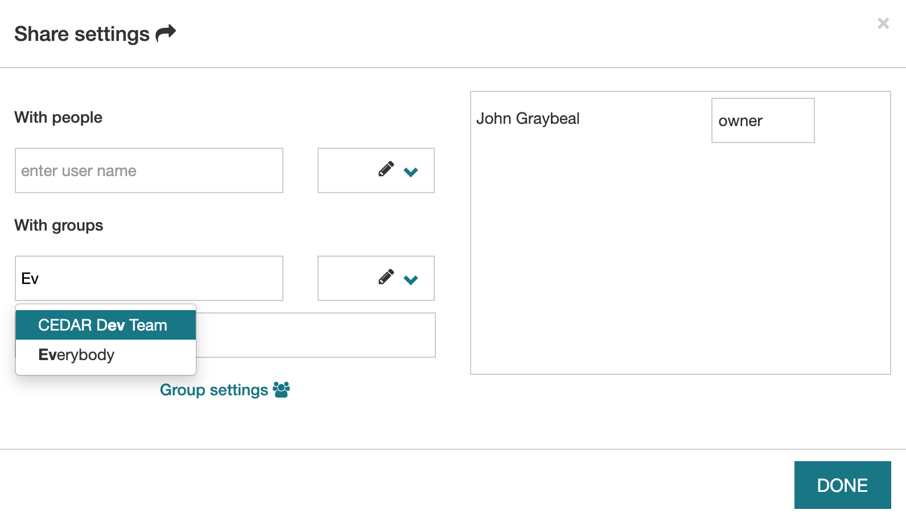{:width="75%" class="centered"}

After you've selected the Everyone group, you can enter the type of sharing (as described in Sharing for Reading and Writing). We highly recommend leaving this 'can read', the default!

To complete the process, you must click on the OK button.
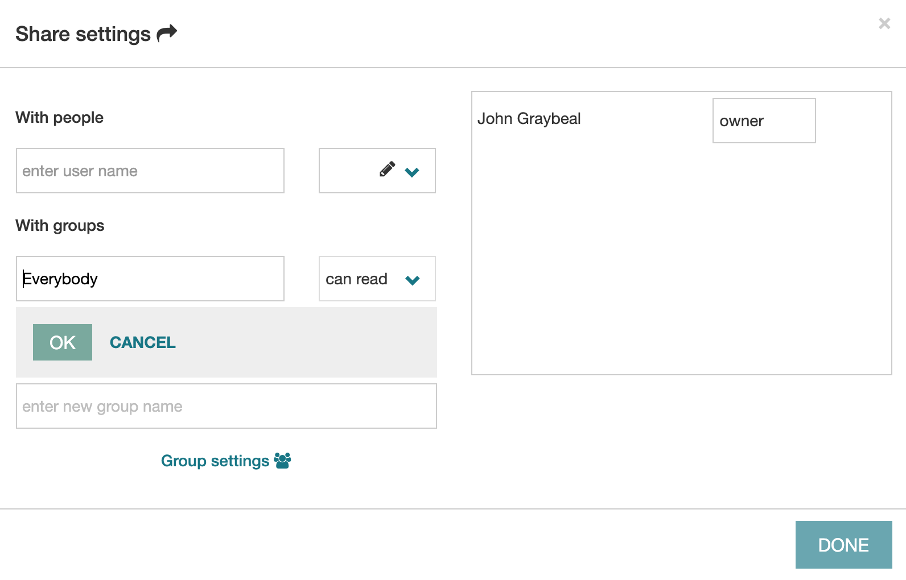{:width="75%" class="centered"}

Now you should see the group displayed in the right-hand panel, showing the assigned permission.
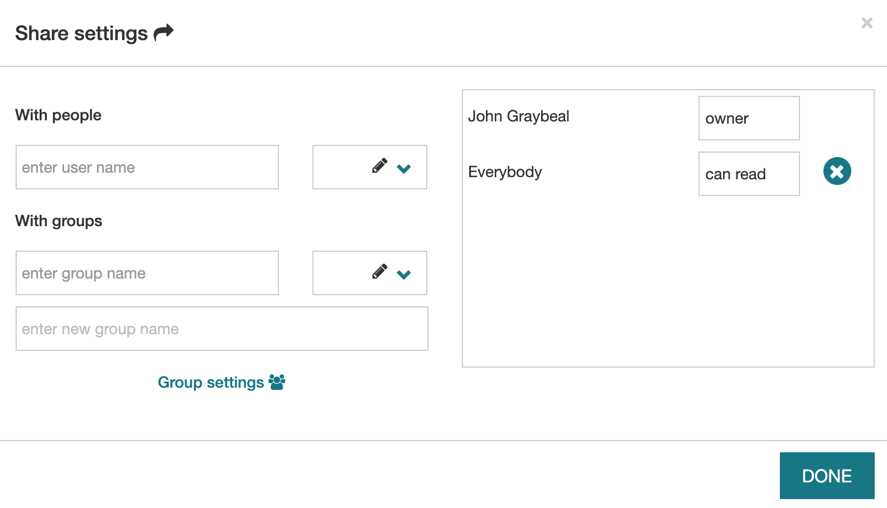{:width="75%" class="centered"}

If you had wanted to share your artifact with the CEDAR Dev Team so they can all see it, you could choose that group after typing the 'Ev' above!

### **Creating Groups**

What if you don't have a group yet, but want one?  Instead of entering an existing group name, enter your new group name in the box labeled 'enter new group name'.  Here we've entered ABCD Lab Team for the group name.

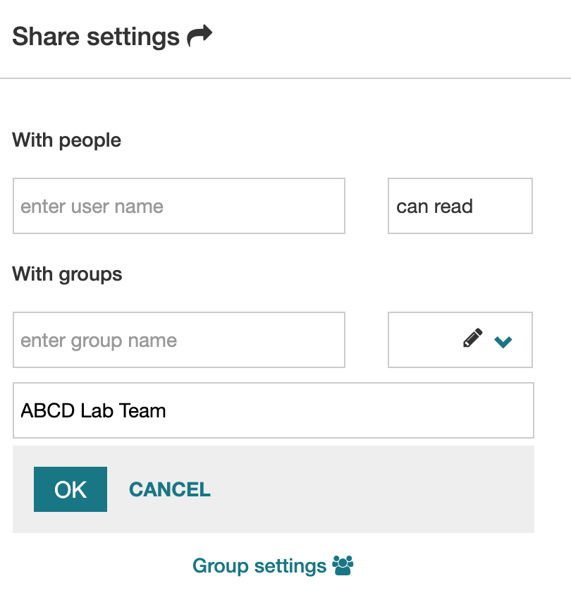{:width="40%" class="centered"}

As soon as you hit return, the group is created, and you can give it read (or write) access permissions by clicking on the OK button.

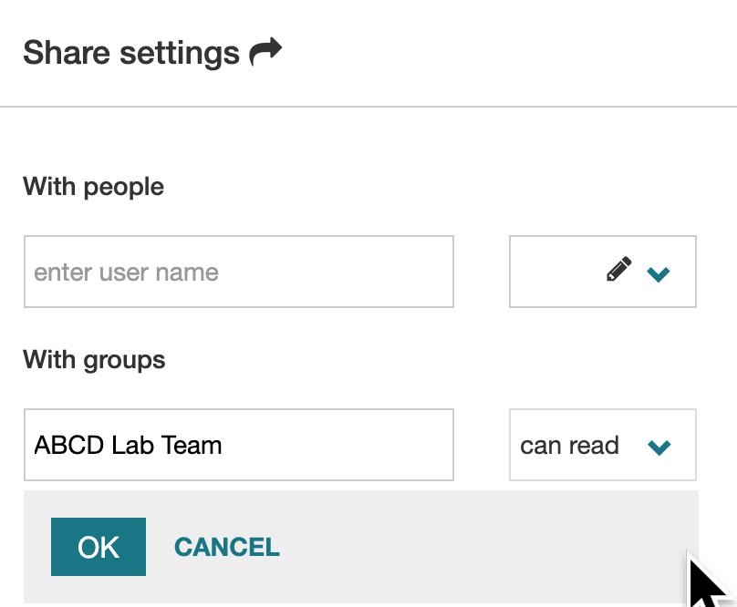{:width="40%" class="centered"}

### **Modifying Groups**

Presumably you want to add people to your group. To do this, 
click on the blue Group settings link (pointed to by the green arrow in the screenshot below).

[//]: # (![]&#40;../img/userguide/group-settings-xselector-20190909.png&#41;{:width="75%" class="centered"})

This brings up a window in which you have to re-select the group you want to modify.

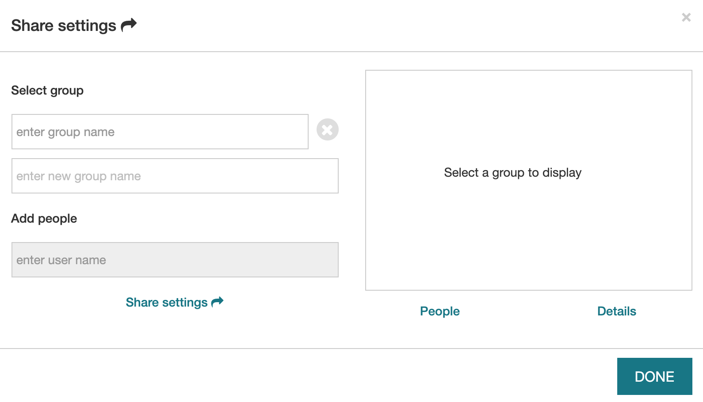{:width="75%" class="centered"}

Enter the group you want to make changes to, and when you choose the group name, the people in the group will be displayed.
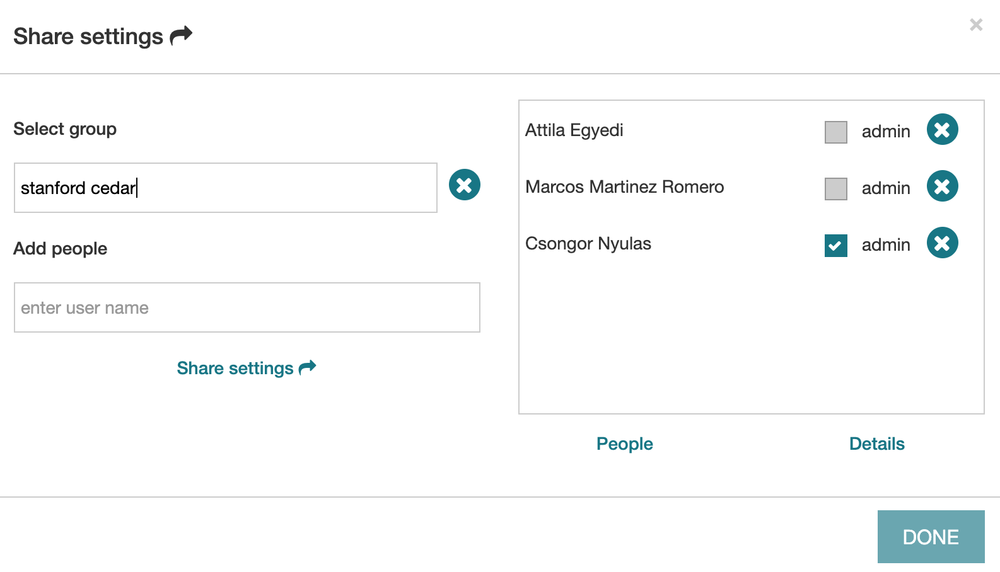{:width="75%" class="centered"}

To add someone to the group, start entering their name in the Add people box, select their name from the drop-down list, 
and click on OK. (To remove someone, click on the X by their name.)

To see more information about the group, click on the Detailed info link under the box on the right side. 
This will bring up detailed information about the group, some of which you can edit.
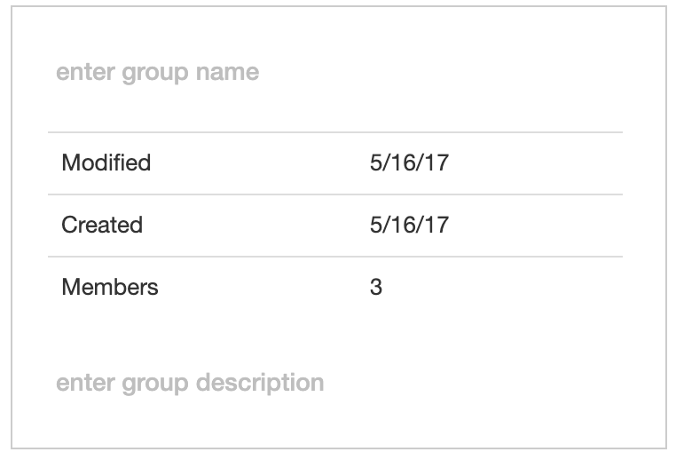{:width="75%" class="centered"}

### **Group Administration**

You can make multiple people administrators of the group, by checking the appropriate box next to each person's name in the People list.

## How Permissions Work

### **Introduction**
You may have some questions about CEDAR's access privileges, like these:

1. How can I keep my files private (or make them public)?
2. How can someone collaborate with me on a lot of different files?
3. Why can't I save this metadata where the template is?
4. How can I tell whether other people can see my file?
5. I just logged in for the first time, why can't see some of the shared files?

In this tutorial we'll talk about how CEDAR permissions work, and help you answer questions like these.

(You can see answers to the questions at the end of this page.)

### **Permission types**
You want to access individual resources in CEDAR, or keep someone else from accessing them. So what you need to know, for a given node, is whether a particular user:

- can read,
- can write,
- can publish,
- can create a draft version of,
- can change the permissions (sharing) of, or
- can change the owner of the node.

The operations above are evaluated on-the-fly in CEDAR. They are not attached to nodes in the system, but are computed from different graph relationships (like folder hierarchies) and properties when they are needed.

A basic concept that may help you interpret CEDAR permissions is that you only need one permission on a resource to perform that operation. 

### **Permission rules**
For simplicity, we refer to the object in each question as a resource (templates, elements, fields, and metadata instances are all resources), but this section also applies to folders.

We should not that for practical reasons, the administrator of the CEDAR system has permission to do all of the actions represented by the 6 permission types above.

Now let's start with a few easy-to-answer questions.

#### **Who can change the owner of a resource?**
Only the owner of a resource can change the owner of a resource. Each resource has only one owner.

#### **Who can change a resource's permissions?**
The resource's permissions are changed via the Share menu for the resource. 

To change a resource's permissions, the following must be true:

- The user has write access to the resource. (This means they can update the resource. And who can do that? See below.)

#### **Who can read a resource?**
For a user to be able to read a resource, at least one of the following must be true:

- The user owns the resource, or a folder that contains the resource
- The user, or any group of which the user is a member, can read or write the resource or any folder containing it (except the root folder '/' and users folder '/Users').

For example, because any user can read the '/Shared' folder, any user can also read any content at any level under the '/Shared' folder. (Unfortunately, this means we can't give users write permission in this folder, because then they can overwrite any other shared content. We'll create an exception rule to handle this soon.)

#### **Who can update a resource?**
These rules are similar to reading. For a user to be able to update a resource, at least one of the following must be true:

- The user owns the resource, or a folder that contains the resource
- The user, or any group of which the user is a member, can write the resource or any folder containing it

The creation rules are just like the updating rules, except simpler, since the user can’t own or write a resource that doesn’t exist. (To create a resource, use the 'New +' icon at the upper left of your workspace.) So one of the following must be true:

- The user must own any containing folder (that is, any single folder higher in the hierarchy than the new resource).
- The user must be able to write any containing folder (that is, any single folder higher in the hierarchy than the new resource).
Note that no user can write or create resources directly in the '/', '/Users', or '/Shared' folder. 

Copying a folder or resource into a target folder, or moving a resource into a target folder, requires the same permission as creating a resource in the target folder.

#### **Who can create a draft version of a published resource?**
A draft version of a resource is a resource that can be overwritten, by editing and saving it. All resources in CEDAR start out as a draft, and must be explicitly published (see next item) before this question applies.

For a user to create a draft from a published resource, the following must be true:

- The user owns the published resource that serves as the original content for the draft.
- The resource is a type that supports versioning (field, element or template).
- The resource is the most recently published in the version history of this resource

The last rule means you can not create a draft from some earlier published version of the resource.

#### **Who can publish a resource?**
Publishing a resource is like 'releasing' source code or defining a version of a document: a published resource can never be modified. The only types of resource that can be published are templates, elements, and fields, and they must start out in draft state. (The act of publication replaces the 'draft' version.)

For a user to publish a resource, the following must all  be true:

- The user owns the resource that is to be published.
- The resource is in draft state (all resources start in draft state, and if a draft exists, it is always the most recent resource in a version history)
- The resource is of a versioned type (field, element or template).
 

### **Answers**
Now we can answer our original questions.

1. **How can I keep my files private (or make them public)?**
Your resources will stay private if they are in your own CEDAR user folder, and you have not shared any of their parent folders with anyone else.

To make your files public, simply share them, or one of their parent folders, with the individuals or groups who should get access. The 'everybody' group can be used to share the content with all CEDAR users.

2. **How can someone collaborate with me on a lot of different files?**
Just share the folder containing all of your collaborative files with them. Sharing write privileges on the folder will let them modify all the contained files.
(If you want to have a shared folder for your project under /Users/Shared/, just ask us to create it for you. Be aware the contents are readable by *all* CEDAR users.)

3. **Why can't I save this metadata where the template is?**
Often templates are in a read-only folder, so that the template can not be changed. 
CEDAR will automatically save created metadata to your home folder,
and then you can move it to any other folder that for which you have write permissions.

4. **How can I tell which other people can see my file?**
Unfortunately there is no simple way to evaluate this, without examining the sharing permissions on the resource, and on every folder above it.

5. **I just logged in for the first time, why can't I see some of the shared files?**
All CEDAR permissions must be materialized in Elasticsearch, in order to be used directly for search queries.
When you first log in, your materializations must be created, which can take some time.
In a similar way, a change in the permission of any given node is not propagated instantly into the Elasticsearch index.
Depending on the size of the affected subtree (if the node is a folder), materializing this permission can take several seconds.

## Sharing for Reading and Writing

### **What it Means**

There are two types of sharing: for reading, and for writing. 
If you allow someone to read your content, they can see it, but they can't change it.
That includes changing the metadata, or its sharing settings, or even removing it—they can't do it.

If you share something for writing, then the people (or groups) with whom you've shared it can make all sorts of changes, 
including changing its content, its sharing permissions, and even deleting it. 

If you share a folder for reading or writing, then the permissions you share
apply to everything in that folder, and everything in any folders within that folder.
So be sure you want everyone to be able to read, or write, **all** the folder's content before doing that!

### **How to Share**

It is simple to enable sharing for your CEDAR artifacts. 
Simply find the artifact you want to share in your Workspace. 
Click on the menu selector for the artifact (the small green arrow in the screenshot below). 
In the resulting menu, click on Share menu item (the larger green arrow in the screenshot).  

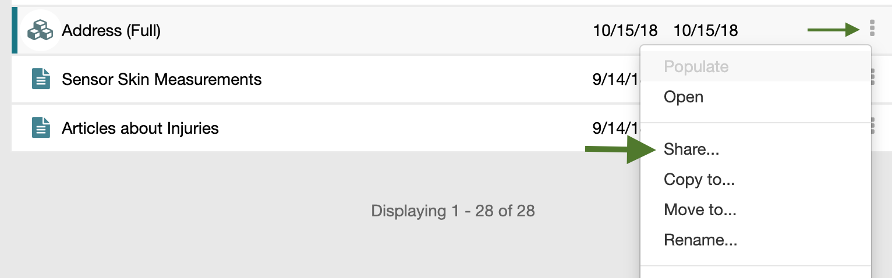{:width="75%" class="centered"}

You can now enter either a person's name, or a group's name. 
As you start typing possible names will appear, and you can select the name you want to share with.
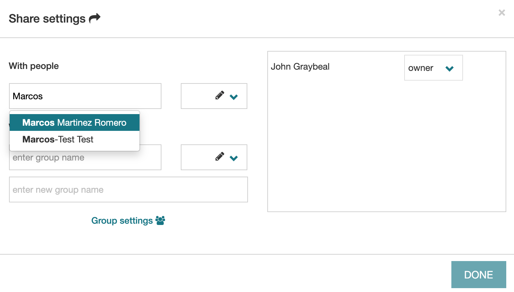{:width="75%" class="centered"}

Once you select the name, a sharing choice will appear with the default permission: read. If you want to change the shared permission to enable writing, or (if you are the owner) even reassign someone else as the owner, click on the down arrow and select the permission you want to give.  
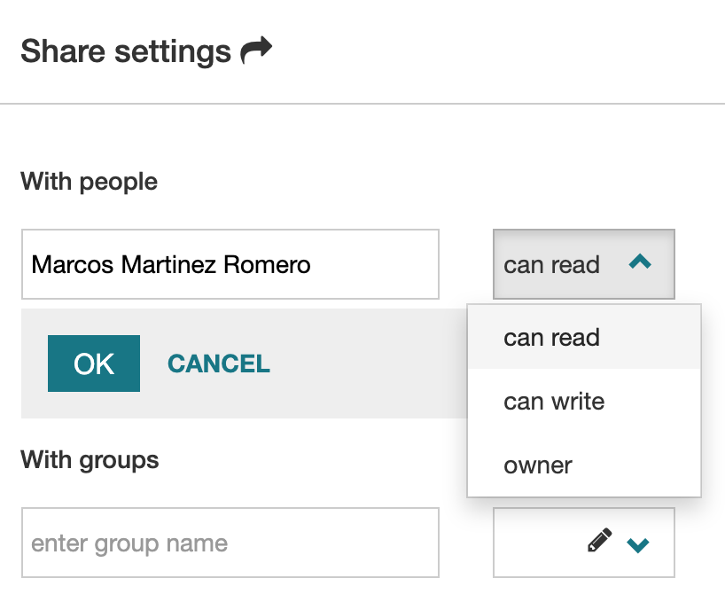{:width="25%" class="centered"}

You must click on the OK button to complete the sharing process.
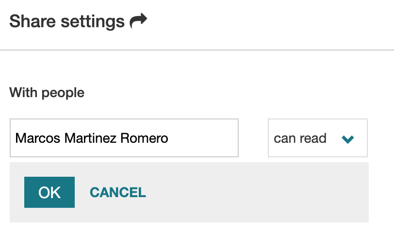{:width="25%" class="centered"}

You should now see the person's name in the list of shared permissions on the right side.
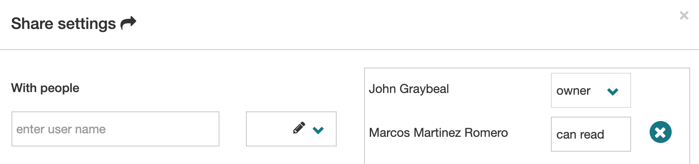{:width="75%" class="centered"}

To share artifacts with groups of people, see the Creating Groups page.

## Sharing Via the Web

### **Introduction**

With CEDAR OpenView, you can share your CEDAR content via the web. 
This feature works for templates, elements, fields, and metadata instances. 
You must be the owner of the content to share it, and if you are sharing a metadata instance, 
the template for that instance must already be shared.
Templates, elements, and fields are displayed as empty metadata instances containing the relevant fields.

### **Sharing to the Web**

To share your CEDAR template, element, or field via the web, simply select Enable OpenView via its drop-down menu. 
The CEDAR system will display a message indicating the sharing was successful. 

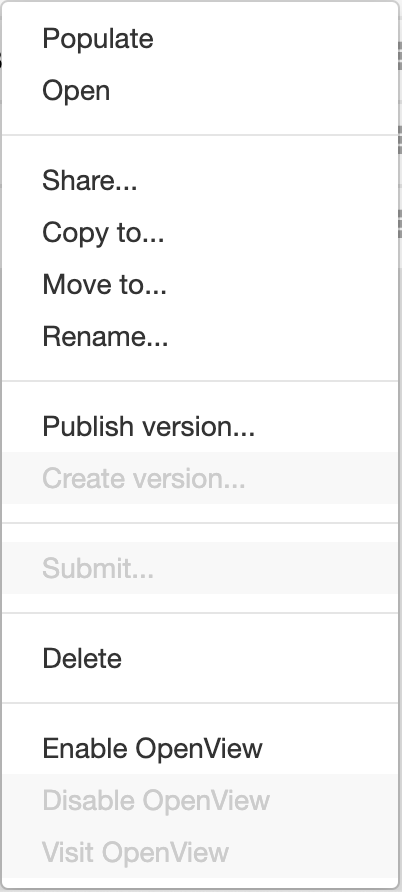{:width="25%" class="centered"}

To share a CEDAR metadata instance via the web, 
you must also share the template on which the instance is based. 
If you are not the owner, contact the owner or the CEDAR team to get help sharing the template. 
After the template has been shared, you will be able to successfully share the instance. 
(If you do not share the template, anyone who visits the shared metadata instance 
will see an error message rather than the actual metadata.)

### **Viewing the Shared Content on the Web**

To view the shared content, select Visit OpenView via the artifacts drop-down menu. 
This brings up the OpenView, a public view of the shared content, in another web page.  
You can copy the URL for the OpenView and share it with anyone else for viewing.

Once at the OpenView page display the content, you can view the metadata for the content by clicking on a downarrow in the title bar. 
The document metadata includes a link to open the document within CEDAR. 
This link will only work if the user has a CEDAR account with permissions to view the document.

The OpenView page lists the field type icons at the bottom of the main section. 
Below that it offers the option to view the 'raw source' representations of the content. 
For a template, element, or field, that will display the JSON Schema for the CEDAR artifact.
For a metadata instance, you can view JSON-LD or RDF views of the metadata, 
as well as the JSON Schema of the template on which the metadata instance is based.

### **Ending Sharing**

The owner of a CEDAR document that has OpenView enabled may choose to disable the OpenView at any time, 
using the Disable OpenView menu item from the document's drop-down menu.
