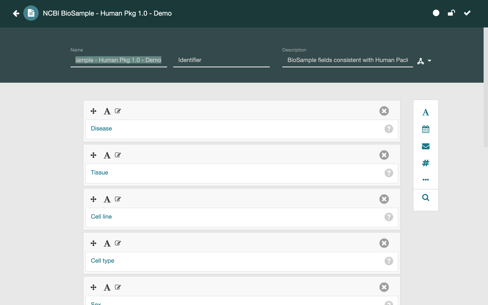
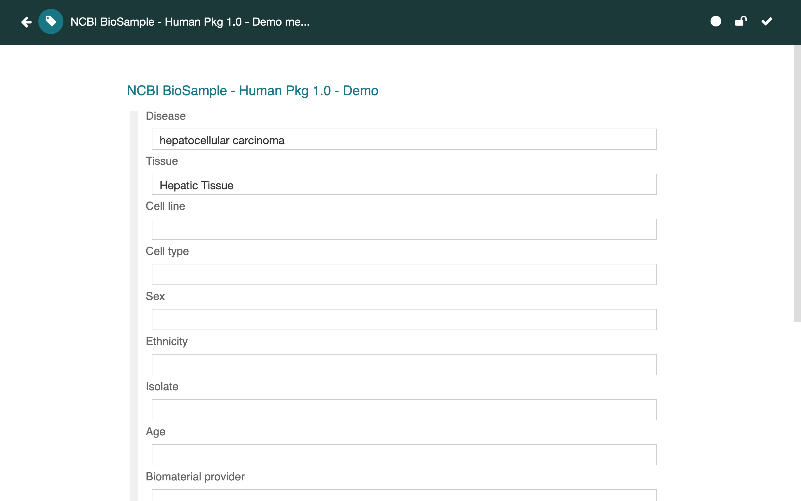
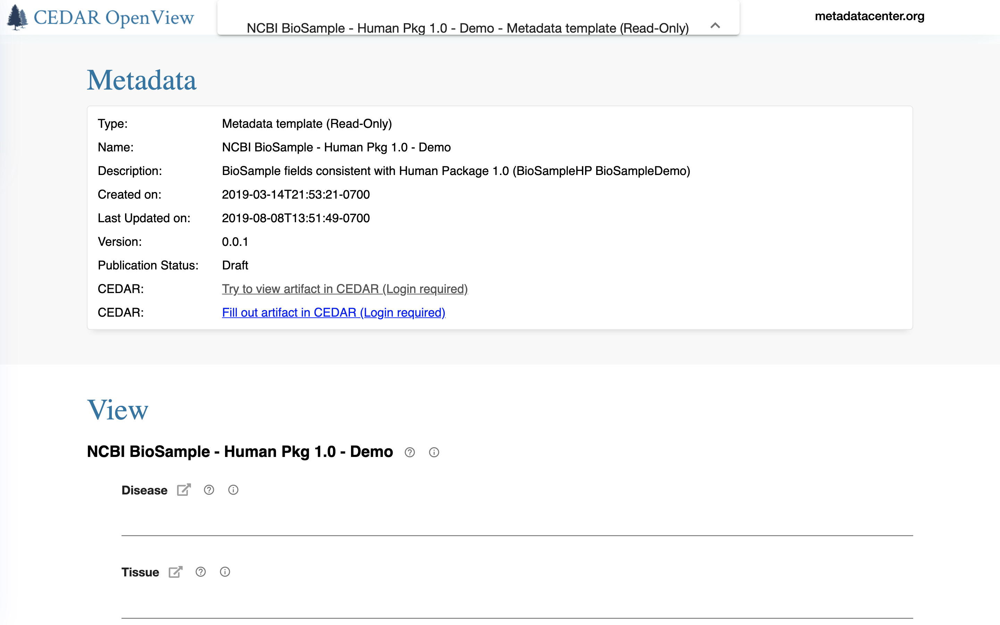

# Viewing Resource Information

CEDAR resources can be viewed within the user interfaces you use to work with them,
but also in their raw format, as well as on the web when shared in OpenView.

## Viewing Resources Overview

### Introduction to the Resources

There are four types of resources in CEDAR: folders, metadata templates, metadata elements, metadata fields, and metadata instances. In this section we will drop the term 'metadata' from these names and refer to each resource by its shorter form.

CEDAR folders are used to organize CEDAR content and the sharing settings for that content. To view folder resources you navigate into the folders.

The rest of this section emphasizes CEDAR artifacts: 
templates, elements, fields, and instances. 

### Viewing Resource Content

We use the phrase 'viewing resource content' to mean looking at the resource in human-friendly form, either in the CEDAR application or on the web using OpenView.

#### Natively in CEDAR

To open an artifact for viewing in CEDAR that is listed in the Desktop view, 
either double-click on the artifact, 
or select the artifact and use the resource menu (*⋮*) to select Open.
Both techniques work whether you are in search or browse mode.

You will be shown a viewing window that lets you navigate throughout the artifact,
open and close sections of metadata instances, and if you have write permission,
make changes to the document. 

This is also the view which enables seeing the raw artifact content inside CEDAR.

For more details about this viewing mode, visit [Viewing Resource Content](#viewing-resource-content-in-cedar).

#### On the Web with OpenView

If you click on the resource menu (*⋮*) and find the OpenView section, 
you will be able to see whether OpenView is enabled for this artifact.
(The View in OpenView command must be selectable.) 

By selecting View in OpenView, you will be directed in a new browser tab
to the web page for this artifact that supports navigation and viewing features.
(Modifications are not available in OpenView mode.) 

You can also see artifact metadata and raw artifact content from the OpenView format.

For more details about this viewing mode, visit [Viewing Resource Content on the Web](#viewing-resource-content-on-the-web). 

### Viewing Resources in Raw Formats

All three CEDAR templating artifacts—templates, elements, and fields—are maintained
as JSON Schema documents, an ASCII format following the JSON specification. 
CEDAR metadata instances are maintained in JSON-LD (for JSON-Linked Data), 
which also follows the JSON specification. 
JSON-LD is expressly designed for interoperability with RDF, 
so the CEDAR metadata instances can be expressed as JSON-LD or RDF.

Whichever format applies, the information is accessible at the bottom of the 
artifact's view in CEDAR by clicking on the appropriate link. 
(Raw formats can also be accessed via the web when OpenView is enabled for the artifact.)

For more details about this viewing mode, visit [Viewing Resource as Raw JSON](#viewing-resource-as-raw-json). 

### Viewing Resource Metadata

Within CEDAR, metadata for an artifact or a folder is viewed from the Desktop.
Once a resource is selected, if the metadata panel is not visible on the right
side of the Desktop, click on the 'i' information icon to open it.

Another metadata panel is available from the top part of the OpenView format, 
with a different metadata collection appropriate to OpenView users. 

For more details about viewing resource , visit [Viewing Resource Metadata](#viewing-resource-metadata). 

## Viewing Resource Content in CEDAR

We use the phrase 'viewing resource content' to mean looking at the resource in human-friendly form, in this case within the CEDAR application.

When you want to open an artifact for viewing that is listed in the Desktop view, 
either double-click on the artifact,
or select the artifact and use the resource menu (*⋮*) to select Open.
Both techniques work whether you are in search or browse mode.

The artifact will open in the appropriate editor for that artifact. This is the Template Designer for templating artifacts—templates, elements, and fields—and the Metadata Editor for metadata instances. 

In either case, the editor is opening a modal window, and no other CEDAR tools are accessible until the window is dismissed. 
The artifact is saved only when you click the Save button; it will not be saved if the browser window is closed or a back button is pressed, although a warning is issued.

### All Artifact Editors

When the artifact opens, you will see a formatted view of its content.
You can navigate throughout the artifact,
in some cases open and close sections of the document, 
and if you have write permission, make changes to the document. 

#### Artifact Headers

At the top of the view, you will see the name of the artifact, 
an identifier field, and the artifact description. 
All three fields can be modified by a user with write permission on the artifact.

To the left of the artifact name is a left arrow. 
If you click on this left arrow, CEDAR will return to the previous folder view.
(If the current document is modified but not saved, 
you will be warned and given a chance to save your work.)

To the right of the left arrow is an artifact type icon, 
showing the kind of artifact being modified. 
The following images show the artifact type icons 
for templates and instances.
{:width="44%" class="right"}
{:width="40%"}

{:width="15%" class="right"}
In the upper right of each editor is an artifact status display, shown to the right.
The artifact display shows white icons to reflect normal status, 
and yellow icons if there is an issue. 
The left-most icon indicates whether the artifact has been modified without saving. 
The center icon indicates whether the document can be edited, 
showing a locked icon if it can not be edited. (This can happen if you do not have permission to edit the document, or if the document is a published version, 
which means no one can edit it.) 
The right icon shows whether the document validates. 
(The document should always validate if the system correctly implements
the template model specifications.)

#### Artifact Footers

At the foot of every artifact one or two horizontal bars let you view the raw format of the artifact.  See [Viewing Resource as Raw JSON](#viewing-resource-as-raw-json) for more information.

### Template Designer View

For templating artifacts, the Template Designer
will show the elements and fields of the template,
with visual indentation to show the organization of the elements within the template.

{:width="75%" class="centered"}

There is also an identifier field, which can be used to provide an external identifier for the template. (This is not the same as the artifact's identifier, which is always a CEDAR-generated IRI.) The external identifier does not have to be an IRI, and does not have to be unique across different artifacts, though both are highly recommended.

More information about using the Template Designer can be found in the CEDAR Templates chapter, starting with [Description of a Template](description-of-a-template.md).

### Metadata Editor View

For metadata instances, the Metadata Editor
will show the metadata as a form to be filled out,
again with visual indentation to show the organization of the elements within the form.

{:width="75%" class="centered"}

If there is an arrow to the left of a given line, 
clicking on the arrow will expand or collapse the content under that entity.

Information about using the Metadata Editor can be found in the Filling Out (Creating) Metadata chapter, starting with [Filling Out Metadata](filling-out-metadata.md#filling-out-metadata).

## Viewing Resource Content on the Web

We use the phrase 'viewing resource content' to mean looking at the resource in human-friendly form, in this case viewing it on the web using CEDAR OpenView.

OpenView is a CEDAR feature that allows you to publish CEDAR artifacts to the web, where anyone with the IRI can view them. The details of this process are described in [Sharing Via the Web](sharing-resources.md#sharing-via-the-web).
Under the heading Viewing the Shared Content on the Web, that page also describes how to access an OpenView page, what content is visible on the page, and how to view additional hidden information.

An added feature of the web-based view of instance artifacts is that you can view not just the raw JSON-LD or RDF for the instance, but also the JSON Schema for that instance. Simply click on the appropriate viewing link at the bottom of the form on the web.

Another feature of the web view is that the artifact's metadata are customized for public viewing. 
For example, in the screenshot below of a [demonstration template in CEDAR OpenView](https://openview.metadatacenter.org/templates/https:%2F%2Frepo.metadatacenter.org%2Ftemplates%2F4595e3d3-b0c5-467b-a967-fec870801624),
you can see the links to visit the template in CEDAR, and to fill it out in CEDAR.

{:width="90%" class="centered"}

## Viewing Resource as Raw JSON

As noted in the [Viewing Resources Overview](#viewing-resources-overview), 
all CEDAR artifacts are maintained internally in JSON.

The three CEDAR templating artifacts—templates, elements, and fields—are maintained
as JSON Schema documents, an ASCII format following the JSON specification. 
(They are validated using a higher-level JSON Schema specification.)

CEDAR metadata instances are maintained in JSON-LD (for JSON-Linked Data), 
which also follows the JSON specification. 
JSON-LD is expressly designed for interoperability with RDF, 
so the CEDAR metadata instances can be expressed as JSON-LD or RDF.
The JSON-LD instances are validated using the JSON Schema of the CEDAR templates.

Whichever format applies to your artifact, you can access the artifact in that format  using links in horizontal bars at the bottom of the artifact when it is being viewed.
For metadata instances, you can also see the metadata in RDF form using similar links.

Raw formats can also be accessed via the web when OpenView is enabled for the artifact. When visiting an OpenView page, scroll the page to the bottom to find the JSON-LD and RDF viewing links. 
On the OpenView page for metadata instances you can also find a link to the JSON Schema for the template under which the instance was produced.

## Viewing Resource Metadata

There are 3 ways you can view metadata about a CEDAR resource: within your CEDAR Workspace view; in the OpenView of any artifact that has OpenView enabled; and by looking at the content. Each of these is described below.

As a reminder, the term 'resource' refers to any CEDAR artifact or folder; while 'artifact' refers only to templating resources (templates, elements, and fields) and metadata instances. 

### In the CEDAR Workspace

By selecting any resource in the main file viewing window in your CEDAR Workspace (see diagram below), you can view an information panel to the right side of the display
with metadata for that resource.
Click on the 'i' icon (shown as item L in the diagram) to make the metadata panel visible
if it is not already visible.

If no resource is selected, the 'i' icon presents metadata about the folder (B) shown in the middle pane. The right-hand smaller image below shows the information panel for one of these artifacts.

The information panel displays 3 types of metadata in the corresponding tabs: metadata about the resource's general characteristics; metadata about an <a href="artifact-versioning.md">artifact's version history</a> (for templating resources only, not instances); and metadata about the categories into which the resource has been classified (artifacts only, not folders).

In the main window, most of the metadata is self-explanatory, but there are two features of special interest. The Description field is the same content as the description at the top of the artifact when it is open, and this field is editable in the information panel. Also, for metadata templates the panel shows all the metadata instances that are visible to you; clicking on any of the instances in the list will open it. The count at the top of that metadata instances sub-panel is the count of instances you can see, and the total count of instances.

{:width="75%" class="centered"}

### Metadata in an artifact's OpenView

If an artifact has OpenView enabled, you can navigate to the OpenView either with the direct IRI (if you have it), or by navigating to the artifact in CEDAR (if you have access to that) and clicking on the Visit in OpenView resource menu item. 

In either case, the top line of the artifact in OpenView has a metadata block with the title in the middle. By clicking on this metadata block, you will unfold a metadata view, as shown in [Viewing Resource Content on the Web](#viewing-resource-content-on-the-web)

### Metadata in the raw artifact views

By looking in any [raw artifact view](#viewing-resource-as-raw-json),
you can see the metadata that CEDAR maintains as part of that artifact.

To understand the metadata in more detail, 
you will need to understand the CEDAR Template Model, as described in the [Description of a Template](description-of-a-template.md).
