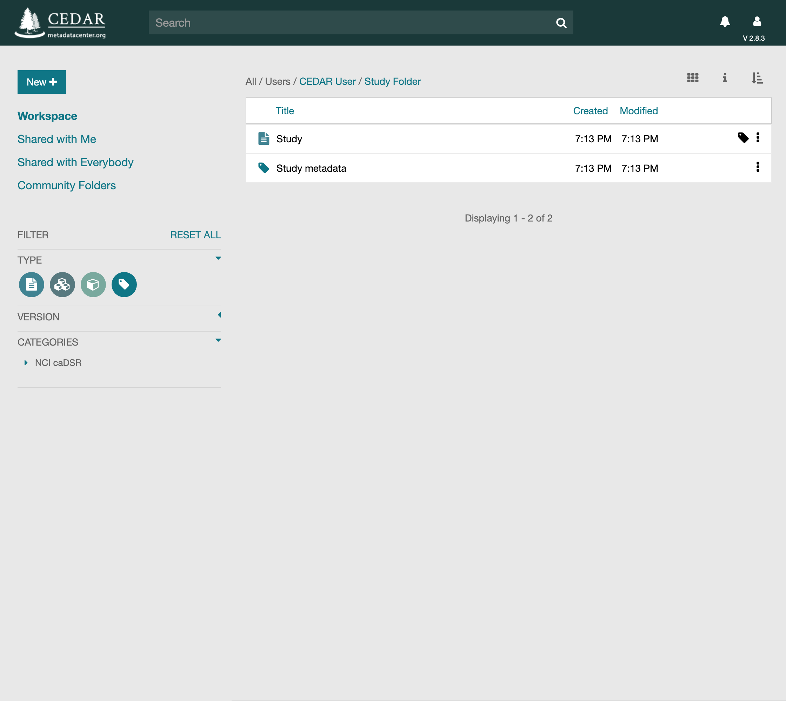
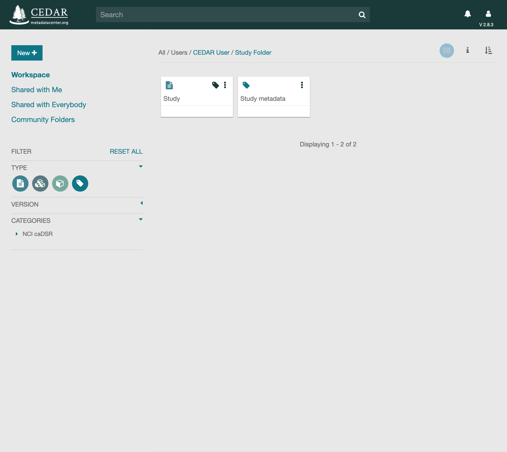
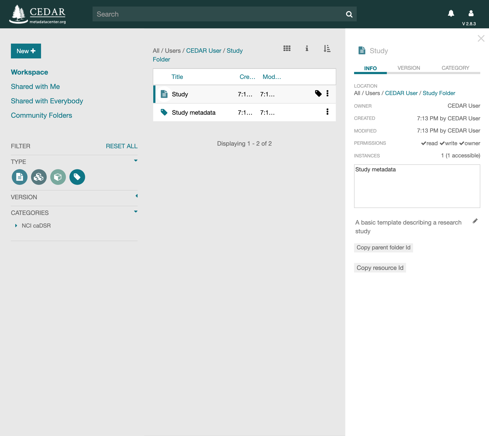

# Your CEDAR Workspace

When you first sign in, you land in your workspace, the home for the resources you create. A
new account starts empty; as you build templates, elements, fields, and metadata, they collect
here. The workspace looks like this once it holds some content.

{:width="95%" class="centered"}

**The middle pane** lists the resources you can see. You sort it by clicking a column header or
the sort control, and a count shows how many items it holds. A layout control switches the
pane between this list and a card view.

**The links on the left** choose which resources appear. *Workspace* is your own home folder,
*Shared with Me* is content shared with you or with a team you belong to, *Shared with
Everybody* is content shared with every CEDAR user, and *Community Folders* gathers folders
shared by CEDAR communities. Above the pane, a location string shows the folder you are in;
click a folder in it to move up the hierarchy.

**The search bar** at the top finds resources anywhere in CEDAR. The round type-filter icons on
the left narrow what the pane shows to particular kinds of resource, and the version selector
controls whether you see only the latest published version of a template or every version.
[Finding Resources](finding-resources.md) covers searching and filtering in full.

**To create content**, the **New+** button makes a template, element, field, or folder. To
enter metadata instead, open the template you want the metadata to follow and choose Populate;
its metadata tag opens the Metadata Creator, the form for that template.

**Each resource has its own menu**, opened by the vertical triple-dots (⋮) at its right, for
renaming, copying, moving, sharing, and more. [Managing Resources](managing-resources.md)
covers those commands.

Along the top right sit the bell, which lights when you have messages from CEDAR, and the
profile icon, which opens your CEDAR profile and API key.

## The Card Layout

The middle pane can show each resource as a card rather than a row. A card shows the resource's
type icon, its title, and any tags it carries, along with the same ⋮ menu. This gives a more
visual, at-a-glance view of a folder. Switch between the list and card layouts at any time with
the layout control.

{:width="100%" class="centered"}

## The Information Panel

Selecting a resource and clicking the 'i' icon opens an information panel along the right side.
It summarizes the resource's metadata — its place in the folder hierarchy, its owner, when it
was created and last modified, and your permissions on it. Its INFO, VERSION, and CATEGORY tabs
switch between this summary, the resource's version history, and its categories. With nothing
selected, the panel describes the current folder instead.

{:width="100%" class="centered"}
