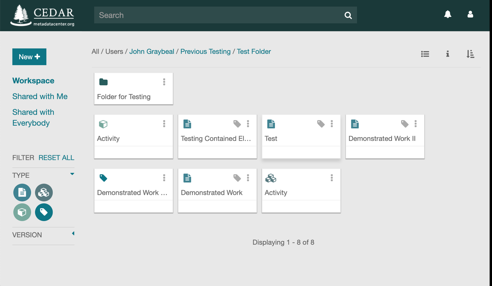
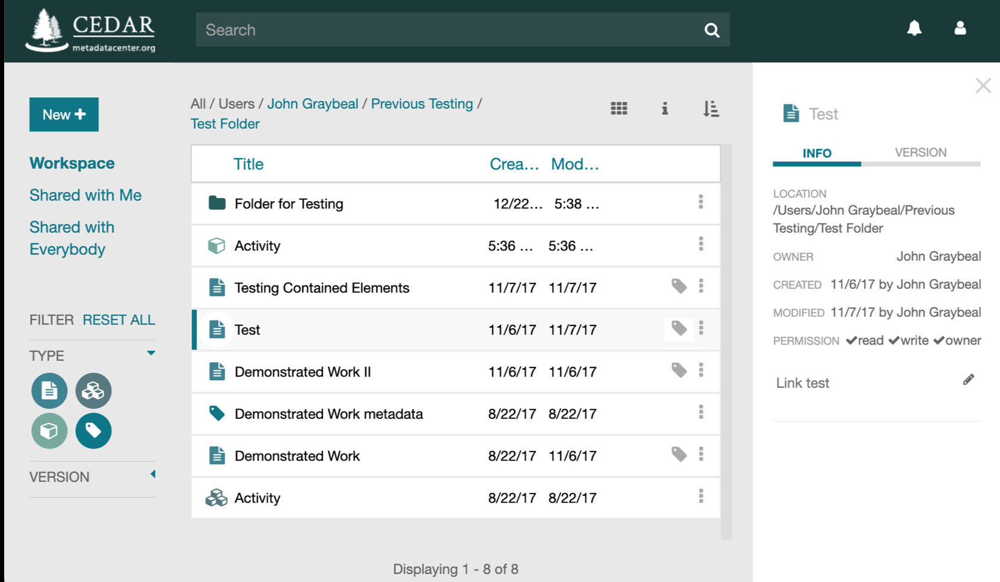

# Your CEDAR Workspace

When you first sign in, you land in your own workspace, shown annotated below. Your workspace
will not yet hold any of the resources shown in the middle of this example.

{:width="95%" class="centered"}

The labels below match the yellow circles in the screenshot.

* **(A)** The search bar finds other CEDAR resources.
* **(B)** The location string shows the folder you are viewing. When it is absent, you are looking at search results; click **Workspace** (C) to return to the folder view. Click any folder in the location string to move up the hierarchy.
* **(C)** These three options on the left control which resources you see. **Workspace** shows your home folder. **Shared With Me** shows content shared with you or with a team you belong to. **Shared With Everybody** shows content shared with everyone on CEDAR.
* **(D)** The **New+** button creates your own content: templates, elements, fields, and folders. To create a metadata instance instead, open the template you want the metadata to follow.
* **(E)** The large middle pane lists the resources you can view. Controls (A), (B), (C), (H), and (I) determine what appears here. Sort the list by clicking a column header or the sort icon (M).
* **(F)** Each resource has a dropdown menu, opened by the vertical triple-dots at its right. From it you can rename, copy, move, share, and more.
* **(G)** Any template can produce a form for entering metadata. Click the metadata tag to open the Metadata Creator and start filling out metadata that follows that template.
* **(H)** The round icons on the left filter the kinds of content shown. A green icon (white figures) is on; a white icon (green figures) is off. Folders are always visible.
* **(I)** The Version selector controls which template versions you see: only the latest published version and its draft, if one exists, or every version. The default shows the latest published version and any draft.
* **(J)** This shows how many items the middle pane holds. When there are more than fit, scroll to see the rest.
* **(K)** This icon switches the middle pane between list and card layouts.
* **(L)** The 'i' icon opens an information panel on the right with more detail about the selected resource. With nothing selected, it describes the current folder (B).
* **(M)** The sort icon sets the sort order for the middle pane.
* **(N)** The bell icon shows whether you have messages from CEDAR; a white bell means none.
* **(O)** The profile icon opens your CEDAR profile, including your API key, along with Support and Logout.

The card layout presents each resource in the middle pane as a card rather than a row in a table. Every card shows the resource's type icon, its title, and any tags it carries, along with the three-dot menu (F) for renaming, copying, moving, or sharing the item. This gives a more visual, at-a-glance view of a folder's contents. Switch between the list and card layouts at any time using the layout toggle (K).

{:width="100%" class="centered"}

The information panel opens along the right side of the workspace when you select a resource and click the 'i' icon (L). It summarizes the selected resource's metadata — its location in the folder hierarchy, its owner, the dates it was created and last modified, and your permissions on it — and offers INFO and VERSION tabs for switching between this summary and the resource's version history. When no resource is selected, the panel describes the current folder instead.

{:width="100%" class="centered"}
